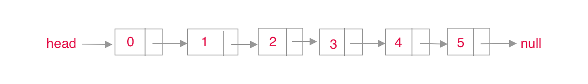
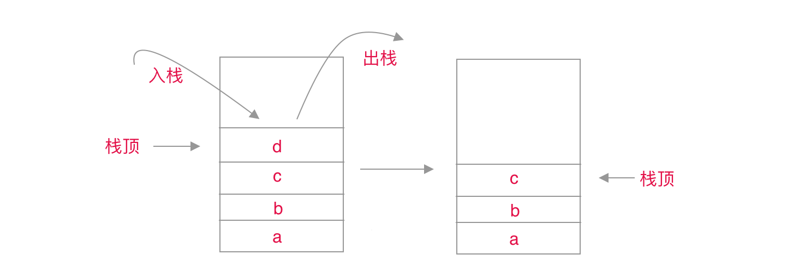
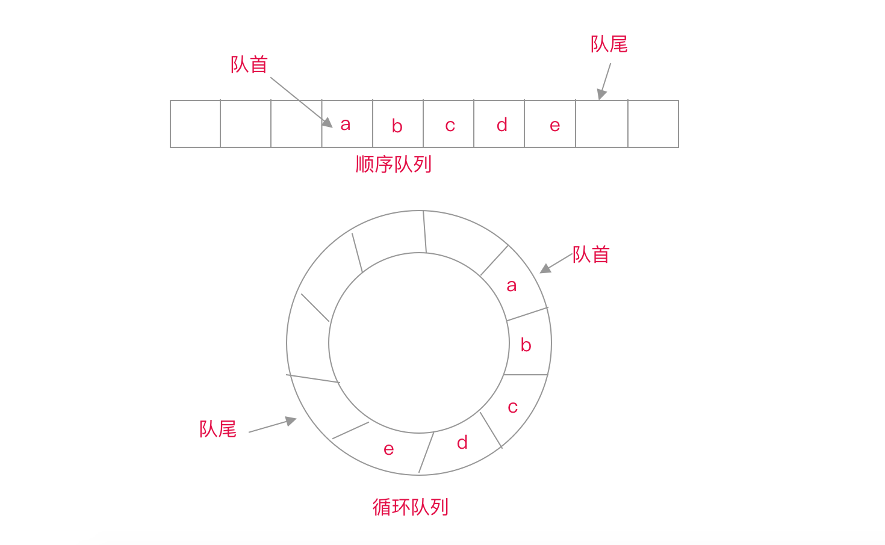
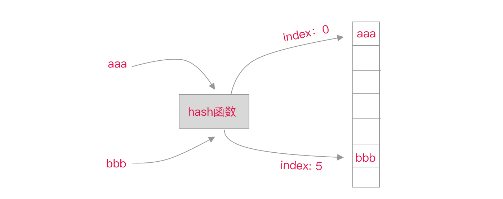

基础数据结构，最基础的就只有两种，一个是数组，一个是链表。其他的数据结构都是在它们之上抽象出来的，比如，栈，队列，散列表，树，图等。

### 数组

数组在内存中是申请的一组连续的内存空间，在一些强类型语言中，初始化数组时是要事先指定数组大小和类型的，一旦完成，则数组大小和类型不可改变。我们常说的对数组的动态扩容等，其实也是申请更大的数组，然后把旧数组里的数据搬移到新数组里。在 Javascript 中，数组却没有这样的限制，可以随意增加内容，随意改变数组的大小，且数组里元素类型可以不一样。JavaScript 底层中实现数组时，如果元素是同类型的，则使用的是连续的内存空间，如果是不同类型的元素，则应该使用的是类似哈希结构。Javascript 中的[TypeArray](https://developer.mozilla.org/en-US/docs/Web/JavaScript/Reference/Global_Objects/TypedArray)就是使用的连续的内存空间。

对数组中任意位置元素的访问，是十分高效的。我们可以根据下标值，很快就可以在 O(1)时间内完成访问，而链表则需要移动多次 head 指针才能完成。由于它是一组连续的内存空间，计算机可以一次性把它全部读入内存缓冲区中，下次访问其他位置元素，只需要计算偏移量就可以从内存缓冲区中读取，速度是非常快的。但是对于频繁的插入和删除操作，可能就涉及动态扩容或者维护数据的有序性，那么就会存在额外的数据搬移工作，额外花费的时间可能是 O(n)。


### 链表

链表是由一个一个节点链接起来的，每个节点会存储当前节点的值，还会有一个 next 指针，指向下一个节点。对于第一个节点，会有一个 head 指针指向它，最后一个节点的 next 指向 null。它天生就支持动态扩容或者缩容，由于对内存空间不要求连续，对内存利用率更高。如果需要扩容，就增加节点，插入到链表的某一个节点后面。如果要缩容，就删除释放掉部分不用的节点。

```typescript
/*
  链表节点
  链表节点用于组成单向链表，双向链表，循环链表等。
*/
class LinkedNode<Item> {
  public val: Item
  public next: LinkedNode<Item>
  public pre: LinkedNode<Item>
  constructor(val: Item, next: LinkedNode<Item>, pre: LinkedNode<Item> = null) {
    this.val = val
    this.next = next
    this.pre = pre
  }
}
```

由于它的不连续性，我们在访问链表中某个位置的节点数据时，需要从头开始遍历 head 指针，直到 head 指向要访问的节点，需要的时间复杂度为 O(n)。对于删除或者插入数据，只需要简单的改变上一个节点和当前节点的 next 指针即可，不需要额外的搬移其他节点，时间复杂度一般为 O(1)。



链表有多种变体，比如双向链表，循环链表，双向循环链表等。双向链表，就是节点不仅有一个 next 指针，还有一个 pre 指针，指向前一个节点。由于单向链表只有一个 next 指针，所以只能往后遍历，而双向链表，既可以往后遍历，也可以根据 pre 指针往前遍历，使用非常方便，并且只需要多存储一个 pre 指针即可。在实际应用中，更多的是使用双向链表。循环链表，就是最后一个节点的 next 不指向 null，而是指向第一个节点，从而形成了一个环。

由于链表中每个节点不仅存储了值，还需要额外的空间存储 next 指针（双向链表还需要存储 pre 指针），所以对于相同数据而言，链表花费的内存空间比数组要大。

对于链表的掌握，我做了如下一些练习，你可以看看，

- [链表-删除链表倒数第 k 个结点](https://github.com/snayan/algorithm-demo/blob/master/Algorithm/链表-删除链表倒数第k个结点/index.ts)
- [链表-判断回文字符串](https://github.com/snayan/algorithm-demo/blob/master/Algorithm/链表-判断回文字符串/index.ts)
- [链表-单向链表的反转](https://github.com/snayan/algorithm-demo/blob/master/Algorithm/链表-单向链表的反转/index.ts)
- [链表-合并两个有序链表](https://github.com/snayan/algorithm-demo/blob/master/Algorithm/链表-合并两个有序链表/index.ts)
- [链表-检测链表中是否有环](https://github.com/snayan/algorithm-demo/blob/master/Algorithm/链表-检测链表中是否有环/index.ts)
- [链表-求链表的中间结点](https://github.com/snayan/algorithm-demo/blob/master/Algorithm/链表-求链表的中间结点/index.ts)

|      | 访问任意位置元素 | 插入或者删除某一个元素 | 内存空间 | 使用内存大小 |
| ---- | ---------------- | ---------------------- | -------- | ------------ |
| 数组 | O(1)             | O(n)                   | 连续     | 较小         |
| 链表 | O(n)             | O(1)                   | 不连续   | 较大         |

### 栈

栈是一种抽象的 LIFO（last in , first out）数据结构。用数组实现的栈，一般称为顺序栈，用链表实现的栈，一般称为链式栈；实际应用中，顺序栈使用较多。栈一般暴露出来的操作，只有出栈和入栈，可能还会有清空，查找等其他辅助操作。它遵循后进，先出的策略，只有通过不停的出栈操作才能遍历或者访问它最开始加入的数据。

函数调用栈，就是用的这种结构，在一个函数 A 中调用另外一个函数 B，就会先把函数 B 压入到执行栈里，当函数 B 执行完毕之后，就会把函数 B 出栈，继续执行栈顶函数 A。特别是对于递归调用，我们要控制终止条件，不然就会出现递归次数过多，抛出*maximum-call-stack-size-exceeded-error* 的错误。解决办法可以将递归转化为迭代，或者使用尾递归优化。



对于栈的掌握，我做了如下一些练习，你可以看看，

- [顺序栈](https://github.com/snayan/algorithm-demo/blob/master/DataStructure/Stack/ArrayStack.ts)
- [链式栈](https://github.com/snayan/algorithm-demo/blob/master/DataStructure/Stack/LinkedStack.ts)
- [栈-实现四则表达式运算](https://github.com/snayan/algorithm-demo/blob/master/Algorithm/栈-实现四则表达式运算/index.ts)
- [栈-实现浏览器的前进后退功能](https://github.com/snayan/algorithm-demo/blob/master/Algorithm/栈-实现浏览器的前进后退功能/index.ts)

### 队列

队列是一种抽象的 FIFO（first in, first out）数据结构。同理，队列也可以用数组或者链表实现。实际应用中，顺序队列使用比较多。队列一般暴露出来的操作，只有入队列和出队列，可能还有清空队列，查找等其他辅助操作。它遵循先进，先出的策略，后加入的元素放在队尾，类似于我们生活中排队买票一样。

JavaScript 中常说的[event loop](https://developer.mozilla.org/en-US/docs/Web/JavaScript/EventLoop#Event_loop)，就是队列的应用之一。它会不断的从可执行队列中出队列，取出一个可执行的函数，然后将它放入执行栈中执行。我们在实现 IO 操作，事件监听，或者`setTimeout`时就会入队列操作，将执行函数放入队列末尾。如果更加深入，JavaScript 的 event loop 分为两种队列，一个是 macrotask，一个是 microtask，这里不做更加深入的探讨。

在使用广度优先搜素（BFS）遍历图时，队列也是常用的数据结构。初始时，随机选择一个节点入队列，然后通过每次从队列里出队列一个节点，访问它，然后把它所有的关联节点都入队列。这样当队列为空时，整个图所有节点就都被访问到了。

队列也有变体，循环队列，优先级队列。循环队列，跟循环链表类似，循环队列只是我们思维抽象上的环。由于队列入队列时，只能加到队尾，当一个固定大小的队列的尾部有元素时，我们就无法再执行入队列了，即使队列前面有空的位置，这将导致内存空间的浪费。解决办法之一就是我们每次执行出队列时，都移动队列中元素，填充第一个空的位置，这样虽然可以防止队列空间的浪费，但是每次搬移队列中数据，将导致性能急剧下降。解决办法之二就是使用我们的循环队列，计算队尾位置时，并不是我们固定的数组最后一个位置，而是结合队首空的位置来计算。优先级队列，出队列逻辑并不是先入队列的元素出队列，而是优先级高的元素先出队列，如果优先级相同，则先入队列的元素先出队列。堆的应用之一就是优先级队列。



对于队列的掌握，我做了如下一些练习，你可以看看，

- [顺序队列](https://github.com/snayan/algorithm-demo/blob/master/DataStructure/Queue/ArrayQueue.ts)
- [链式队列](https://github.com/snayan/algorithm-demo/blob/master/DataStructure/Queue/LinkedQueue.ts)

### 散列表

散列表又叫哈希表，通常是通过键（key）来存储一个值（value），也就是常用的 key-value 结构。散列表是基于数组抽象出来的，不过它是通过一个 key 来访问一个 value 的，时间复杂度也是 O(1)。当我们存储一个 key-value 时，会先通过散列函数和 key 计算出一个非负整数 index，再把 value 存在下标为 index 的位置。通过 key 查询 value 时，过程也是类似的，也是先通过散列函数和 key 计算出下标 index，然后返回数组中下标为 index 的位置值。

```javascript
const index = hash(key)
```

一个好的散列函数，既要计算过程简单，不能消耗太多时间，也要满足生成的下标 index 随机且分布均匀。如果散列函数计算过程非常复杂，每次插入或者查询时都将花费更多的时间，影响性能。如果散列函数生成的 index 不够随机分布，就会增加发生散列冲突的概率，解决散列冲突也会花费额外的时间，也会影响性能。

如果 k1 通过散列函数得到 i1，我们把 v1 存在数组下标为 i1 的位置；如果 k2 通过散列函数也到 i1，由于 i1 的位置已经被 v1 使用了，v2 不能直接存在 i1 的位置，这个时候就发生了散列冲突。散列冲突的概率不仅受散列函数的影响，也受当前装载因子大小的影响。当装载因子过高时，可以启动动态扩容，减少散列冲突，当装载因子过低时，可以启动动态缩容，释放没有使用的内存空间。

> 装载因子 = 数组已经使用的元素个数 / 数组的长度



解决散列冲突常见的方法一种是开放寻址法，一种是链表法。开放寻找法中有一种是线性探测，简单点说就是如果当前位置 i1 已经被使用了，就继续遍历数组后面的位置，直到找到一个为空的位置，然后将 v2 放入。链表法就是数组中存储的是一个链表的地址，通过散列函数得到的下标 index，然后将数组插入当前链表的尾部。这里不做深入说明了，想继续深入的，可以看下面的资料，

- [散列表](https://cs.nyu.edu/courses/fall17/CSCI-UA.0102-001/Notes/HashTableImplementation.html)
- [开发寻址法](https://en.wikipedia.org/wiki/Hash_table#Open_addressing)
- [链表法](https://en.wikipedia.org/wiki/Hash_table#Separate_chaining)
