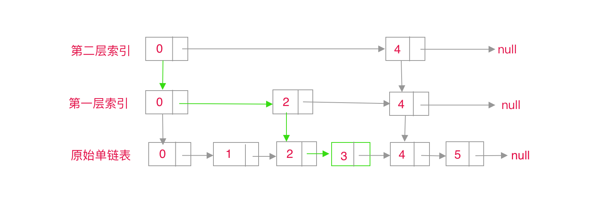

## TLDR

1. 跳表是基于链表建立多级索引的动态数据结构
2. 跳表的查询时间复杂度是 $O(\log(n))$，而单链表的查询时间复杂度是 $O(n)$
3. 跳表需要额外的内存空间存储索引，实现空间换时间
4. 动态插入，删除数据时，跳表需要维护索引大小平衡性，避免退化为单链表

## 原理

跳表是一种高效的动态数据结构，它是基于链表实现的。在遍历有序单链表中，需要从头指针开始遍历，逐个节点的遍历，直到链表最后一个节点，需要遍历的节点个数是 n。如果，我们现在做一点改变，在遍历时，不是逐个节点遍历，而是每次遍历 2 个节点，那么遍历一遍同样大小的链表，需要遍历的节点个数是 $ n \div 2 + 1 $。如果每次遍历的节点个数是 4 个，那么需要遍历的节点个数为 $ n \div 4 + 1 $；类似的，一次遍历 n 个节点呢，就只需要遍历 2 个节点，整个链表就遍历完成了。

基于上述思想，我们可以在原始单链表的基础上，每两个节点抽出一个节点，建立第一层索引，第一层索引的节点总数就为 $ n \div 2 $。在第一层索引的节点基础上，每两个节点再抽出一个节点，建立第二层索引，那么第二次索引的节点总数为 $ n \div 4 $。类似的方式，我们建立第 k 层索引时，节点总数为 $ n \div (2^k)$。如果 $ n \div (2^k) = 2 $，那么 $k = \log(n) - 1$。再加上原始单链表这一层，那么整个高度就是 $\log(n)$。当我们在跳表中查找一个数据时，需要从最上层索引开始查找，逐层往下层找，直到原始单链表这一层。如果每一层查找，需要遍历 m 个节点，那么整个查找需要遍历的总节点个数为$ m * \log(n) $。由于我们是每两个节点抽出的一个节点去建立索引，所以每一层最多需要遍历 3 个节点，即 $m = 3$ 。跳表的查询时间复杂度就为 $3 * \log(n) $，用大 O 表示法，常数可以省略，记为 $O(\log(n))$。



## 实现

弄清楚了原理之后，我们用 JavaScript 实现一个最简单的跳表，它存储不重复的数字。一个跳表的基本功能应该包含，查找，插入，删除。[查看完整实现](https://github.com/snayan/algorithm-demo/blob/master/DataStructure/SkipList/index.ts)。

### 查找

在一个跳表中查找一个数据时，总是从最顶层的索引开始查找，然后直到当前层满足某一个条件，就跳转到当前节点的下一层索引继续查找，重复上述过程，直到达到元素单链表层。查找一个数据的时间复杂度是 $O(\log(n))$。

```typescript
public find(value: number) {
  let p = this.head; // head 为头节点，哨兵节点，不存储实际数据
  // 从顶层索引开始查找，当level-1时，则表示跳转到下一层的索引中了
  for (let level = this.maxLevel - 1; level >= 0; level--) {
    while (isNotEmpty(p.nexts[level]) && p.nexts[level].data < value) {
      p = p.nexts[level];
    }
  }
  // 循环之后，总是会到达原始单链表层，然后在原始单链表层中判断
  if (isNotEmpty(p.nexts[0]) && p.nexts[0].data === value) {
    return p.nexts[0];
  }

  // 找不到，则返回null
  return null;
}
```

### 插入

为了维护链表的有序性，需要把节点插入到合适的位置，而不是直接插入到链表的尾部。跳表必须是有序性的，不然我们的查找性能就会退化到 $O(n)$。为了插入到合适的位置，需要先执行类似查找操作，找到一个合适的位置。每插入一个节点，需要动态维护索引的平衡性。我们可以随机生成新节点索引层级数。在插入新节点后，还需要更新新节点所有层级的索引。这里有一个优化，与查找不同的是，不是从顶层索引开始查找，而是从生成的随机索引层开始。我们知道，在链表中插入一个节点的时间为 $O(1)$，但是跳表需要先查找，再插入，所以跳表的插入操作的时间为 $O(\log(n))$。

```typescript
public insert(value: number) {
  // 获取随机索引层
  const newLevel = this.randomLevel();

  // 先生成新节点
  const newNode: LinkedNode = { data: value, maxLevel: newLevel, nexts: [] };

  // 每一层索引待更新节点
  const updatedNode: LinkedNode[] = [];

  let p = this.head;

  // 从生成的索引层开始查找
  for (let level = newLevel - 1; level >= 0; level--) {
    while (isNotEmpty(p.nexts[level]) && p.nexts[level].data < value) {
      p = p.nexts[level];
    }
    // 跳转下一层之前，记录当前层需要更新的节点
    updatedNode[level] = p;
  }

  // 如果跳表中已经存在value，则不插入
  if (isNotEmpty(p.nexts[0]) && p.nexts[0].data === value) {
    return;
  }

  // 每层索引插入新的值
  for (let i = 0; i < newLevel; i++) {
    newNode.nexts[i] = updatedNode[i].nexts[i];
    updatedNode[i].nexts[i] = newNode;
  }

  // 更新maxLevel
  if (newLevel > this.maxLevel) {
    this.maxLevel = newLevel;
  }

  // count 值加1
  this.count++;
}
```

### 删除

删除操作跟插入类似，也是先找到要删除的位置，然后从原始链表中删除，并且更新删除节点所有层级的索引。删除操作的时间也是 $O(\log(n))$，比较简单，就不细说了，直接贴代码，看一下就明白了。

```typescript
public delete(value: number) {
  let p = this.head;

  // 索引层待更新节点
  const updatedNode: LinkedNode[] = [];

  // 从顶层索引开始查找
  for (let level = this.maxLevel - 1; level >= 0; level--) {
    while (isNotEmpty(p.nexts[level]) && p.nexts[level].data < value) {
      p = p.nexts[level];
    }
    updatedNode[level] = p;
  }

  // 如果找到了，则开始删除
  if (isNotEmpty(p.nexts[0]) && p.nexts[0].data === value) {
    const level = p.nexts[0].maxLevel;
    for (let i = 0; i < level; i++) {
      p.nexts[i] = p.nexts[i].nexts[i];
    }
    // count 值减1
    this.count--;
  }
}
```

跳表这种数据结构在前端应用中出现很少，基本不会用到。它比原始的单链表性能要好很多。当我们使用一个有序的单链表时，不妨可以考虑使用跳表。
