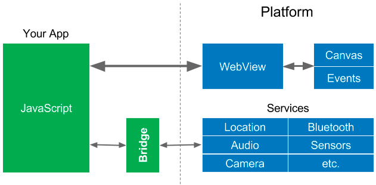
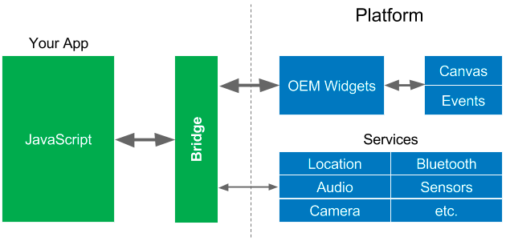
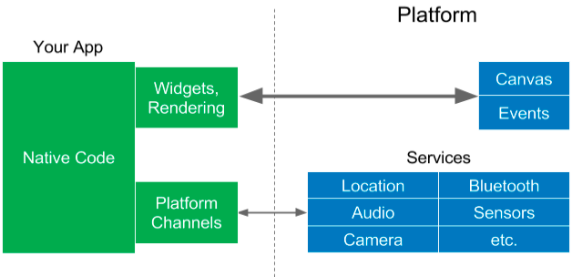

2019 年，在前端圈听到最多的就是 flutter 了。作为一个跨平台新宠，国内已有一些大厂，将它用在了实际的项目中。对于一个新技术，到底要不要跟进学习，笔者不做任何评论。笔者只是纯粹以学习的目的，去学习了 flutter，并通过写一个 demo 加深对它的理解。下面将结合自己开发的一个 demo 项目，从前端的角度去阐述，希望能对你学习 flutter 有所帮助。

flutter demo 项目地址：[点击这里](https://github.com/snayan/flutter_juejin)

## 跨平台

### 渲染

flutter 最大的特性就是跨平台。一套代码，即可搞定 iOS，Android，web 三端，真可谓之强大。为何它能跨平台呢，因为它将 widget 和渲染器从平台移到了应用程序自身上。它通过自带渲染引擎 skia，封装了系统提供的 2D 绘图接口。不管是 iOS，android，web，只需要提供一个 2D 渲染环境(canvas)，flutter 就可以渲染界面。

业界其他跨平台方案还有 H5，react native 等。当做一个技术选型时，需要根据实际业务需求来衡量，所以这里对它们不做任何优劣之分，仅仅只是从实现原理去理解它们。只有真正了解它们的实现差异，才能对某一个具体业务选择最合适的方案。

h5，最简单，平台支持度最高的。它需要不同平台提供一个 web view，渲染方式就是 web view 提供的渲染引擎去完成的。不同平台的 webview 实现方式可能不一样，但是它们都遵循 w3c 标准，所以一套 H5 代码能运行在不同平台之上。渲染之前需要通过平台生成一个 webview 实例，然后通过 http 请求，加载所需的静态资源（包含 html，css，js，image 等），这些前置步骤会导致一个白屏时间的存在。并且 js 是运行时编译的，所以它的运行速度不如原生的快。对于平台功能，需要通过 bridge 等方式来获得支持。



rn，使用 jsx 的方式声明 UI，然后通过 bridge 通信，使用平台控件来渲染界面。相比 h5 的 webview 渲染，平台控件渲染减少了 web view 实例化的过程，并且体验也更加流畅一些。每次 jsx 的变化，都需要通过 bridge 通知到平台那边。所以对于动画，滚动等高频率的改变，它的性能就会急剧下降。跟 h5 类似，也存在 js 的运行时性能不够好，对于平台功能，需要通过 bridge 等方式来获得支持。



flutter，由于自带高性能的渲染引擎，所有的 UI 显示都可以自己搞定，不需要 bridge 等中间层通信，所以在渲染方面表现出的性能要比 rn 优秀一点。flutter 支持 AOT，在 release 编译中，会将 dart 代码编译成对应平台的本地代码，其运行速度远比 js 的快。对于平台功能，flutter 也提供了类似 bridge 的 Method Channel 的方式来获得支持。



新创建一个 flutter 项目时，目录结构中会有 ios，android，web 三个目录，它们分别就是对应到三个端的宿主平台代码。一般在开发时，不需要关心它们，实际 flutter 项目的代码，会放在 lib 目录中。flutter 选择了 dart 作为开发语言，dart 也是类似 JavaScript 的单线程语言，与 JavaScript 有许多相似之处，学习成本很低，这里不详细展开，更多可以去[官网](http://dartlang.org/)了解。需要提到的一点是，官方有[dart2js](https://dart.dev/tools/dart2js)的工具，将 dart 代码转换为 js 代码。实际上 flutter 能运行到 web 端，也就是在编译的时候，会进行 dart2js 的转换。

### 通信

有时候，产品功能会比较复杂，需要调用原生操作系统底层能力去实现某一部分功能，比如打开相机拍照等。仅仅使用 flutter 框架能力是无法实现的，这个时候就需要 flutter 层去调用原生层的服务了。flutter 通[MethodChannel](https://api.flutter.dev/flutter/services/MethodChannel-class.html)去实现这种场景，与 H5 通过 bridge 调用 native 功能的方式比较类似。如不清楚 H5 与 native 的通信细节，可以看看我之前写的[「理解 h5 与 native(ios)通信细节」](/post/understand_the_details_of_h5_and_native(ios)_communication/)。下面，我们通过[url_launcher](https://pub.dev/packages/url_launcher)来详细了解一下 MethodChannel 的实现和使用。

url_launcher 的功能之一，就是支持在 iOS 和 android 设备上打开一个 URL 链接。在 flutter 中使用如下

```dart
_launchURL() async {
  const url = 'https://flutter.dev';
  if (await canLaunch(url)) {
    await launch(url);
  } else {
    throw 'Could not launch $url';
  }
}
```

选择`canLaunch`函数作为切人点，一起看看它在 flutter 中的实现如下，

```dart
const MethodChannel _channel = MethodChannel('plugins.flutter.io/url_launcher');

/// Checks whether the specified URL can be handled by some app installed on the
/// device.
Future<bool> canLaunch(String urlString) async {
  if (urlString == null) {
    return false;
  }
  return await _channel.invokeMethod<bool>(
    'canLaunch',
    <String, Object>{'url': urlString},
  );
}
```

实现比较简单，就是简单的判断了 urlString 是否为空，然后通过`MethodChannel#invokeMethod`去调用平台的接口了，并将参数封装为 Map 的形式传递过去。我们选择 Android 平台，看看平台是如何通过 MethodChannel 定义接口的，iOS 中实现也是类似的步骤。

第一步，需要在 MainActivity 中注册 MethodChannel

```kotlin
// Android入口
class MainActivity: FlutterActivity() {
  override fun onCreate(savedInstanceState: Bundle?) {
    super.onCreate(savedInstanceState)
    // 这里会注册插件
    GeneratedPluginRegistrant.registerWith(this)
  }
}
```

```java
public final class GeneratedPluginRegistrant {
  public static void registerWith(PluginRegistry registry) {
    // 先判断是否已经注册过了
    if (alreadyRegisteredWith(registry)) {
      return;
    }
   UrlLauncherPlugin.registerWith(registry.registrarFor("io.flutter.plugins.urllauncher.UrlLauncherPlugin"));
  }
}
```

第二步，定义接口，通过`call.argument`获取参数，`call.method`获取方法名称

```java
@Override
public void onMethodCall(MethodCall call, Result result) {
  final String url = call.argument("url");
  switch (call.method) {
    case "canLaunch":
      onCanLaunch(result, url);
      break;
    case "launch":
      onLaunch(call, result, url);
      break;
    case "closeWebView":
      onCloseWebView(result);
      break;
    default:
      result.notImplemented();
      break;
  }
}
```

第三步，实现并返回结果

```java
private void onCanLaunch(Result result, String url) {
  result.success(urlLauncher.canLaunch(url));
}

/* urlLauncher.canLaunch */
/** Returns whether the given {@code url} resolves into an existing component. */
boolean canLaunch(String url) {
  Intent launchIntent = new Intent(Intent.ACTION_VIEW);
  launchIntent.setData(Uri.parse(url));
  ComponentName componentName =
    launchIntent.resolveActivity(applicationContext.getPackageManager());

  return componentName != null
    && !"{com.android.fallback/com.android.fallback.Fallback}"
    .equals(componentName.toShortString());
}

```

对于一个底层能力的插件，需要在 iOS 和 Android 端分别实现，这样在 flutter 层就无需关注原生实现细节，只需要通过 MethodChannel 调用就可以了。感觉实际项目开发中，还是需要 iOS，Android 同学去开发底层能力，然后业务功能可以使用 flutter 开发。幸好，大部分这种通用底层能力的接口，官方或社区都以插件的形式实现了，直接安装即可使用。

## 包管理

flutter 选择 dart 作为开发语言，dart 使用的包管理是[pub](https://pub.dev/)，它与 npm 类似。下面列举它们的差异点。

| 包管理     | pub                       | npm                  |
| ---------- | ------------------------- | -------------------- |
| 配置文件   | pubspec.yaml              | package.json         |
| 版本锁文件 | pubspec.lock              | Package-lock.json    |
| 安装目录   | flutter 目录.pub-cache 下 | 项目 node_modules 下 |

如需在 flutter 中安装一个插件，比如 url_launch，步骤如下，

第一步，在 pubspec.yaml 中 dependencies 中声明，如是开发环境依赖包，则在 dev_dependencies 中声明，与 package.json 类似。

```yaml
dependencies:
  flutter:
    sdk: flutter

  url_launcher: ^5.2.3
```

第二步，可以执行如下命令，一般在 pubspec.yaml 中改变了，vscode 获取 Android studio 会自动安装的，所以这一步一般可以省略。

```bash
flutter pub get
```

第三步，就是直接在项目中引用使用即可，如下，

```dart
import 'package:url_launcher/url_launcher.dart';

_launchURL() async {
  const url = 'https://flutter.dev';
  if (await canLaunch(url)) {
    await launch(url);
  } else {
    throw 'Could not launch $url';
  }
}
```

## 小结

对于跨平台的框架，一般需要满足最基本的两个条件，其一是能够在不同平台上高效的渲染，，其二是能够通过某种方式调用平台的服务。flutter 无疑在这两方面都做的比较出色，它通过自带的渲染引擎可以高效的在 Android 和 iOS，web 等平台上渲染界面，同时通过 method channel 等 bridge 方式调用平台服务。

flutter 选择 dart 作为开发语言，它也有类似 npm 的包管理器 pub，可以很方便的安装或者发布特定功能的插件。

## 参考

- [What’s Revolutionary about Flutter](https://hackernoon.com/whats-revolutionary-about-flutter-946915b09514)

- [Why native app developers should take a serious look at Flutter](https://hackernoon.com/why-native-app-developers-should-take-a-serious-look-at-flutter-e97361a1c073)
