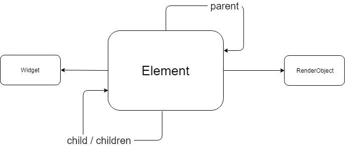
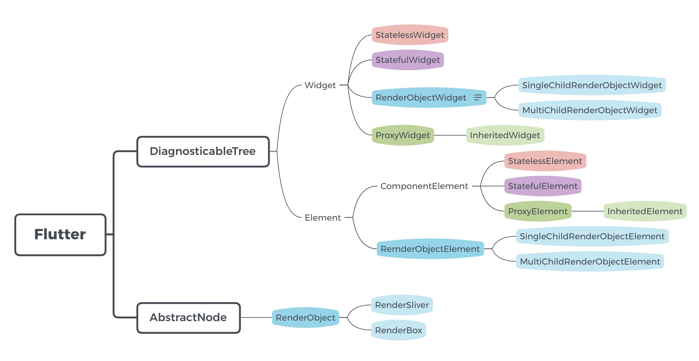

[上一篇文章](/post/2019/flutter-learn-1)中，学习了 flutter 跨平台的特性，以及 dart 的包管理器 pub。这一篇，我们将详细了解 flutter 很重要的一个概念，widget。

## 组件

flutter 是响应式的，它通过编程方式去写 UI 页面，而不是像 html 或者 android 中的 xml 等模版语言去定义 UI。它借鉴了 React，也是以组件的方式去定义一个一个 UI 部件。

> Flutter widgets are built using a modern framework that takes inspiration from [React](https://reactjs.org/).

### 分类

在 flutter 中一切皆是 widget。按照状态划分，可以分为 StatelessWidget 和 StatefulWidget，与 React 中的 Stateful Class Component 和 Stateless Function Component 比较类似；按照功能划分，又有 layout widget，style widget，content widget；按照 child 接受单个 widget，或者多个 widget，又有 SingleChildRenderObjectWidget 和 MultiChildRenderObjectWidget。常见 widget 如下，

1. layout widget，例如`Scaffold`，`Row`，`Column`，`Container`等；
2. style widget，例如`Container`，`Padding`，`Center`等；
3. content widget，例如`Text`，`Image`，`RaisedButton`等；

在开发 flutter 页面时，可以通过组合多个 widget，实现一个复杂或者独立功能的自定义 widget。对于描述一个 widget 的样式时，需要使用样式 widget 进行包装，或者更改 widget 提供的某些样式属性，比如`Container`的`padding`属性等。

### 实现

在开发自定义 widget 时，一般都是继承自 StatelessWidget，或者 StatefulWidget。StatelessWidget 和 StatefulWidget 又都是继承自 Widget。下面我们通过源码来看看它们的实现。

```dart
/// 列出主要实现，去掉了其他不重要的属性或者方法
@immutable
abstract class Widget extends DiagnosticableTree {
  const Widget({ this.key });

  final Key key;

  @protected
  Element createElement();

  static bool canUpdate(Widget oldWidget, Widget newWidget) {
    return oldWidget.runtimeType == newWidget.runtimeType
      && oldWidget.key == newWidget.key;
  }
}
```

Widget 是一个抽象类，主要有一个`createElement`的抽象方法和`canUpdate`的静态方法。`createElement`需要由继承它的子类来实现，必须返回一个 Element 对象，每一个 widget 都会有一个关联的 element 对象；在 Widget 上面有`@immutable`声明，描述 widget 对象是不可变的，它的属性都应该使用`final`标记，每次做 rebuild 时，都只会重新创建新的 widget 对象。widget 是不可变的，但是 element 是可变的，可以把 widget 看成是 element 的静态配置信息，最终是用 element 信息来完成渲染的。为了尽可能复用 element 对象，每次更新时都会先调用`canUpdate`，通过`runtimeType`和`key`来比较新旧 widget，如果返回 true，则复用旧的 element，并更新 element 的 widget 为新的 widget，否则调用新的 widget 的`createElement`来生成新的 element。

```dart
abstract class StatelessWidget extends Widget {
  const StatelessWidget({ Key key }) : super(key: key);

  @override
  StatelessElement createElement() => StatelessElement(this);

  @protected
  Widget build(BuildContext context);
}
```

对于 StatelessWidget 的实现，它继承 Widget，重写了`createElement`用于生成一个`StatelessElement`。它还声明了一个`build`方法，接受一个`BuildContext`参数，并返回一个 Widget。实际上，这个`BuildContext`就是上面通过`createElement`创建的 Element 对象，下面将会解释到。

```dart
abstract class StatefulWidget extends Widget {
  const StatefulWidget({ Key key }) : super(key: key);

  @override
  StatefulElement createElement() => StatefulElement(this);

  @protected
  State createState();
}
```

对于 StatefulWidget，就复杂一些了。它跟 StatelessWidget 一样，继承 Widget，提供一个`createElement`方法，但是返回是`StatefulElement`对象；跟 StatelessWidget 不一样的是，它没有声明`build`方法，而是有一个`createState`方法，生成一个 State 对象。前面说过，Widget 是不可变的，每次 rebuild 都会销毁和重建，所以状态不能直接放在 widget 中，而是需要独立出来，关联到 element 上，这样状态才不会丢失。

```dart
abstract class RenderObjectWidget extends Widget {
  const RenderObjectWidget({ Key key }) : super(key: key);

  @override
  RenderObjectElement createElement();

  @protected
  RenderObject createRenderObject(BuildContext context);

  @protected
  void updateRenderObject(BuildContext context, covariant RenderObject renderObject) { }

  @protected
  void didUnmountRenderObject(covariant RenderObject renderObject) { }
}
```

RenderObjectWidget，是比较特殊的一类 widget。它声明了`createRenderObject`去创建一个 RenderObject，而在 flutter 中真正被渲染的对象就是 RenderObject。上面提到的 StatelessWidget，StatefulWidget，它们都没有直接提供 RenderObject 的实现，而是通过组合其他 RenderObjectWidget，从而实现渲染出某一个部分组合 UI。根据接受的参数个数，它有两个子类，

1. SingleChildRenderObjectWidget，仅接受一个 child，比如 Padding；

2. MultiChildRenderObjectWidget，可以接受多个 child，比如 Row；

## State

StatefulWidget 会通过`createState`生成一个 State 对象，它会被关联到对应的 StatefulElement 上。State 不会随着 widget 的销毁而销毁，而是会保持其生命期跟随着 element。一个 State 对象，在整个生命周期内，会有不同的阶段，为了方便开发者针对不同阶段处理一些事情，它会暴露出相应的钩子函数，类似生命周期方法。

```dart
@optionalTypeArgs
abstract class State<T extends StatefulWidget> extends Diagnosticable {
  T get widget => _widget;
  T _widget;

  _StateLifecycle _debugLifecycleState = _StateLifecycle.created;

  BuildContext get context => _element;
  StatefulElement _element;

  bool get mounted => _element != null;

  @protected
  @mustCallSuper
  void initState() {}

  @mustCallSuper
  @protected
  void didUpdateWidget(covariant T oldWidget) { }

  @protected
  void setState(VoidCallback fn) {
    final dynamic result = fn() as dynamic;
    _element.markNeedsBuild();
  }

  @protected
  @mustCallSuper
  void deactivate() { }

  @protected
  @mustCallSuper
  void dispose() {}

  @protected
  Widget build(BuildContext context);

  @protected
  @mustCallSuper
  void didChangeDependencies() { }
}
```

State 对象会持有 StatefulWidget 的引用\_widget，还有一个\_StateLifecycle 状态。在不同的阶段，会调用不同的方法，然后\_StateLifecycle 的值也会不一样，类似 react 中的生命周期方法。这里主要有如下生命周期方法，

1. `initState`，初始化时执行，一般用于执行申请资源等操作，不可以执行`setState`，在 state 的生命里只会调用一次。
2. `didChangeDependencies`，如果在`build`中有调用`BuildContext.inheritFromWidgetOfExactType`，而且 inherited widgets 有变化，则会触发此方法。可以根据变化，调用`setState`来更新当前 children widgets。
3. `didUpdateWidget`，当 element 上调用的`canUpdate`返回 true 时，也就是复用 element，更新 element 关联的 widget 时会触发此方法。state 需要根据新的 widget 来作出改变。在执行完`didUpdateWidget`时，框架紧接着会执行 statet 的`build`方法来更新 UI，所以不应该在此方法中执行`setState` 。
4. `deactivate`，当 element 上调用的`canUpdate`返回 false 时，会卸载当前的 element，随即也会卸载当前的 element 关联的 state，则会触发此方法。State 会被从树中移除，应该在此方法里解除它与其他 element 的引用关系。
5. `dispose`，销毁时执行，一般用于释放在`initState`中申请的资源，不可以执行`setState`

State 会有一个 context 的属性，它实际就是 widget 的 element 对象。State 有一个比较重要的方法`setState`，每次调用它，都会触发当前 widget 的更新。在上面的实现中，可以看到它调用了`_element.markNeedsBuild()`，将当前 element 标记为 dirty，然后在下一个 frame 中会重新执行 rebuild。如果直接更改 state 中的值，是不会触发 widget 的更新的。

## Element Tree

通过上面的部分源码分析，真正负责渲染的 widget 对象是 RenderObjectWidget，它会生成 Element 和 RenderObject，关系如下



把它们与 React 中元素来做类似关联，应该就比较明白它们的作用了，

1. widget，类似于 React 中 JSX，用于定义 UI 应该展示什么样子，在最上层。
2. element，类似于 React 中 Component 生成的 vdom 对象，这里会做一些复用逻辑和渲染优化，用于为真正渲染对象提供数据，位于中间层。
3. renderObject，类似于真正的 DOM 了，真正的渲染对象，在最底层了。

react 会形成一颗虚拟的 dom 树，flutter 中也在 element 这一层生成一颗 element 树。

flutter 框架会帮我们处理好 element 和 renderObject 层，对于一般业务开发，我们只需要在 widget 层去实现功能即可。框架会在三个地方帮我们调用`createElement`去生成对应的 element 对象，下面我们分别来看看这三个地方。

第一个地方就是生成 element 树的根节点。flutter 是通过调用`runApp`来启动的，如下

```dart
void main() => runApp(MyApp());
```

在`runApp`中会做很多初始化的工作，其中就包含了生成 element 树的根节点并挂载。

```dart
void runApp(Widget app) {
  WidgetsFlutterBinding.ensureInitialized()
    /// 这里就会生成element树的根节点
    ..scheduleAttachRootWidget(app)
    ..scheduleWarmUpFrame();
}
```

沿着`scheduleAttachRootWidget`调用栈一路找下去，最后会生成一个`RenderObjectToWidgetAdapter`对象，并调用它的`attachToRenderTree`方法，

```dart
 class RenderObjectToWidgetAdapter<T extends RenderObject> extends RenderObjectWidget {

  @override
  RenderObjectToWidgetElement<T> createElement() => RenderObjectToWidgetElement<T>(this);

  RenderObjectToWidgetElement<T> attachToRenderTree(BuildOwner owner, [ RenderObjectToWidgetElement<T> element ]) {
    if (element == null) {
      owner.lockState(() {
        // 如果root element为空，则调用createElement生成root element
        element = createElement();
        assert(element != null);
        element.assignOwner(owner);
      });
      owner.buildScope(element, () {
        // 并挂载在element树上
        element.mount(null, null);
      });
      // This is most likely the first time the framework is ready to produce
      // a frame. Ensure that we are asked for one.
      SchedulerBinding.instance.ensureVisualUpdate();
    } else {
      element._newWidget = this;
      element.markNeedsBuild();
    }
    return element;
  }
}

```

先判断当前 root element 存不存在，如果不存在，就会调用`createElement`生成新的 root element，并调用`element.mount(null, null)`进行挂载

第二个地方就是进行 mount 时，如果当前 element 是 MultiChildRenderObjectElement，则会为它的 widget 的 children widget 生成对应的 element，并挂载。

```dart
  void mount(Element parent, dynamic newSlot) {
    super.mount(parent, newSlot);
    _children = List<Element>(widget.children.length);
    Element previousChild;
    for (int i = 0; i < _children.length; i += 1) {
      /// inflateWidget就是调用createElement并进行mount
      final Element newChild = inflateWidget(widget.children[i], previousChild);
      _children[i] = newChild;
      previousChild = newChild;
    }
  }
```

```dart
  Element inflateWidget(Widget newWidget, dynamic newSlot) {
    assert(newWidget != null);
    final Key key = newWidget.key;
    if (key is GlobalKey) {
      /// ...
    }
    final Element newChild = newWidget.createElement();
    newChild.mount(this, newSlot);
    return newChild;
  }
```

第三个地方就是进行 rebuild 时，更新 child element，如果 child element 为 null，且新的 widget 不为 null，则也会调用`inflateWidget`来新建 element 且挂载。

```dart
Element updateChild(Element child, Widget newWidget, dynamic newSlot) {
    // newWidget为null，则直接返回null
   if (newWidget == null) {
      /// ...
      return null;
    }
   //child不为null，且newWidget也不为null
    if (child != null) {
      // 如果widget相等，则直接用之前的element
      if (child.widget == newWidget) {
        /// ...
        return child;
      }
      // 如果canUpdate返回true，也直接用之前的element
      if (Widget.canUpdate(child.widget, newWidget)) {
        /// ...
        child.update(newWidget);
        return child;
      }
    }
   // child element为null，且newWidget不为null，则生成新的child element
    return inflateWidget(newWidget, newSlot);
  }
```

在维护更新 element 树的同时，会每次将更新点同步到 RenderObject 上。最后，flutter 根据 RenderObject 来渲染出页面。为了更高效的渲染，在 layout 阶段会通过 RelayoutBoundary 来控制 relayout 的范围，在 paint 阶段会通过 RepaintBoundary 只重新绘制受响应的部分。

## 结构图

从 Widget，Element，RenderObject 角度分别列举了它们的父类和子类，



## 注意点

1. flutter 渲染分为三层，框架会自动处理好 Element 层和 RenderObject 层，大部分时候只需要编写 Widget 层即可。
2. Widget 是不可变的，总应该将它的属性标记为`final`。
3. 对于无状态的 Widget，总是应该使用 StatelessWidget，避免额外的创建和维护 State。
4. 在更新 element 时，会直接判断 new widget 与 old widget 是否相等，如果相等则直接复用旧的 element。所以我们可以通过 state 来提前保存生成好的子 widget，而不必每次都在 build 中生成新的子 widget。
5. 对于在整个渲染树中复用的 element，可以给它对应的 widget 增加一个 global key。这样在更新时，会通过`Widget.canUpdate`来判断是否可以复用 element。
6. RenderObject 并没有定义节点的布局模型，它有 2 个子类，一个是 RenderBox，定义了节点在笛卡尔坐标系中的布局方式，一个是 RenderSliver，定义了节点在滚动时的布局方式。

## 小结

我们大部分时候都是直接与 Widget 在打交道，而很少关心底层的 Element 和 RenderObject。Widget 在 flutter 中承担了非常多的功能，而不仅仅只是组合 UI，例如 flutter 中的路由管理 Navigator 就是 StatefulWidget，样式主题 Theme 是 StatelessWidget 等。flutter 提供了非常丰富的 Widget，有 Material Design 风格的 material widget，有 IOS 风格的 cupertino widget。

## 参考

- [flutter-internals](https://www.didierboelens.com/2019/09/flutter-internals/)
