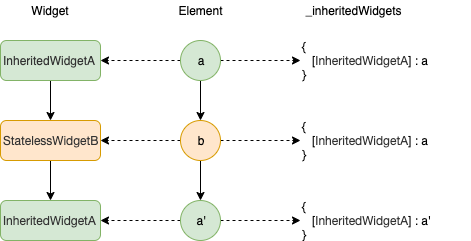

[上一篇文章](/post/2019/flutter-learn-2)中，我们学习了 flutter 中三个主要的 widget，分别是 StatelessWidget，StatefulWidget，和 RenderObjectWidget；也简单介绍了 Widget，Element 和 RenderObject 之间的关系。这一篇，将介绍如何在 flutter 应用中进行状态管理以及其基本的原理。

状态管理，实际上就是对数据的管理，这些数据可以是与用户交互的数据，网络请求的数据，或者当前动画的状态数据。在进行状态管理时，需要根据当前状态的影响范围来决定其管理方式。一般是「就近原则」，就是把状态放在距离使用它最近的地方维护。对于组件内部状态（local state），放在组件内部维护就好了；对于多个组件需要共同使用的状态（shared state），就将它放在最近公共祖先中来维护；对于全局状态（global state），一般放在 app 全局状态中维护。现在很多 react 开发者，提到状态管理，就是使用 redux 放在全局管理，也不管这些数据的使用场景。这样做，通常会导致全局状态混乱且不好维护，而且也会造成一些渲染方面的性能问题，是非常不建议的。在 flutter 应用中，基本原则跟 react 是一样的，只不过具体实现方式略有差异而已。

## 状态管理

### local state

对于组件内部的状态，其他地方根本不关心它，也不使用它时，直接将它们放在组件内部维护就好了。这样不仅可以很方便地使用它，也保证了它不被外部污染或者改变。从设计模式上来说，减少了组件的外部依赖，增加组件的内聚性。

在 flutter 中，使用 StatefulWidget 来创建和维护状态。在上一篇「[flutter 学习小结（二）](/post/2019/flutter-learn-2)」中，详细介绍了 StatefulWidget 和 State，以及其生命周期方法，这里我们通过一个简单的例子来说明如何使用。

```dart
class StateDemo extends StatefulWidget {
  @override
  StateDemoState createState() {
    return StateDemoState();
  }
}

class StateDemoState extends State<StateDemo> {
  /// state
  int _count = 0;

  void _increment() {
    /// setState会对当前组件执行rebuild
    setState(() {
      _count++;
    });
  }

  @override
  Widget build(BuildContext context) {
    return Column(
      mainAxisAlignment: MainAxisAlignment.center,
      children: <Widget>[
        Text('$_count'),
        RaisedButton(
          onPressed: _increment,
          child: Icon(Icons.add),
        ),
      ],
    );
  }
}
```

在 State 内部有一个`_count`数据，每次点击按钮，都会将它加 1。

### shared state

如果有多个组件需要共享某些状态，那么我们可以将需要共享的状态提升到它们的最近的上层组件中去。

当组件与上层组件是直接父子关系，那么父组件可以将这些状态以及改变状态的方法传递到子组件中。例如，我们可以将上述例子中`_count`以及`_increment`直接传递给两个子组件。

```dart
/// 上述StateDemoState
@override
Widget build(BuildContext context) {
  return Column(
    mainAxisAlignment: MainAxisAlignment.center,
    children: <Widget>[
      Child1(_count, _increment),
      Child2(_count),
    ],
  );
}
```

当组件与上层组件中间有多层组件，它们是祖先与子孙关系时，如果还是通过上面这样层层传递，就会显得十分繁琐，那我们能不能使得子孙组件可以直接获取祖先的数据，并且祖先数据改变了，自动更新子孙组件呢？

react 中是提供了 Context 的方式，将共享数据放在 Context 组件中，它的所有子级组件都可以通过`contextType`或者`Consumer`来获得共享数据，具体细节可以查看[官方文档](https://reactjs.org/docs/context.html)。在 flutter 中，可以有如下方案可以选择，

1. flutter 提供的基础 Widget，包括 InheritedWidget，InheritedModel
2. flutter 官方提供的库，Provide，
3. 社区实现的库，包括 Bloc，Redux，Mobx，Scoped Model 等

我们会在下面详细讨论 InheritedWidget，InheritedModel，Provider 的实现，至于社区提供的方案，感兴趣的可以自己去了解。

### global state

全局状态是一种特殊的共享状态，它将状态放在 app 根组件中去维护，使得整个 app 的所有子组件都可以获取到，所以它的处理方案跟 share state 中一样。一般的全局状态有 app 主题，语言，或其他用户自定义设置等。下面我们聊聊 flutter 中状态管理的实现原理。

## InheritedWidget

我们前面只聊了 flutter 中 StatelessWidget，StatefulWidget，和 RenderObjectWidget。这里，我们来详细聊聊 flutter 另一个比较重要的 Widget，InheritedWidget。

InheritedWidget 的主要作用就是可以直接将数据传递给子树下面的任意子组件，并且当数据变了时，子组件会自动更新。当在一棵 Widget tree 中，子组件可以通过 BuildContext.dependOnInheritedWidgetOfExactType 来获取最近的 InheritedWidget 数据（在 flutter1.12.1 之前是使用 BuildContext.inheritFromWidgetOfExactType）。

```dart
/// InheritedWidget源码
abstract class InheritedWidget extends ProxyWidget {
  const InheritedWidget({ Key key, Widget child })
    : super(key: key, child: child);

  @override
  InheritedElement createElement() => InheritedElement(this);

  @protected
  bool updateShouldNotify(covariant InheritedWidget oldWidget);
}
```

InheritedWidget 与其他 Widget 不同之处是，多出了一个`updateShouldNotify`方法，这个方法需要子类去实现。每当 rebuild 时，则会根据`updateShouldNotify`返回的值去决定是否需要对依赖它的子组件做更新。下面我们使用 InheritedWidget 来实现上面 count 的例子。

```dart
/// 因为Widget是immutable的，所以需要使用StatefulWidget来存储数据
class CountProvider extends StatefulWidget {
  Widget child;

  CountProvider({this.child});

  @override
  State<CountProvider> createState() {
    return CountProviderState();
  }

  /// 通过CountProvider.of(context)就可以获取InheritedWidget上的数据了
  static ShareDataWidget of(BuildContext context) {
    return context.dependOnInheritedWidgetOfExactType<ShareDataWidget>();
  }
}

/// State用于保存数据，并且更新
class CountProviderState extends State<CountProvider> {
  int _count = 0;

  void _incrementCounter() {
    setState(() {
      _count++;
    });
  }

  @override
  Widget build(BuildContext context) {
    /// 需要将数据和更新方法传递给InheritedWidget，
    /// 因为子孙组件只能获取到InheritedWidget，而非StatefulWidget和State
    return ShareDataWidget(
      child: this.widget.child,
      count: _count,
      add: _incrementCounter,
    );
  }
}

/// 实现InheritedWidget
class ShareDataWidget extends InheritedWidget {
  final int count;
  final VoidCallback add;
  /// 通过构造函数接受需要共享的数据和方法
  ShareDataWidget({
    Key key,
    @required Widget child,
    this.count,
    this.add,
  }) : super(child: child, key: key);

  @override
  bool updateShouldNotify(ShareDataWidget oldWidget) {
    /// 当count不想等时，需要通知子孙组件更新，
    /// 如果count相等，则子孙组件不需要更新
    return oldWidget.count != this.count;
  }
}
```

如果进一步深究原理，我们需要回答如下 2 个问题，

1. dependOnInheritedWidgetOfExactType 是如何找到 InheritedWidget 的？
2. updateShouldNotify 是如何控制子孙组件更新的？

下面，我们来通过分析源码一步一步回答上面的问题。我们知道 context 实际上就是 element，在 element 上调用 dependOnInheritedWidgetOfExactType 就可以取出指定的 InheritedWidget，

```dart
  /// Element类
abstract class Element extends DiagnosticableTree implements BuildContext {
  /// 省略其他

  Map<Type, InheritedElement> _inheritedWidgets;
  Set<InheritedElement> _dependencies;

  @override
  InheritedWidget dependOnInheritedElement(InheritedElement ancestor, { Object aspect }) {
    assert(ancestor != null);
    /// 先实例化一个Set
    _dependencies ??= HashSet<InheritedElement>();
    /// 将祖先InheritedElement加入到_dependencies中
    _dependencies.add(ancestor);
    /// 调用组先updateDependencies，将当前element加入到祖先的_dependencies中
    ancestor.updateDependencies(this, aspect);
    /// 返回祖先InheritedElement关联的widget
    return ancestor.widget;
  }

  @override
  T dependOnInheritedWidgetOfExactType<T extends InheritedWidget>({Object aspect}) {
    /// 先找到祖先InheritedElement
    final InheritedElement ancestor = _inheritedWidgets == null ? null : _inheritedWidgets[T];
    if (ancestor != null) {
      /// 注册依赖项，并返回对应的InheritedWidget
      return dependOnInheritedElement(ancestor, aspect: aspect);
    }
    _hadUnsatisfiedDependencies = true;
    return null;
  }
}

```

它会通过`_inheritedWidgets`取出对应类型的祖先 InheritedElement，接着会执行如下步骤，

1. 生成一个 Set 实例，存放依赖项
2. 将组先 InheritedElement 加入到当前的\_dependencies 中
3. 将当前 element 加入到组先 InheritedElement 的\_dependencies 中
4. 返回祖先 InheritedElement 关联的 Widget

祖先 InheritedElement 和子孙 Element 相互把对方加入到自己的\_dependencies 中。那么子孙 Element 是何时将祖先 InheritedElement 加入到自己的`_inheritedWidgets`的呢？

```dart
  /// Element类
abstract class Element extends DiagnosticableTree implements BuildContext {
  /// 省略其他

  void mount() {
    /// ...
    _updateInheritance();
    /// ...
  }

  void activate() {
    /// ...
    _updateInheritance();
    /// ...
  }

  /// 一般element，只是使用parent element的_inheritedWidgets
  /// 但是，InheritedElement会重写_updateInheritance方法
   void _updateInheritance() {
    _inheritedWidgets = _parent?._inheritedWidgets;
  }
}

/// InheritedElement会重写_updateInheritance方法
class InheritedElement extends ProxyElement {
  /// 忽略其他

  @override
  void _updateInheritance() {
    /// 先取父级element的_inheritedWidgets
    final Map<Type, InheritedElement> incomingWidgets = _parent?._inheritedWidgets;
    if (incomingWidgets != null)
      _inheritedWidgets = HashMap<Type, InheritedElement>.from(incomingWidgets);
    else
      _inheritedWidgets = HashMap<Type, InheritedElement>();

    /// 最后，将自己加进去
    _inheritedWidgets[widget.runtimeType] = this;
  }
}
```

看上面代码，逻辑就很简单了，每次 element 在`mount`和`activate`会更新`_inheritedWidgets`。对于普通的 element，`_inheritedWidgets`就是取的 parent element 的`_inheritedWidgets`。一直这样迭代，直到碰到`InheritedElement`，它会将自己加入进去。如果有相同类型的 InheritedElement 的嵌套关系，则会直接覆盖，这也是为什么子孙 element 只能取得离它最近的一个特定类型的 InheritedElement，如下图所示。



到这里，我们实际上已经回答了第一个问题了。我们再来看看第二个问题，updateShouldNotify 是如何控制子孙组件更新的。

```dart
abstract class ProxyElement extends ComponentElement {
  /// 忽略其他的

  @override
  void update(ProxyWidget newWidget) {
    final ProxyWidget oldWidget = widget;
    /// ...
    /// 会调用InheritedElement的updated
    updated(oldWidget);
    /// ...
  }

  @protected
  void updated(covariant ProxyWidget oldWidget) {
    notifyClients(oldWidget);
  }

  @protected
  void notifyClients(covariant ProxyWidget oldWidget);
}

/// InheritedElement
class InheritedElement extends ProxyElement {
  /// 忽略其他的

  @protected
  void notifyDependent(covariant InheritedWidget oldWidget, Element dependent) {
    /// 对于StatefulElement，didChangeDependencies方法中会调用State.didChangeDependencies,
    /// 对于其他element，会调用markNeedsBuild，实现rebuild
    dependent.didChangeDependencies();
  }

  /// 重写了Element中updated方法
  @override
  void updated(InheritedWidget oldWidget) {
    /// 通过updateShouldNotify判断，是否需要更新子孙element
    if (widget.updateShouldNotify(oldWidget))
      /// 再调用ProxyElement的updated，ProxyElement的updated会调用notifyClients
      /// InheritedElement又重写了notifyClients
      super.updated(oldWidget);
  }

  /// 重写了Element中notifyClients方法
  @override
  void notifyClients(InheritedWidget oldWidget) {
    /// 我们上面说了InheritedElement和子孙element会相互将自己加入到对方的_dependents中
    /// 这里就是循环所有的子孙element，然后调用其didChangeDependencies
    for (Element dependent in _dependents.keys) {
      notifyDependent(oldWidget, dependent);
    }
  }
}
```

Element 每次 rebuild，更新其 Widget 之后，都会调用`update`方法。对于 ProxyElement 而言，它会在`update`方法里通过调用 InheritedElement 的`updated`，从而调用 InheritedWidget 的`updateShouldNotify`来判断是否需要更新子孙 Widget。至此，第二个问题也已尽回答完毕。

## InheritedModel

InheritedModel 是 InheritedWidget 的子类，它对 InheritedWidget 做了进一步的封装。当`updateShouldNotify`返回`true`时，InheritedWidget 会无条件的对所有依赖它的子组件执行 rebuild。如果我们想当共享的某一部分数据变了，才更新我们的子组件，那么就需要使用 InheritedModel 了。例如，我们共享的数据有 a 和 b，只有当 a 变了，我们才更新子组件 Childa，只有当 b 变了，我们才更新子组件 Childb。如果是用 InheritedWidget 来实现，则不管 a 和 b 哪个变了，Childa 和 Childb 都会更新。

```dart
class ABModel extends InheritedModel<String> {
  ABModel({this.a, this.b, Widget child}) : super(child: child);

  final int a;
  final int b;

  /// 跟InheritedWidget中updateShouldNotify一样
  /// 当返回true，然后再根据updateShouldNotifyDependent的返回值，去决定是否需要对子组件执行rebuild
  @override
  bool updateShouldNotify(ABModel old) {
    return a != old.a || b != old.b;
  }

  /// 比InheritedWidget多了一个判断步骤，
  /// 这个就是根据指定条件去判断，是否需要对子组件执行rebuild
  @override
  bool updateShouldNotifyDependent(ABModel old, Set<String> aspects) {
    return (a != old.a && aspects.contains('a')) ||
        (b != old.b && aspects.contains('b'));
  }
}

class CountProvider extends StatefulWidget {
  /// ...
  /// 增加aspect参数，
  static ABModel of(BuildContext context, {String aspect}) {
    return InheritedModel.inheritFrom<ABModel>(context, aspect: aspect);
  }
}

class Childa extends StatelessWidget {
  @override
  Widget build(BuildContext context) {
    /// 只有当a变了，才会对Childa执行rebuild
    ABModel state = CountProvider.of(context, aspect: 'a');
    /// ...
  }
}

class Childb extends StatelessWidget {
  @override
  Widget build(BuildContext context) {
    /// 只有当b变了，才会对Childb执行rebuild
    ABModel state = CountProvider.of(context, aspect: 'b');
  }
}
```

接下来，我们从源码实现看看 InheritedModel 是如何做到指定数据变了，才会更新子组件的。

```dart
/// InheritedModel继承InheritedWidget
abstract class InheritedModel<T> extends InheritedWidget {
  const InheritedModel({ Key key, Widget child }) : super(key: key, child: child);
  /// 忽略其他的

  @override
  InheritedModelElement<T> createElement() => InheritedModelElement<T>(this);

  /// Return true if the changes between this model and [oldWidget] match any
  /// of the [dependencies].
  @protected
  bool updateShouldNotifyDependent(covariant InheritedModel<T> oldWidget, Set<T> dependencies);
}

```

InheritedModel 继承至 InheritedWidget，并提供了`updateShouldNotifyDependent`方法。它会在`widget.updateShouldNotifyDependent`返回`true`时被调用，然后根据其结果，决定是否需要对子组件执行 rebuild。

```dart
/// InheritedModelElement也继承InheritedElement
class InheritedModelElement<T> extends InheritedElement {

  /// ...忽略其他的

  /// notifyDependent在updateShouldNotify返回true时才执行
  @override
  void notifyDependent(InheritedModel<T> oldWidget, Element dependent) {
    final Set<T> dependencies = getDependencies(dependent);
    if (dependencies == null)
      return;
    /// 根据updateShouldNotifyDependent决定是否需要对子组件执行rebuild
    if (dependencies.isEmpty || widget.updateShouldNotifyDependent(oldWidget, dependencies))
      dependent.didChangeDependencies();
  }
}

```

InheritedWidget 是较底层的能力，InheritedModel 是在它之上做了一些功能增强。如果我们需要自己去实现一些共享状态逻辑处理，建议优先使用 InheritedModel，而非 InheritedWidget。一般情况下，我们可以直接使用 flutter 提供的状态管理库，Provider。

## Provider

Provider 的底层实现实际上就是使用的 InheritedWidget，只不过它提供了多种形式的使用方式，比如 Provider，MultiProvider，ProxyProvider，详细使用可以参考[官方文档](https://pub.dev/packages/provider)，这里我们说一下它的基本实现。

```dart
class Provider<T> {
  /// 忽略其他的

  /// 同样提供了of方法，增加了listen参数，用于控制是否自动更新子组件
  static T of<T>(BuildContext context, {bool listen = true}) {
    // this is required to get generic Type
    final type = _typeOf<InheritedProvider<T>>();
    /// 如果listen为true，则调用inheritFromWidgetOfExactType，它会注册当前InheritedWidget和子孙组件互为依赖项
    /// 否则，使用ancestorInheritedElementForWidgetOfExactType，它只是简单的获取InheritedWidget的数据，而不会注册依赖项
    final provider = listen
      ? context.inheritFromWidgetOfExactType(type) as InheritedProvider<T>
      : context.ancestorInheritedElementForWidgetOfExactType(type)?.widget
        as InheritedProvider<T>;

    if (provider == null) {
      throw ProviderNotFoundError(T, context.widget.runtimeType);
    }

    return provider._value;
  }

    @override
  Widget build(BuildContext context) {
    /// InheritedProvider就是InheritedWidget的子类
    /// 可以传递自定义的updateShouldNotify
    return InheritedProvider<T>(
      value: delegate.value,
      updateShouldNotify: updateShouldNotify,
      child: child,
    );
  }
}
```

## 小结

flutter 中的状态管理，大部分都是依赖 InheritedWidget 来实现的。我们详细列举了 flutter 中常见的几种状态管理场景，以及在跨层共享数据时的具体实现细节，希望本文对你有所帮助，谢谢。

## 参考

- [Flutter State Management Guide](https://fireship.io/lessons/flutter-state-management-guide/)

- [State Management in Flutter](https://blog.geekyants.com/state-management-in-flutter-7df833e6f3bd)
