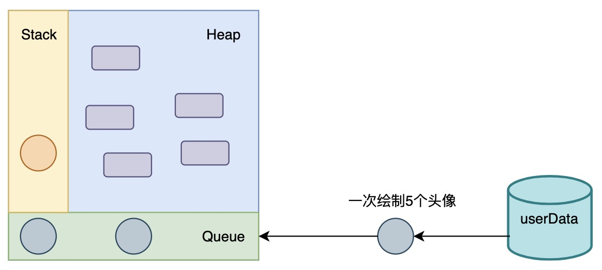
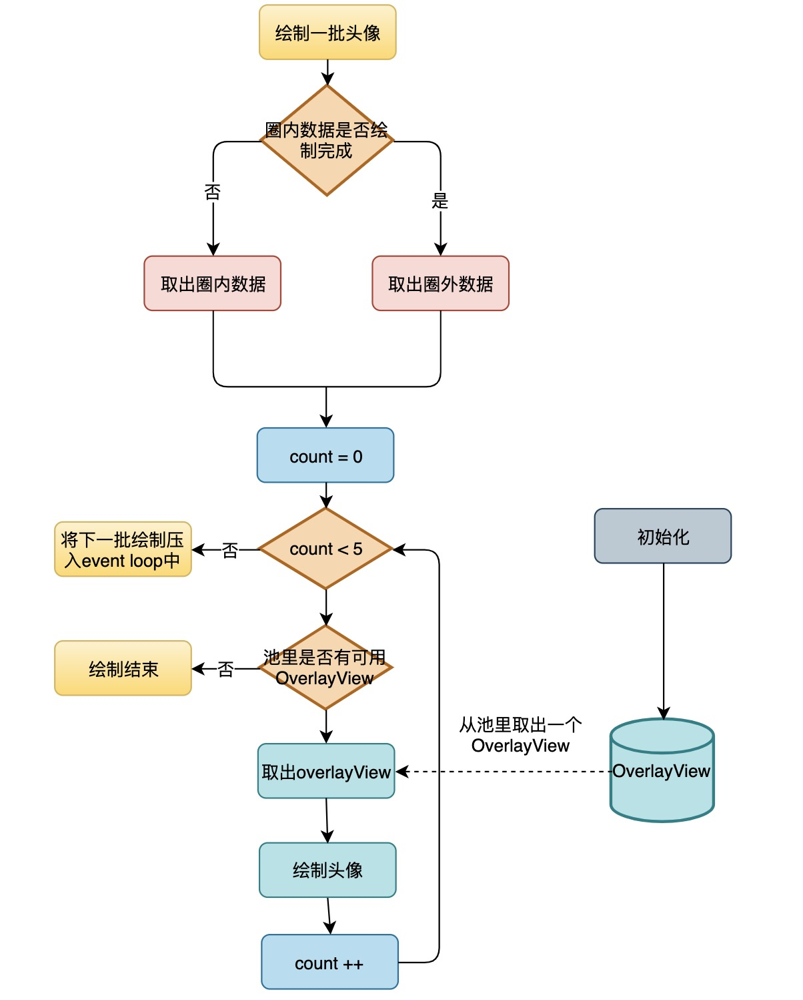
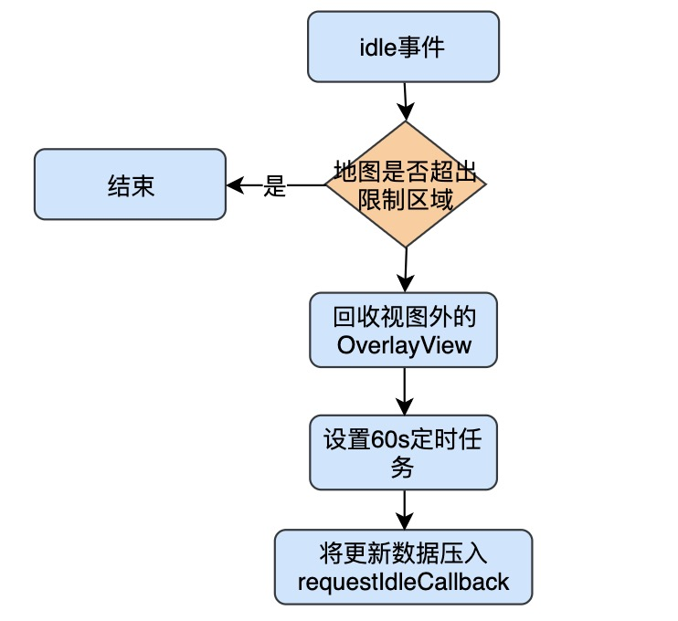
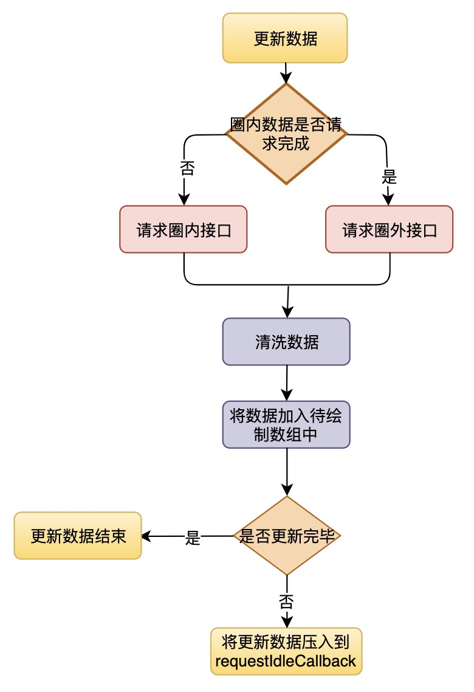
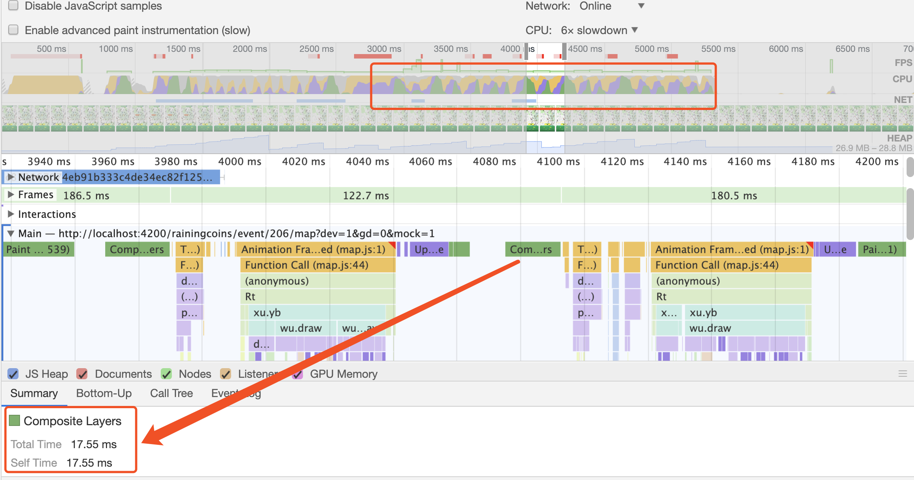
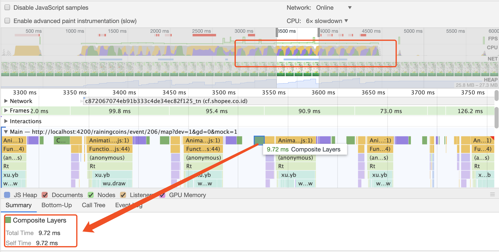
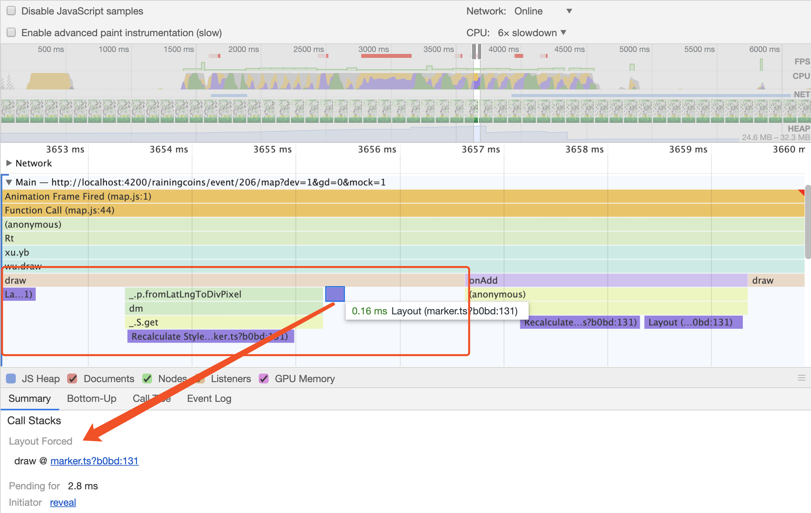
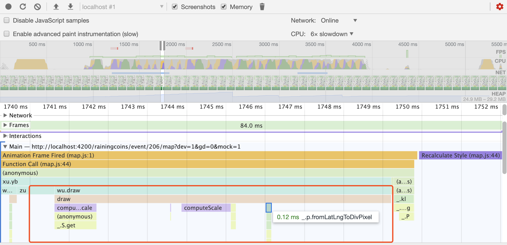
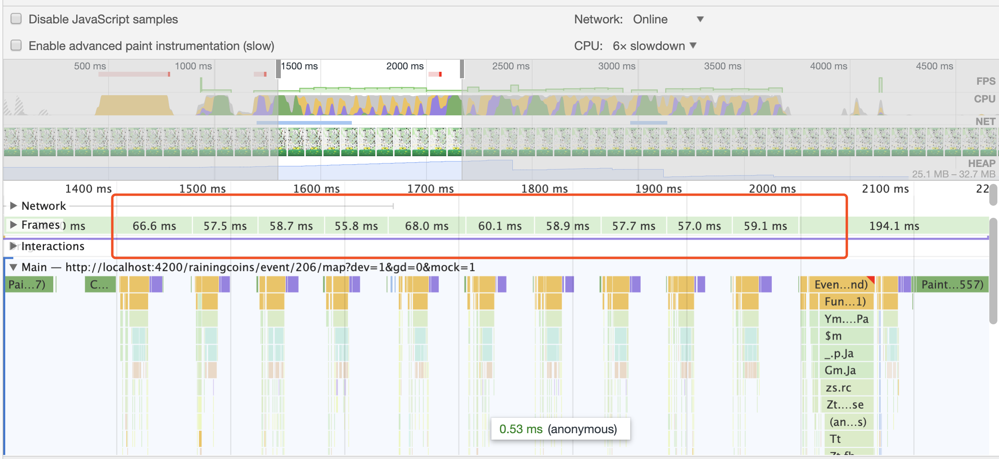
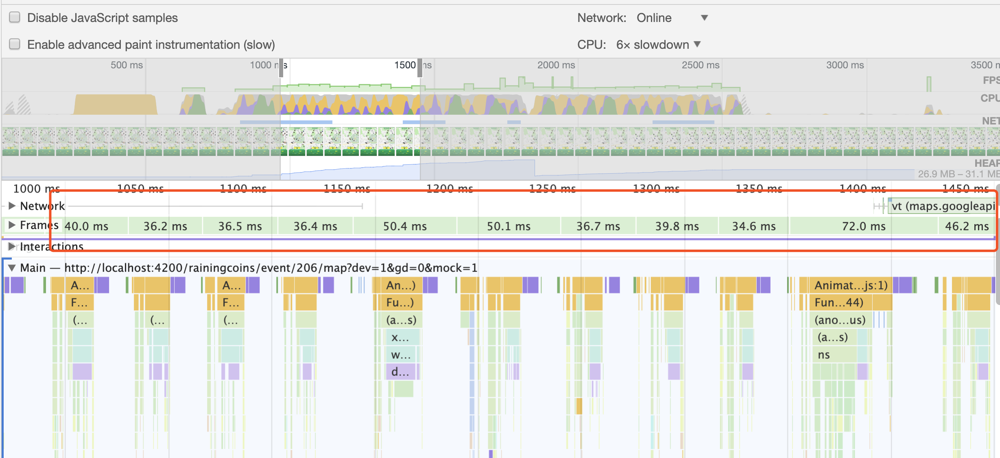

## 背景

最近老板来了一个新需求，地理位置组团。其中一个功能点，就是用户可以进入地图页面，查看当前自身位置，且扫描圈内和圈外其他玩家，将玩家头像显示在地图页面上，标明玩家在哪个位置。老板说，在地图上要可以同时显示 200 个玩家头像，且保证页面流畅；Android6 的手机上，在拖拽，缩小放大时，不能出现明显的卡顿，必须保证用户体验。在拖拽，缩小或者放大等改变地图可视范围时，或则停留时间超过 60s，需要更新当前地图上的用户头像。

## 思路

需求其实不复杂，但是要做到老板的要求，就没那么简单了。android 6 的机型，这个应该是几年前的千元机了。这种机型的硬件本来就很差，不用想，在地图上一次性绘制 200 个头像，肯定会很卡。并且拖拽地图之后，又清空之前已经绘制的 200 个头像，重新绘制新的 200 个，这个肯定会使页面出现明显的卡顿。要达到老板的要求，必须仔细的思考一下该怎么做了。

### 分批绘制

[浏览器对同一个域名的并发请求数量是有上限的](http://www.stevesouders.com/blog/2008/03/20/roundup-on-parallel-connections/)，一般不会超过 8 个，就算一次发送 200 个图片请求，也是分批返回的。结合这一点，我也可以分批绘制，200 个头像，我可以分成 40 次绘制，每次只绘制 5 个，上一次的 5 个绘制完成了，才开始绘制下一批的 5 个。带着这种想法，就去找 PM 商量，跟他说明浏览器请求限制和性能上的考虑，能不能不要一次性全部显示，可以慢慢显示出来。PM 接受了这种方式，但是要优先显示圈内的头像。

为了达到可以分批绘制，且圈内的要优先绘制，容易就想到了，[**优先级队列**](https://en.wikipedia.org/wiki/Priority_queue)，优先级高的先出队列。这里，圈内头像就比圈外的优先级高。每一次从队列里取出 5 个头像来绘制，直到队列为空。如果同步的循环调用每一批绘制，直到队列为空，那么肯定会使得当前帧执行时间超过 16ms，且会超过很长时间，浏览器一直会被阻塞，使得其他用户事件都不得到响应，表现出来就是页面卡死了，这样肯定不行的。利用[javascript 的 event loop](https://developer.mozilla.org/en-US/docs/Web/JavaScript/EventLoop)，可以将每次绘制 5 个头像，这样一个功能包装在一个任务里，将 200 个头像就可以分成 40 个这样的任务，然后将每个任务分别加入到 javascript 的执行队列里。这样，可以异步的方式，将头像分批绘制出来，页面也不会出现卡死。



```typescript
// 伪代码，
// 将一次绘制5个头像包装成一个任务，放到event loop 里
const PER_COUNT = 5
function paintMarker(type) {
  // 优先获取圈内数据
  const userData = getUserData(type)

  if (!userData.length) {
    if (type === "nearbyMarker") {
      // 圈内绘制完了，继续绘制圈外的
      this.engine.pushDraw(() => {
        this.paintMarker("externalMarker")
      })
    }
    return
  }

  // 一次绘制5个
  let start = 0
  let notAvailable = false
  while (start < PER_COUNT && start < userData.length) {
    const user = userData[start]
    // 从实例池取出一个
    const marker = this.pools.take()
    if (!marker) {
      notAvailable = true
      break
    }
    // 开始绘制头像
    marker.draw(user)
    start = start + 1
  }

  // 将下一次绘制任务加入到event loop里
  if (!notAvailable) {
    this.engine.pushDraw(() => {
      this.paintMarker()
    })
  }
}
```

### 重复利用

对于地图页面，绘制的上限是 200 个头像。每次改变了地图的范围，比如移动，缩小，放大地图等操作，需要重新请求接口数据，获得当前新的地图可视范围内的玩家头像数据，然后将新的玩家头像绘制出来。由于 google map 在绘制自定义图形时，需要生成一个 google map 的 OverlayView 对象，实现它的 onAdd 和 onDraw 方法。如果，我们每次绘制新的头像都新建一个 OverlayView 对象，势必会增加浏览器的内存使用，且新建 OverlayView 对象也是需要花费一定时间的。为了高效绘制，且花费尽量少的内存，可以事先创建一个容量为 200 的 OverlayView 对象池，在每次改变地图范围操作之后，可以先回收那些不在可视范围内的 OverlayView 对象，放入池中；然后在绘制新的头像时，直接从池中取一个 OverlayView 对象使用就可以了，这样，即减少了内存的使用，也减去了每次新建 OverlayView 对象花费的时间。当池中没有可用 OverlayView 对象时，说明当前页面已经绘制了 200 个头像，达到了上限，不需要在绘制其他头像了。



```typescript
// 伪代码
// 初始化pools
const MAX_COUNT = 200
function init() {
  // 初始marker实例池
  this.pools = new MarkerPool(MAX_COUNT)

  // 监听idle事件
  google.maps.event.addListener(this.map, "idle", () => {
    this.isIdle = true
    // 回收可视区域外的marker
    this.reclaimMarker()
    // 设置定时刷新数据
    this.initRefreshTimer()
    // 请求用户数据
    this.fetchUserData("nearbyMarker", { users: [] }, true)
  })
}
```

### idle 时机执行

为了保证在操作地图的时候有最好的流畅度，比图拖拽，缩小，放大等，我们不做任何事情，即不绘制头像，也不请求数据，就仅仅让 google map 自己改变地图。当 google map 状态是 idle 时，我们再去做绘制头像或者更新数据等。google map 提供了 idle 事件，我们只需要监听这个事件就可以了。



更新数据，就是把接口请求来的数据，先做一些清洗工作，然后把合格的数据更新到待绘制头像队列里；可以把它的优先级降到最低，只有当前绘制头像队列为空时，才去执行更新数据任务。它的执行时间基本是固定可预估的，不会特别延误到当前帧的绘制，可以把它放在[requestIdleCallback](https://developer.mozilla.org/en-US/docs/Web/API/Window/requestIdleCallback)队列里去，通过增加一个超时执行时间内，只有当浏览器是 idle 时或者超过了某一个时间，才会去执行。



```typescript
// 伪代码
// 将更新数据操作放入到requestIdleCallback
function fetchUserData(type, userData, fromStart = true) {
  // 加入到待绘制数组中
  if (data.users.length) {
    this.patchUserData(data.users, type)
  }
  const nextType
  // ... //
  this.fetchUserDataApi(
    this.myLocation,
    this.mapBounds,
    fromStart,
    nextType
  ).then(data => {
    this.engine.pushRequest(() => {
      this.fetchUserData(nextType, data)
    })
  })
}
```

## 优化

浏览器的理想帧率是 60fps，如果一直稳定在 60fps 左右，那么将是非常流畅的。对于 Android 6 这样的机型，肯定是达不到 60fps 的，只能尽可能提高它的帧率，让它能稳定在 30fps 左右，基本上就可以达到要求了。对于一些细节的优化，特别是要避免 layout reflow 的情况，同样严重影响页面流畅度。下面的 performance 分析，我都是将 CPU 降低 6 倍，且绘制了 200 个头像，拖动地图页面得到的。

### 避免设置 zIndex

刚开始，给每个 OverlayView 都设置了`zIndex = '50'`，当前用户的 OverlayView 设置了`zIndex = '80'`，这样当前用户总是显示在最上层。这样更改头像样式能达到设计稿的视觉效果，但是这将造成页面非常卡顿，具体我们通过 chrome performance 调试得到结果。



页面的帧率平均是 8fps，也就是绘制一帧需要花费平均 122ms 左右。先不看其他影响帧率的地方，就看看 Composite Layers 步骤，它就花费了 17.56ms。理想 60fps 的情况下，一帧的绘制总共才花费 16.67ms 左右。显然，我们的 Composite Layers 步骤严重影响性能。Composite Layers 是浏览器一帧绘制工作中的最后一个步骤，合成层。每当设置新的 zIndex 值，都将会创建新的 layer，同一个 zIndex 的值的元素，最后会被绘制在同一个 layer 中，具体可以查看[使用 zIndex](https://developer.mozilla.org/en-US/docs/Web/CSS/CSS_Positioning/Understanding_z_index/Adding_z-index)。去掉 zIndex，我们再来看看结果。



去掉了 zIndex 之后，现在页面的帧率平均是 10fps，绘制一帧需要花费的平均时间是 100ms 了。在 Composite Layers 阶段花费的时间基本是 9ms 左右了。显然是有所提升的。

### 避免在 onDraw 里访问 offsetWidth 等触发 reflow

由于在拖拽地图时，google map 会不停的调用我们实现的 onDraw 方法。在 onDraw 方法里，可以随意设置当前 OverlayView 对象的样式和位置。未优化之前，是根据当前容器 div 的宽高和当前经纬度换算出来的坐标计算得到当前 OverlayView 对象的 left 和 top。

```typescript
// 部分代码如下
/* 继承 google.maps.OverlayView，实现draw */
function draw() {
  const overlayProjection = this.overlayView.getProjection()
  const posPixel = overlayProjection.fromLatLngToDivPixel(this.latLng)
  const scale = this.computeScale()

  // Resize the image's div to fit the indicated dimensions.
  const div = this.el
  let x = posPixel.x - div.offsetWidth / 2
  let y = posPixel.y - (div.offsetHeight * (scale + 1)) / 2
  div.style.transform = `scale(${scale})`
  div.style.left = x + "px"
  div.style.top = y + "px"
}
```



draw 方法中，访问`div.offsetWidth`和 `div.offsetHeight`，强制触发 reflow，这将非常影响性能。我们可以优化成，头像显示成固定宽高。例如，`let x = posPixel.x - 32 / 2;`和`let y = posPixel.y - 32 * (scale + 1) / 2;`。



可以看到，在 draw 方法里，现在就没有 Layout 和 Recalculate Style 的操作了。现在帧率平均基本是 12fps 了，绘制一帧需要花费的平均时间是 84ms 了。又有所提高了。

### 必要降级，去掉不必要的元素

对于 Android 6 等机型，完全没有必要还为每个头像都绘制出一个底部三角形。底部三角形，会额外创建一个 div 元素，如果是 200 个头像，页面就会多出了 200 个元素。并且在拖拽等操作，频繁的调用 onDraw，会重新绘制每个头像，也会重新绘制每个底部三角形，这样也增加了绘制所需要的时间。对于 android 6 以下等低端机型，可以去掉底部三角形。



现在页面的帧率平均可以达到了 15fps，绘制一帧需要花费的平均时间是 68ms 了。

在优化这些小细节之后，在 CPU 降低到 6 倍慢，且页面绘制 200 个头像时，帧率从之前的 8fps 提高了 15fps，足足提升了一倍的性能。对于 Android 6 等极端机型，其实还可以再降级，从 200 个头像减少到 100 个。



头像降到 100 个之后，可以看到现在页面的帧率平均可以达到了 27fps，绘制一帧需要花费的平均时间是 36ms 了。帧率从之前的 8fps 提高了 27fps，足足提升了三倍多的性能。

## 小结

前端也可以使用一些基础的数据结构和算法，结合前端的一些知识，可以有比较好的实践。在开始动手编码之前，可以先思考一下，大致的实现思路，是否可以有更优方案。当在低端机型上无法满足性能要求时，要学会与 PM 沟通，是否可以降级处理。在遇到性能瓶颈时，学会使用工具分析和定位问题。
