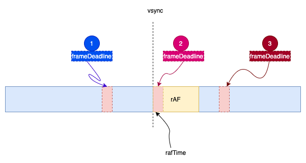
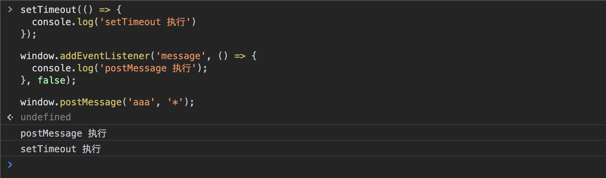

React 从 v16.0.0 开始，实现了异步渲染模式（Concurrency Mode），解决了之前 Stack Reconciler 采用同步更新的问题。异步渲染，实际上就是将一个大的渲染任务，分成很多个小的任务，每个任务执行完就交出主线程，使得其他线程可以处理其他事情（比如渲染，响应用户点击等）。最常见的实现方式就是使用`setTimeout`将这些小任务加到事件队列（event queue）里，利用浏览器的 [event loop](https://developer.mozilla.org/en-US/docs/Web/JavaScript/EventLoop) 来异步执行。本篇是 React Time Slice 系列中的第一篇，深入分析 React v16.0.0 是如何实现 requestIdleCallback polyfill。

为了尽可能地提高渲染性能，React 希望这些小的任务可以在浏览器空闲时间去执行。浏览器提供了[requestIdleCallback](https://developer.mozilla.org/en-US/docs/Web/API/Window/requestIdleCallback)来保证可以在空闲时间执行一些操作。但是它有兼容性问题，对于不支持 rIC 的浏览器，React 团队使用`requestAnimationFrame`和`postMessage`来实现，并且是自动调节`frame rate`的。下面是它的实现逻辑，

首先定义特殊的 message 事件，并监听`message`事件，

```javascript
// 定义message 事件名
var messageKey =
  "__reactIdleCallback$" +
  Math.random()
    .toString(36)
    .slice(2)

// 监听message
window.addEventListener("message", idleTick, false)
```

对于 rIC 的实现，使用 rAF 来保证在下一帧触发

```js
rIC = function(callback) {
  // 先是存储callback
  scheduledRICCallback = callback
  // 判断是否正在rAF调度
  if (!isAnimationFrameScheduled) {
    isAnimationFrameScheduled = true
    requestAnimationFrame(animationTick)
  }
  return 0
}
```

先将需要执行的`callback`保存起来，接着触发 rAF。

```js
var animationTick = function(rafTime) {
  isAnimationFrameScheduled = false
  if (!isIdleScheduled) {
    isIdleScheduled = true
    window.postMessage(messageKey, "*")
  }
}
```

在 rAF 触发函数里，调用`postMessage`，触发 message 事件。

```js
var idleTick = function(event) {
  // 检查是否内部触发的message，
  if (event.source !== window || event.data !== messageKey) {
    return
  }
  isIdleScheduled = false
  // 获取之前存的callback
  var callback = scheduledRICCallback
  scheduledRICCallback = null
  if (callback !== null) {
    // 真正执行callback
    callback(frameDeadlineObject)
  }
}
```

在 message 事件里，才是真正执行`callback`。看完它的实现，有几个疑惑，

1. 为什么不直接要用 rAF？
2. 为什么不直接使用`postMessage`？
3. 为什么不使用`setTimeout`?

## 如果用 rAF 实现

我们知道 rIC 的触发时机是，如果在一帧里有剩余时间，则在当前帧的结尾处触发 rIC，或者是当前页面没有更新，是处于空闲的状态，也会触发 rIC。rAF 的触发时机是，在一帧的开头。


如果直接使用 rAF，Fiber tree 的更新操作会在 rAF 里执行，整体增加了当前帧完成所需的时间，会导致帧率下降。

## 如果用 postMessage 实现

`postMessage`的常用使用场景是，不同域的父子页面(使用 iframe)之间通信，至于具体使用方式，可以自己查看[MDN 文档](https://developer.mozilla.org/en-US/docs/Web/API/Window/postMessage)。但在这里，它的用途并不涉及跨域通信，仅仅是异步调用。如果只是使用`postMessage`，实现代码大致如下，

```js
var scheduledRICCallback = null
var isIdleScheduled = false

window.addEventListener("message", idleTick, false)

var idleTick = event => {
  if (event.source !== window || event.data !== messageKey) {
    return
  }
  isIdleScheduled = false
  var callback = scheduledRICCallback
  scheduledRICCallback = null
  if (callback !== null) {
    var start = Date.now()
    callback({
      didTimeout: false,
      timeRemaining: function() {
        // Is there maximum value that timeRemaining() will return? Yes, it’s currently 50ms
        // see: https://developers.google.com/web/updates/2015/08/using-requestidlecallback#faq
        return Math.max(0, 50 - (Date.now() - start))
      },
    })
  }
}

var ric = callback => {
  scheduledRICCallback = callback
  if (!isIdleScheduled) {
    isIdleScheduled = true
    window.postMessage(messageKey, "*")
  }
}
```

这样实现的主要问题是，对于当前帧剩余时间的计算是不准确的，它总是默认还有 50ms 的剩余时间，在帧率为 60fps 时，一帧的执行时间才大致 17ms 左右。所以 React 团队使用 rAF 来动态算出当前帧率，计算出当前帧执行截止时间。动态计算当前帧率逻辑大致如下，

1. 初始以当前帧率为 30fps，则每一帧执行时间大约为 33ms
2. 如果连续 2 帧的执行时间都小于当前帧率下的每帧执行时间，则表明当前帧率有待提高

```js
// 帧截止时间
var frameDeadline = 0
// 初始当前帧率为30fps，则帧执行时间为33ms
// 上一帧执行时间
var previousFrameTime = 33
// 30fps下，每一帧执行时间
var activeFrameTime = 33

// 计算rIC参数，剩余时间
var frameDeadlineObject = {
  timeRemaining:
    typeof performance === "object" && typeof performance.now === "function"
      ? function() {
          return frameDeadline - performance.now()
        }
      : function() {
          return frameDeadline - Date.now()
        },
}

var animationTick = function(rafTime) {
  // 计算出下一帧执行时间，这里的frameDeadline为上一帧的截止时间
  var nextFrameTime = rafTime - frameDeadline + activeFrameTime
  // 如果连续2帧的执行时间都小于帧执行时间，则说明可以提高帧率
  if (nextFrameTime < activeFrameTime && previousFrameTime < activeFrameTime) {
    if (nextFrameTime < 8) {
      // 最高提高的120fps，
      nextFrameTime = 8
    }
    // 取连续2帧中执行时间较大的，防止执行超过帧截止时间
    activeFrameTime =
      nextFrameTime < previousFrameTime ? previousFrameTime : nextFrameTime
  } else {
    previousFrameTime = nextFrameTime
  }
  // 计算出帧截止时间
  frameDeadline = rafTime + activeFrameTime
}
```

调整逻辑示意图如下，React 的实现中没有针对场景 1 做处理，即不会将帧率调整降低，



1. 第一种场景，下一帧的开始时间大于上一帧的截止时间，说明估算的帧执行时间偏小，帧率可以调整降低
2. 第二种场景，下一帧的开始时间等于上一帧的截止时间，说明估算的帧执行时间正确，帧率不需要调整
3. 第三种场景，下一帧的开始时间小于上一帧的截止时间，说明估算的帧执行时间偏大，帧率可以调整增高

## 为什么不要用 setTimeout

既然`postMessage`的作用是异步调度，那么为什么不使用`setTimeout`呢，它同样是可以实现异步调度？

如果不使用 rIC，我们是无法真正准确的确定帧空闲时机的。上面使用`postMessage`实现异步调度，是为了交出 js 线程执行权，让渲染相关线程得到执行。上面结合使用 rAF 动态计算出当前帧率，得出帧截止时间，从而可以较准确的计算得到 rIC 中参数`timeRemaining`。需要注意的是，帧截止时间是在 rAF 中以当前帧开始时间为基准算的，就是说，我们默认`callback`在计算完成帧截止时间之后就开始执行的。但是如前面所说，我们不能直接在 rAF 里执行`callback`，而是使用异步调度。异步调度越早开始，那么`timeRemaining`得到值的误差就会越小。例如，帧开始时间是 10ms，以 10ms 为基准计算得到帧截止时间为 30ms，也就是说帧执行时间会总共有 20ms，如果异步调度是在 5ms 之后开真正执行`callback`，那么在`callback`中调用`timeRemaining`得到的时间只有`30 - 5 = 25`，比预期的少了 5ms。

为了减少误差，React 使用了`postMessage`，而不是`setTimeout`，因为`postMessage`比`setTimeout`要早得到执行。对于现代浏览器来说，使用`setTimeout(callback,0)`，会存在 4ms 的执行间隔限制。

> <https://html.spec.whatwg.org/multipage/timers-and-user-prompts.html#timers>
>
> 1. If timeout is less than 0, then set timeout to 0.
> 2. If nesting level is greater than 5, and timeout is less than 4, then set timeout to 4.

考虑如下代码，在`setTimeout`里调用`setTimeout`，当`cb`执行 5 次之后，则后面`cb`必须至少间隔 4ms 执行。

> **Note**: 4 ms is [specified by the HTML5 spec](http://www.whatwg.org/specs/web-apps/current-work/multipage/timers.html#timers) and is consistent across browsers released in 2010 and onward. Prior to (Firefox 5.0 / Thunderbird 5.0 / SeaMonkey 2.2), the minimum timeout value for nested timeouts was 10 ms.

```js
function cb() {
  setTimeout(cb, 0)
}
setTimeout(cb, 0)
```

使用`postMessage`可以较早于`setTimeout`执行，下面是 MDN 上的描述

> To implement a 0 ms timeout in a modern browser, you can use [`window.postMessage()`](https://developer.mozilla.org/en-US/docs/Web/API/Window/postMessage) as [described here](http://dbaron.org/log/20100309-faster-timeouts).

React 团队实现这个 polyfill 的作者也做了[如下说明](https://github.com/facebook/react/pull/8833#issuecomment-273974686),

> I originally used `setTimeout(idle, 0)` but since it adjusts to at least 4ms and sometimes more, you end up dropping a bit more than I'd like from the available frame time. However, in practice `postMessage` can be delayed up to 4ms anyway because of the internal browser scheduling around the frame.

我自己也亲自在 Chrome(84.0.4147.125)中做了测试如下，



## 小结

React v16.0.0 中实现 rIC 的核心思路就是，使用 rAF 动态计算帧率，使用`postMessage`实现异步调用。当然，它的实现中也有一些场景没有考虑，有一些不足之处，

1. 浏览器会对 rAF 进行一些优化，有些情况不会触发 rAF，例如切换到后台时；如果 rAF 得不到执行，那么 callback 就不会按照期望得到触发。
2. 它仅仅只支持单个 callback 执行，如果多次执行`rIC(callback)`，也只会有最后一个 callback 被执行，并不是真正符合 rIC 规范。在 [v16.4.0 中支持了多个 callback](https://github.com/facebook/react/pull/12746)。
3. 当前实现并未支持`timeout`参数，在 [v16.2.0 中就实现了](https://github.com/facebook/react/commit/9b36df86c6ccecb73ca44899386e6a72a83ad445#diff-5fd92c13da957dbd337d4583340fab8b)
4. 当前并未支持`cancelIdleCallback`，在 [v16.4.0 中实现了](https://github.com/facebook/react/pull/12746)

## 资料

- [requestIdleCallback polyfill - React v16.0.0 中实现](https://github.com/facebook/react/pull/8833)
- [Minimum delay and timeout nesting](https://developer.mozilla.org/en-US/docs/Web/API/WindowOrWorkerGlobalScope/setTimeout#Minimum_delay_and_timeout_nesting)
- [setTimeout with a shorter delay](https://dbaron.org/log/20100309-faster-timeouts)
