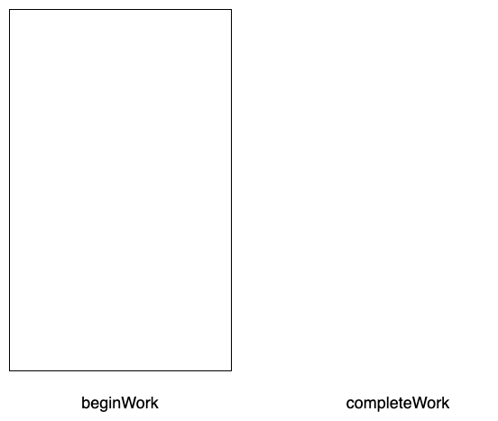

最近给组内同事做了一次技术分享，有关 React fiber 的。内容涉及了 Stack reconciler，Fiber reconciler，以及它们之间的区别。事后整理了下文字稿，篇幅有点长，内容如下。

## Jsx && element

react 中，一个 virtual dom 是使用 element 来表示的。element 结构如下，

```typescript
export type ReactElement = {
  $$typeof: any
  type: any
  key: any
  ref: any
  props: any
  _owner: ReactInstance
}
```

Jsx 语法会被 Babel 编译为 `React.createElement` 形式，最后返回的都是 element 对象。

## Stack reconciler

### InternalComponent Tree

在 v16 之前，react 采用 Stack reconciler 策略来更新 virtual dom 的状态。它会给每一个 element 对象都生成一个 InternalComponent（react 内部对象，不会暴露出去），这样 Element tree 会组织成 InternalComponent tree。

```jsx
[object CompositeComponent] {
  currentElement: <App />,
  publicInstance: [ object App],
  renderedComponent: [object CompositeComponent] {
    currentElement: <Main />,
    publicInstance: null,
    renderedComponent: [object DOMComponent] {
      currentElement: <div />,
      node: [object HTMLDivElement],
      renderedChildren: {
        '.0' : [object DOMComponent] {
          currentElement: <button />,
          node: [ object HTMLButtonElement],
          renderedChildren: null
        },
        '.1' : [object DOMComponent] {
          currentElement: <span />,
          node: [ object HTMLSpanElement],
          renderedChildren: null
        }
      }
    }
  }
}
```

每一个 InternalComponent 通过 `renderedComponent` 或者`renderChildren`来关联当前组件`render`出来的 element。通过这样的引用关系，它们就在 react 内部形成了一棵树。


**需要注意的是，如果 children 是一个数组，那么`renderChildren`就会有多个子节点**。可以仔细再观察一下，其实叶子节点都是 HostComponent，因为视图最后是通过 HostComponent 渲染的。我们再来完整看一下 Element tree 与 InternalComponent tree 的联系，


### Recursion Update

在 Stack Reconciler 策略中，react 采用 **递归**的方式来生成或者更新 InternalComponent tree。下面我们以更新场景，通过伪代码简单看下它的实现。每一个 InternalComponent 实例都会有一个 `receiveComponent`的方法，它定义如下,

```typescript
// 我们忽略其他参数
// nextElement 就是更新的element对象，它是通过render生成的。
function receiveComponent(nextElement: ReactElement): void
```

每次更新时，通过组件的`render`方法返回新的 element 对象，然后会调用当前 InternalComponent 的`receiveComponent`方法。

```js
class InternalComponent {
  receiveComponent(nextElement) {
    var prevElement = this._currentElement

    this.updateComponent(prevElement, nextElement)
  }
  updateComponent(prevParentElement, nextParentElement) {
    // 更新当前节点的props和state
    var prevProps = prevParentElement.props
    var nextProps = nextParentElement.props
    var nextState = this._processPendingState(nextProps, nextContext)
    this._publicInstance.props = nextProps
    this._publicInstance.state = nextState

    // 更新子节点
    var prevComponentInstance = this._renderedComponent
    // 上次render出来的element
    var prevRenderedElement = prevComponentInstance._currentElement
    // 调用component 的 render，获取新的element
    var nextRenderedElement = this._publicInstance.render()
    // 判断是否是仅仅需要更新子节点
    if (shouldUpdateReactComponent(prevRenderedElement, nextRenderedElement)) {
      // 子节点，递归调用receiveComponent
      prevComponentInstance.receiveComponent(nextRenderedElement)
    } else {
      // 否则，卸载旧的子节点，然后走新建子节点流程
    }
  }
}
```

通过递归的方式，利用浏览器调用栈来保存当前执行中的一些数据。这个过程是不可以中断的，必须等到执行栈为空，才可以处理其他事情。这样带来的问题如下，

1. 如果当前组件层次非常深，或者某一个组件更新耗时非常长，用户操作（点击，输入）不能得到立即响应，表现出卡顿
2. 对于动画场景而言，如果一帧时间超过 16ms，就会出现掉帧，动画不流畅
3. 对于一些低优先级的组件（比如隐藏，屏幕外），也会同样占用更新资源，没有优先级之分。

## Fiber reconciler

为了解决 Stack reconciler 出现的问题，react 团队开始采用新架构，希望可以实现一下几个目标，

> 1. Ability to split interruptible work in chunks.
> 2. Ability to prioritize, rebase and reuse work in progress.
> 3. Ability to yield back and forth between parents and children to support layout in React.
> 4. ...

### Fiber Tree

类似 Stack reconciler，react 会通过 [createFiberFromElement](https://github.com/facebook/react/blob/v16.13.1/packages/react-reconciler/src/ReactFiber.js#L743) 给每一个 element 对象生成一个 Fiber node，Element tree 也会以这样的层次关联形式一颗 Fiber tree

```json
[object FiberNode] {
  type: App,
  stateNode: [ object App],
  return: [ object FiberNode],
  sibling: null,
  child: [object FiberNode] {
    type: Main,
    stateNode: null,
    return: [ object FiberNode],
    sibling: null,
    child: [object FiberNode] {
      type: "div",
      stateNode: [object DOMComponent],
      return: [ object FiberNode],
      sibling: null,
      child: [object FiberNode] {
        type: "button",
        stateNode: [object HTMLButtonElement],
        return: [ object FiberNode],
        sibling: [object FiberNode] {
          type: "span",
          stateNode: [object HTMLSpanElement],
          return: [ object FiberNode],
          sibling: null,
          child: null
        },
      }
    }
  }
}
```

每一个 Fiber node 的 return 指向的是当前节点的父节点，child 指向当前节点的第一个子节点，如果有多个子节点，则其他子节点通过 sibling 链接起来。


**注意跟 InternalComponent tree 中不同是，每一个节点，最多只能有一个 child**。一个 [Fiber node](https://github.com/facebook/react/blob/v16.13.1/packages/react-reconciler/src/ReactFiber.js#L128-L257)，也是一个对象，除了 return ，child，sibling 之外，列觉一些比较重要的信息如下，

1. stateNode，存储 class component instance 或者 dom
2. type，跟 react element type 一致
3. alternate，指向 workInProgress 中对应 Fiber node
4. [tag](https://github.com/facebook/react/blob/769b1f270e1251d9dbdce0fcbd9e92e502d059b8/packages/shared/ReactWorkTags.js)，标志当前 Fiber node 组件的类型，根据 react element type 而得出。
5. [effectTag](https://github.com/facebook/react/blob/b87aabdfe1b7461e7331abb3601d9e6bb27544bc/packages/shared/ReactSideEffectTags.js)，当前 Fiber node 一些副作用的任务类型，有 Placement，Update，Remove 等
6. effectNext，指向下一个需要执行 effect 的 Fiber node；通过它，可以把 Fiber node 链接成一个单链表；然后在 commit 阶段，遍历 effectNext 执行更新。

每一个 Fiber node，可以理解为一个最小更新单元(a unit of work)， 不同的组件(tag)，在更新阶段会有不同的事情要处理，比如（Placement，Update，LifeCycle。。。），这些不同的任务，通过 effectTag 来区分。

使用 Fiber reconciler 之后，react 将一次完整的更新分为 2 个阶段，

1. 第一个阶段是 render 阶段，从根组件开始，构建出一个 workInProgress tree，这个阶段是可以中断的，异步的。一些在 render 阶段执行的生命周期方法（比如，willMount，willReceiveXXX，render）等就被要求是无副作用的，可多次执行的。
2. 第二个阶段就是 commit 阶段，render 阶段完成之后，就可以得到一颗完整的 workInProgress tree。commit 阶段就是将这颗树的状态同步更新到视图上，且执行一些有副作用的方法（比如，didMount，didUpdate）。为了保持视图状态的一致性，所以这个阶段是同步的，不可中断的。


### render 阶段

render 阶段就是重新构建 workInProgress tree，它会如下类似执行，

```js
// concurrent 模式下，构建 workInProgress tree
function workLoopConcurrent() {
  // Perform work until Scheduler asks us to yield
  while (workInProgress !== null && !shouldYield()) {
    workInProgress = performUnitOfWork(workInProgress)
  }
}

// sync 模式下，构建 workInProgress tree
function workLoopSync() {
  // Already timed out, so perform work without checking if we need to yield.
  while (workInProgress !== null) {
    workInProgress = performUnitOfWork(workInProgress)
  }
}
```

通过对比可以得到，concurrent 模式和 sync 模式的区别就是在构建 workInProgress tree 时是否可以中断。

```js
function performUnitOfWork(unitOfWork) {
  // 获取WIP node 对应的current node
  const current = unitOfWork.alternate

  // 调用beginWork，对当前 node 处理，得到 child | null
  // 如果 next 为 null，则表明遍历到最底部了，没有子节点了
  let next = beginWork(current, unitOfWork)
  if (next === null) {
    // 如果没有child了，就开始 complete 当前 node
    // 此时，unitOfWork就是 child，如果当前 node 有 sibling，则返回 sibling，
    next = completeUnitOfWork(unitOfWork)
  }
  return next
}
```

`performUnitOfWork` 是 DFS（Depth-first search）遍历过程，先将当前节点执行`beginWork`，然后开始找子节点，对子节点执行`beginWork`，如果没有子节点了，就执行`completeWork`。

```js
function beginWork(current, workInProgress) {
  // statNode会存component instance 或者 dom node
  const instance = workInProgress.stateNode

  // 这里只是列举了class component情况，注意如果是function component会有不同处理
  const nextChildren = instance.render()

  // 这里会根据render出来的element去创建Fiber，
  // 有其他逻辑，比如根据key来处理，
  if (current === null) {
    workInProgress.child = mountChildFibers(workInProgress, null, nextChildren)
  } else {
    workInProgress.child = reconcileChildFibers(
      workInProgress,
      current.child,
      nextChildren
    )
  }
  // 返回child fiber
  return workInProgress.child
}
```

`beginWork`会根据不同的`tag`来做不同的处理，`effectTag`也是在此方法中生成的，具体代码没有列举出来。

```js
function completeUnitOfWork(unitOfWork) {
  // Attempt to complete the current unit of work, then move to the next
  // sibling. If there are no more siblings, return to the parent fiber.
  workInProgress = unitOfWork
  do {
    const current = workInProgress.alternate
    const returnFiber = workInProgress.return

    //complete task
    completeWork(current, workInProgress)

    //这里省略了effectNext的生成过程
    // 。。。

    const siblingFiber = workInProgress.sibling
    if (siblingFiber !== null) {
      // If there is more work to do in this returnFiber, do that next.
      return siblingFiber
    }
    // Otherwise, return to the parent
    workInProgress = returnFiber
  } while (workInProgress !== null)

  // We've reached the root.
  if (workInProgressRootExitStatus === RootIncomplete) {
    workInProgressRootExitStatus = RootCompleted
  }
  return null
}
```

当子节点为`null`时，就会进入`completeUnitOfWork`，它会先对当前节点执行`completeWork`，如果有兄弟节点，则直接返回兄弟节点（兄弟节点后面也会进入`beginWork` -> `completeWork`流程），否则就对父节点执行`completeWork`。对于我们上面的例子，执行流程如下，

```txt
beginWork App -> beginWork Main -> beginWork div -> beginWork button ->  completeWork button
																																								    |
																																								    v
completeWork App <-	completeWork Main <- completeWork div	<- completeWork span <-	beginWork span
```

类似于执行栈的调用，

<p>
  
</p>

<!--  -->

在`completeWork`之后，根据节点的`effectTag`来决定是否将当前节点加入到`effectNext`链表中去。

```js
const effectTag = workInProgress.effectTag

// Skip both NoWork and PerformedWork tags when creating the effect
// list. PerformedWork effect is read by React DevTools but shouldn't be
// committed.
if (effectTag > PerformedWork) {
  if (returnFiber.lastEffect !== null) {
    returnFiber.lastEffect.nextEffect = workInProgress
  } else {
    returnFiber.firstEffect = workInProgress
  }
  returnFiber.lastEffect = workInProgress
}
```


类似上面这颗树，得到的 effect List 如下，


这样做的好处是，在 commit 阶段只需遍历`effectNext`就可以了，而不需要遍历整颗树。

### commit 阶段

commit 阶段就会开始真正的更新视图了，它会处理如下事情

1. 在更新之前，执行一些方法，比如是`getSnapshotBeforeUpdate`，获取更新之前的状态
2. 执行更新，包括，dom 的更新，创建，删除等
3. 将 workInProgress tree 切换为 current tree，因为视图已经根据 workInProgress 更新了
4. 之前更新之后的一些方法，比如`componentDidMount`，`componentDidUpdate`。

代码大致如下，

```js
function commitRoot(root) {
  // finishedWork 就是 WIP tree
  const finishedWork = root.finishedWork
  root.finishedWork = null

  // Get the list of effects.
  // 从RootFiber的firstEffect开始
  let firstEffect = finishedWork.firstEffect || finishedWork

  if (firstEffect !== null) {
    // The first phase a "before mutation" phase. We use this phase to read the
    // state of the host tree right before we mutate it. This is where
    // getSnapshotBeforeUpdate is called.
    commitBeforeMutationEffects()

    // The next phase is the mutation phase, where we mutate the host tree.
    // 包括 Placement | Update | Deletion | Hydrating
    // componentWillUnmount,
    commitMutationEffects(root)

    // The work-in-progress tree is now the current tree. This must come after
    // the mutation phase, so that the previous tree is still current during
    // componentWillUnmount, but before the layout phase, so that the finished
    // work is current during componentDidMount/Update.
    root.current = finishedWork

    // The next phase is the layout phase, where we call effects that read
    // the host tree after it's been mutated. The idiomatic use case for this is
    // layout, but class component lifecycles also fire here for legacy reasons.
    // componentDidMount/componentDidUpdate.
    commitLayoutEffects(root, expirationTime)
  } else {
    // No effects.
    root.current = finishedWork
  }
}
```

对于第 1，2，4 步，都是通过遍历`effectNext`来执行的。类似代码如下，

```js
// 遍历 nextEffect 链表
function executeEffect() {
  while (nextEffect !== null) {
    const effectTag = nextEffect.effectTag
    // 根据effectTag 做一些事情
    // 。。。
    nextEffect = nextEffect.nextEffect
  }
}
```

render 阶段 和 commit 阶段执行流程如下，


这个图里使用了`requestIdleCallback`来代表 react 里做时间分片；实际上，react 并不是使用的 rIC，而是自己使用 Message channel 实现的，至于为什么不使用 rIC，是因为 [rIC 在 1s 内执行频率不够](https://github.com/facebook/react/issues/13206#issuecomment-418923831)，感兴趣的可以自己去看看。

## 小结

从 stack reconciler 切换到 fiber reconciler，React 团队做的事情是，改变了遍历一颗树的方式。stack reconciler 中是使用递归，利用 JS 调用栈的方式，遍历 InternalComponent tree，这个过程是不可中断的，对于高优先级或者用户操作，需要等待执行栈为空才可以得到处理。而在 fiber reconciler 中，使用循环，通过`beginWork`，`completeWork`模拟入栈，出栈操作，达到遍历 fiber tree，这个过程可以根据`shouldYield`来停止，使用 workInProgress 来暂存当前节点，稍后可以继续恢复遍历。

## 参考资料

1. [React Fiber Architecture](https://github.com/acdlite/react-fiber-architecture)
2. [Contributing to fiber](https://github.com/facebook/react/issues/7942)
3. [Notes for Stack reconciler](https://reactjs.org/docs/implementation-notes.html)
4. [Inside fiber in depth](https://indepth.dev/inside-fiber-in-depth-overview-of-the-new-reconciliation-algorithm-in-react/)
5. [A Cartoon Intro to Fiber - React Conf 2017](https://www.youtube.com/watch?v=ZCuYPiUIONs)
