这篇学习和回顾canvas系列笔记的第二篇，完整笔记详见：[canvas核心技术](https://snayan.github.io/2018/07/09/canvas-%E6%A0%B8%E5%BF%83%E6%8A%80%E6%9C%AF/)

通过上一篇[canvas核心技术-如何绘制线段](https://snayan.github.io/2018/07/09/canvas%E6%A0%B8%E5%BF%83%E6%8A%80%E6%9C%AF-%E5%A6%82%E4%BD%95%E7%BB%98%E5%88%B6%E7%BA%BF%E6%AE%B5/)的学习，我们知道了如何去绘制线段。很多的线段的拼接就组成了图形了，比如常见的三角形，矩形，圆形等。

常见图形的绘制可以查看我的在线示例：[canvas shape](https://snayan.github.io/canvas-demo/?module=shape)

示例项目仓库地址：[canvas demo](https://github.com/snayan/canvas-demo)

### 图形

#### 三角形

先来看看如何绘制一个三角形。三角形就是由三条边组成，我们可以理解为三个线段组成。确定了三角形的三个顶点的坐标位置，然后用线连接起来。

```javascript
let point1 = [100, 30]; //顶底1
let point2 = [50, 100]; //顶点2
let point3 = [180, 120]; //顶点3
ctx.beginPath(); //开始一段新路径
ctx.moveTo(point1[0], point1[1]); //移动起点到顶点1
ctx.lineTo(point2[0], point2[1]); //连接顶点1与顶点2
ctx.lineTo(point3[0], point3[1]); //连接顶点2与顶点3
ctx.stroke(); //描边
//绘制顶点坐标显示出来
ctx.textAlign='center'; //绘制文本水平居中
ctx.fillText(`(${point1[0]},${point1[1]})`, point1[0], point1[1]-10); //绘制顶点1文本
ctx.fillText(`(${point2[0]},${point2[1]})`, point2[0]-25, point2[1]+5); //绘制顶点2文本
ctx.fillText(`(${point3[0]},${point3[1]})`, point3[0]+30, point3[1]+5); //绘制顶点3文本
```
<!--more-->
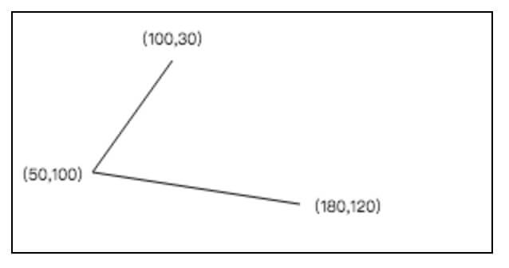

从图可以看到，我们还有一条边没有连接起来，这是因为我们只显示的连接了2个顶点。要想把第三条边也连接起来，我们有2种方式。第一种方式是，我们显示的连接顶点3与顶点1

```javascript
//第一种方式，显示的连接顶点3于顶点1
ctx.lineTo(point1[0], point1[1]);
```

第二种方式是，我们调用`ctx.closePath()`来按canvas自动帮我们连接未关闭的路径。

```javascript
//第二种方式，调用ctx.closePath()
ctx.closePath();
```

无论哪一种都可以实现我们想要三角形。其中第二种方式会用的比较多，因为它会帮我们自动关闭当前路径，也就是使当前路径形成一个闭合的路径，这个在填充时是非常有用的，下面会说的。最终，我们得到三角形图形如下

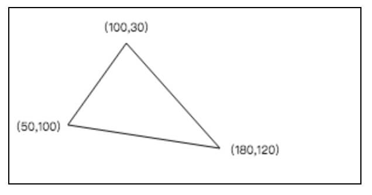

#### 四边形

通过三个顶点，我们可以绘制一个三角形，那么通过四个点，我们当然可以绘制出四边形，我们照例来通过四个点来绘制一个矩形。

```javascript
let point1 = [80, 30]; //p1
let point2 = [180, 30]; //p2
let point3 = [80, 110]; //p3
let point4 = [180, 110]; //p4
ctx.strokeStyle = 'green'; //设置描边颜色为绿色
ctx.beginPath(); //开始新的一段路径
ctx.moveTo(point1[0], point1[1]); //移动起点到p1
ctx.lineTo(point2[0], point2[1]); //连接p1与p2
ctx.lineTo(point4[0], point4[1]); //连接p2与p4
ctx.lineTo(point3[0], point3[1]); //连接p4与p3
ctx.closePath(); //关闭当前路径，隐士连接p3与p1
ctx.stroke(); //描边
//绘制顶点
ctx.textAlign = 'center';
ctx.fillText('p1', point1[0] - 10, point1[1] - 10);
ctx.fillText('p2', point2[0] + 10, point2[1] - 10);
ctx.fillText('p3', point3[0] - 10, point3[1] + 10);
ctx.fillText('p4', point4[0] + 10, point4[1] + 10);
```

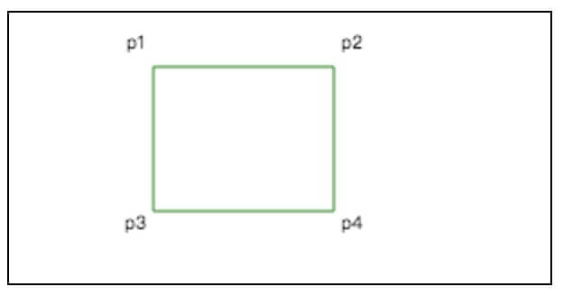

注意，我们的顺序是p1-->p2-->p4--P3，由于矩形是一种特殊的四边形，在canvas中提供了一种方法可以快速创建一个矩形，如果知道了p1的坐标和矩形的宽度和高度，那么我们就可以确定了其他三个点的坐标。

```javascript
//快速创建矩形
ctx.rect(point1[0], point1[1], 100, 80);
```

在创建矩形，我们总是使用`ctx.rect(left,top,width,height)`，但是绘制非矩形的四边形，还是得按照每个点去连接成线段来绘制。

#### 圆与圆弧

圆形可以看作是无数个很小的线段连接起来的，但是通过去定顶点来绘制圆形，显然不现实。canvas中提供了一个专门绘制圆形的方法`ctx.arc(left,top,radius,startAngle,endAngle,antiClockwise)`。各个参数的顺序意思是，圆心坐标X值，圆心坐标Y值，半径，开始弧度，结束弧度，是否逆时针。通过指定`startAngle=0`和`endAngle=Math.PI*2`，就可以绘制一个完整的圆了。最后一个参数`antiClockwise`对于图片的填充时会非常有用，后面讲填充时会详细说到。

```javascript
let center = [100, 75]; //圆心坐标
let radius = 50; //半径
let startAngle = 0; //开始弧度值
let endAngle = Math.PI * 2; //结束弧度值，360度=Math.PI * 2
let antiClockwise = false; //是否逆时针
ctx.strokeStyle = 'blue'; //描边颜色
ctx.lineWidth = 1;
ctx.arc(center[0], center[1], radius, startAngle, endAngle, antiClockwise);
ctx.stroke(); //将圆形描边绘制出来
//绘制出圆心和半径示意图,读者可以忽略下半部代码
ctx.beginPath();
ctx.fillStyle = 'red';
ctx.arc(center[0], center[1], 2, startAngle, endAngle, antiClockwise);
ctx.fill();
ctx.beginPath();
ctx.moveTo(center[0], center[1]);
ctx.lineTo(center[0] + radius, center[1]);
ctx.stroke();
ctx.fillStyle = 'blue';
ctx.font = '24px sans-serif';
ctx.textAlign = 'center';
ctx.fillText('r', center[0] + radius / 2, center[1] - 10);
```

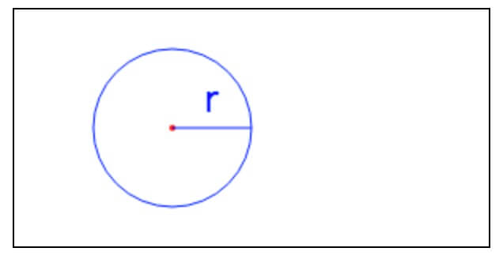

我们还可以改变起始和结束弧度的值，来绘制不同角度的弧形。比如八分之一圆弧，四分之圆弧，半圆弧等。

```javascript
let center = [50, 75]; //圆心坐标
let radius = 20; //半径
let startAngle = 0; //起始弧度为0
let antiClockwise = false; //是否逆时针
let angles = [1 / 8, 1 / 4, 1 / 2, 3 / 4]; //弧度长度
let colors = ['red', 'blue', 'green', 'orange']; //描边颜色
for (let [i, angle] of angles.entries()) {
  let endAngle = Math.PI * 2 * angle; //计算结束弧度
  ctx.strokeStyle = colors[i]; //设置描边颜色
  ctx.beginPath(); //开始新的路径
  ctx.arc(center[0] + i * radius * 3, center[1], radius, startAngle, endAngle, antiClockwise); //绘制圆弧
  ctx.stroke(); //描边
}
```

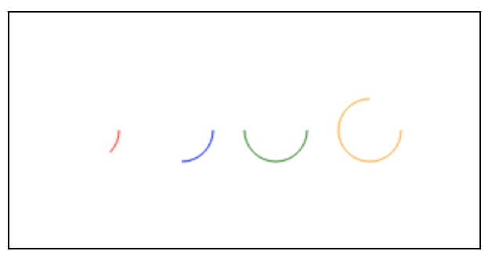

#### 任意多边形

上面说的都是一些比较简单和常见的图形，我们如何可以绘制任意多边形，比如五边形，六边形，八边形等。其实，在绘制四边形的时候就说过了，可以通过确定顶点坐标，然后把这些顶点按照一定顺序连接起来就可以了。下面，来实现一个通用的多边形的绘制方法。

```javascript
class Polygon {
  constructor(ctx, points) {
    this.ctx = ctx;
    this.points = points;
  }
  draw() {
    if (!this.ctx instanceof CanvasRenderingContext2D) {
      throw new Error('Polygon#ctx must be an CanvasRenderingContext2D instance');
    }
    if (!Array.isArray(this.points)) {
      throw new Error('Polygon#points must be an Array');
    }
    if (!this.points.length) {
      return;
    }
    let firstPoint = this.points[0];
    let restPoint = this.points.slice(1);
    ctx.beginPath();
    ctx.moveTo(firstPoint[0], firstPoint[1]);
    for (let point of restPoint) {
      ctx.lineTo(point[0], point[1]);
    }
    ctx.closePath();
  }
}
```

通过实例化这个`Polygon`，并传入多边形的顶点坐标，我们就可以绘制出不同的多边形。例如下面的代码，分别绘制了五边形，六边形。

```javascript
//绘制五边形
let points = [[30, 40], [80, 40], [100, 80], [55, 120], [10, 80]];
let pentagon = new Polygon(ctx, points);
ctx.strokeStyle = 'blue';
pentagon.draw();
ctx.stroke();

//绘制六边形
points = [[160, 40], [210, 40], [230, 80], [210, 120], [160, 120], [140, 80]];
let hexagon = new Polygon(ctx, points);
ctx.strokeStyle = 'green';
hexagon.draw();
ctx.stroke();
```

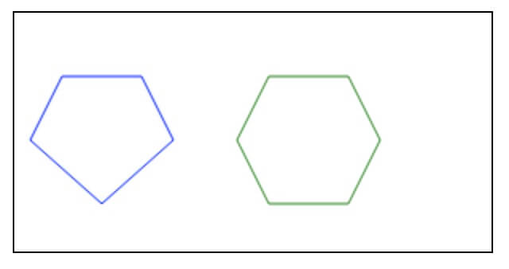

### 填充

上面，我们都是用描边把图形绘制出来，还有一种用的比较多的就是填充了。填充就是用特定的颜色把图形包围的区域涂满。

```javascript
let point1 = [100, 30]; //顶底1
let point2 = [50, 100]; //顶点2
let point3 = [180, 120]; //顶点3
ctx.strokeStyle = 'red'; //用红色描边
ctx.fillStyle = 'yellow'; //用黄色填充
ctx.lineWidth = 2; //设置线段宽度为2
ctx.beginPath(); //开始一段新路径
ctx.moveTo(point1[0], point1[1]); //移动起点到顶点1
ctx.lineTo(point2[0], point2[1]); //连接顶点1与顶点2
ctx.lineTo(point3[0], point3[1]); //连接顶点2与顶点3
ctx.closePath(); //关闭当前路径
ctx.stroke(); //描边
ctx.fill(); //填充
```

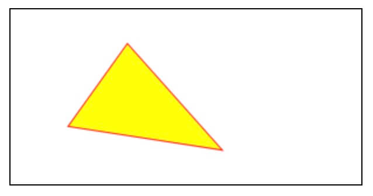

需要注意的是，如果当前路径没有关闭，那么会先默认关闭当前路径，然后在进行填充 ，如下，我们把`ctx.closePath()`注释掉。

```javascript
let point1 = [100, 30]; //顶底1
let point2 = [50, 100]; //顶点2
let point3 = [180, 120]; //顶点3
ctx.strokeStyle = 'red'; //用红色描边
ctx.fillStyle = 'yellow'; //用黄色填充
ctx.lineWidth = 2; //设置线段宽度为2
ctx.beginPath(); //开始一段新路径
ctx.moveTo(point1[0], point1[1]); //移动起点到顶点1
ctx.lineTo(point2[0], point2[1]); //连接顶点1与顶点2
ctx.lineTo(point3[0], point3[1]); //连接顶点2与顶点3
// ctx.closePath(); //关闭当前路径
ctx.stroke(); //描边
ctx.fill(); //填充
```

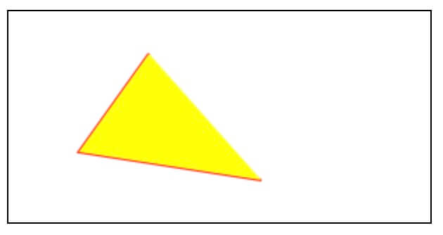

如果当前路径是循环的，或者是包含多个相交的子路径，那么canvas何如进行填充呢？比如下面这样的，为何在填充时，中间这一块没有被填充？

```javascript
let point1 = [100, 30];
let point2 = [50, 100];
let point3 = [180, 120];
let point4 = [50, 60];
let point5 = [160, 80];
let point6 = [70, 120];
ctx.strokeStyle = 'red';
ctx.fillStyle = 'yellow';
ctx.lineWidth = 2;
ctx.beginPath(); //开始一段新路径
//绘制三角形1, 顺序：p1--p2--p3--p1
ctx.moveTo(point1[0], point1[1]);
ctx.lineTo(point2[0], point2[1]);
ctx.lineTo(point3[0], point3[1]);
ctx.lineTo(point1[0], point1[1]);
//绘制三角形2,顺序：p4--p5--p6--p4
ctx.moveTo(point4[0], point4[1]);
ctx.lineTo(point5[0], point5[1]);
ctx.lineTo(point6[0], point6[1]);
ctx.lineTo(point4[0], point4[1]);
ctx.stroke(); //描边
ctx.fill(); //填充
```

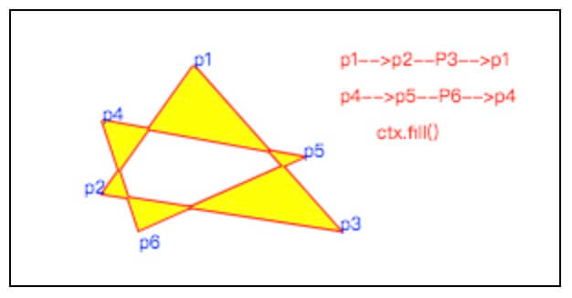

我们来具体研究一下`fill`函数，查看[MDN](https://developer.mozilla.org/en-US/docs/Web/API/CanvasRenderingContext2D/fill)上的解释，

> The `CanvasRenderingContext2D`**.fill()** method of the Canvas 2D API fills the current or given path with the current fill style using the non-zero or even-odd winding rule
>
> ```
 void ctx.fill([fillRule]);
 void ctx.fill(path[, fillRule]);
> ```

fillRule参数是可选的，可取值为`nonzero`,`evenodd`。也就是说，`fill`函数可以给当前路径或者给定的路径，使用**非零环绕规则**或者**奇偶规规则**来填充。path 参数是一个`Path2D`对象，是一个给定的路径，canvas中默认的是当前路径，这个参数并不是所有的浏览器都支持，目前看，还有IE系列和移动设备上都没有很好的支持，就不多说了，具体可以查看[Path2D](https://developer.mozilla.org/en-US/docs/Web/API/Path2D)。

#### 非零环绕规则

对于路径中的任意给定区域，从该区域内部画出一条足够长的线段，使此线段的终点完全落在路径范围之外。接下来，将计数器初始化为0，然后，每当这条线段与路径上的直线或者曲线相交时，就改变计数器的值。如果是与路径的顺时针部分相交，则加1，如果是与路径的逆时针部分相交，则减1。最后，如计数器的值不为0，则此区域就在路径里面，调用`fill`时，该区域被填充。如果计数器的最终值为0，则此区域就不在路径里面，调用`fill`时，该区域就不被填充。canvas的`fill`默认使用的就是这种非零环绕规则。

再来看看上图，为何中间交叉区域没有被填充。我们绘制了2个三角形，第一绘制顺序是p1-->p2-->p3-->p1，第二个绘制顺序是p4-->p5-->p6-->p4 。可以看到第一个三角形在绘制是逆时针方向的，第二个三角形绘制是顺时针方向的，中间相交区域的计数器最终值就为0了，所以不应该包含在这个路径中。

 非零环绕规则演示可以查看我的示例：[非零环绕示例](https://snayan.github.io/canvas-demo/?module=cutout)

#### 奇偶规则

跟非零环绕规则类似，都是从任意区域画出一条足够长的线，使此线段的终点完全落在路径范围之外。如果这个线段与路径相交的个数位奇数，则此区域包含在路径中，如果为偶数，则表示此区域不包含在路径中。

例如，我们把上面的例子改下，绘制第二个三角形的顺序改成逆时针p4-->p6-->p5--P4，然后分别用**非零环绕规则**和**奇偶规则**来填充，看看效果。

```javascript
//绘制三角形2,注意顺序变了:p4-p6-p5-p4
ctx.moveTo(point4[0], point4[1]);
ctx.lineTo(point6[0], point6[1]);
ctx.lineTo(point5[0], point5[1]);
ctx.lineTo(point4[0], point4[1]);
ctx.stroke(); //描边
ctx.fill(); //填充,  默认就是非零环绕规则
```

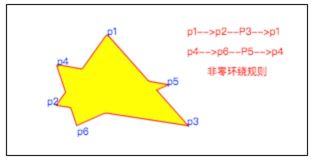

上面两个三角形的顺序都是逆时针，所以按照非零环绕规则，像个三角形的相交区域的计数器的最终值为-2，不为0，则包含在路径中改，被填充了。

同样的顺序，我们在改用奇偶规则来填充。

```javascript
ctx.fill('evenodd'); //填充,  改用奇偶规则
```

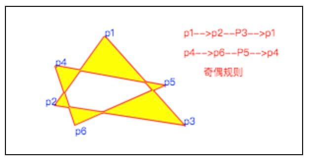

### 小结

这篇我们主要学习了canvas中如何绘制图形，比如常见的三角形，四边形，圆心，以及任意多边形。在绘制图形时，有些比如矩形，圆形等canvas已经提供了内置的函数，`ctx.rect()`和`ctx.arc`可以直接绘制，但是对于任意多边形，我们则需要自己逐线段的绘制。

在绘制路径时，是有顺序的。理解canvas中路径，和当前绘制的顺序，就可以很好的理解了canvas中填充规则了。canvas中填充有**非零环绕规则**和**奇偶规则**。对于同样的路径，不同的规则可能会产生不同的填充区域，是使用时，注意路径顺序就好了。