这篇是学习和回顾 canvas 系列笔记的第三篇，完整笔记详见：[canvas 核心技术](/post/core_html5_canvas/)

通过上一篇[canvas 核心技术-如何绘制图形](/post/how_to_draw_graphics/)的学习，我们知道了如何绘制任意多边形以及图片的填充规则。在 canvas 中应用比较多的还有绘制图片和文本。这篇文章，我们就来详细聊聊图片和文本的绘制。

### 图片

在 canvas 中，我们可以把一张图片直接绘制到 canvas 上，跟使用`img`标签类似，不同的是，图片是绘制到 canvas 画布上的，而非独立的 html 元素。canvas 提供了`drawImage`方法来绘制图片，这个方法可以有三种形式的用法，如下，

- `void drawImage(image,dx,dy);`直接将图片绘制到指定的 canvas 坐标上，图片由 image 传入，坐标由 dx 和 dy 传入。
- `void drawImage(image,dx,dy,dw,dh);`同上面形式，只不过指定了图片绘制的宽度和高度，宽高由 dw 和 dh 传入。
- `void drawImage(image,sx,sy,sw,sh,dx,dy,dw,dh);`这个是最复杂，最灵活的使用形式，第一参数是待绘制的图片元素，第二个到第五个参数，指定了原图片上的坐标和宽高，这部分区域将会被绘制到 canvas 中，而其他区域将忽略，最后四个参数跟形式二一样，指定了 canvas 目标中的坐标和宽高。

<!--more-->

根据参数个数，我们会分别调用不同形式的`drawImage`，第一种形式最简单，就是将原图片直接绘制到目标 canvas 指定坐标处，图片宽高就是原图片宽高，不会缩放。第二种形式呢，指定了目标 canvas 绘制区域的宽高，那么图片最终被绘制在 canvas 上的宽高被固定了，图片会被缩放，如果指定的 dw 和 dh 与原图片的宽高不是等比例的，图片会被压缩或者拉伸变形。第三种形式，分别指定了原图片被绘制的区域和目标 canvas 中的区域，通过 sx，sy，sw，sh 我们可只选择原图片中某一部分区域，也可以指定完整的图片，通过 dx，dy，dw，dh 我们待绘制的目标 canvas 区域。

```javascript
// 创建img元素
let img = document.createElement("img")
// 指定img的src
img.src = "./learn9/google.png"
img.addEventListener(
  "load",
  () => {
    // 将img元素调用drawImage(img,dx,dy)绘制出来
    ctx.drawImage(img, 0, 0)
  },
  false
)
```

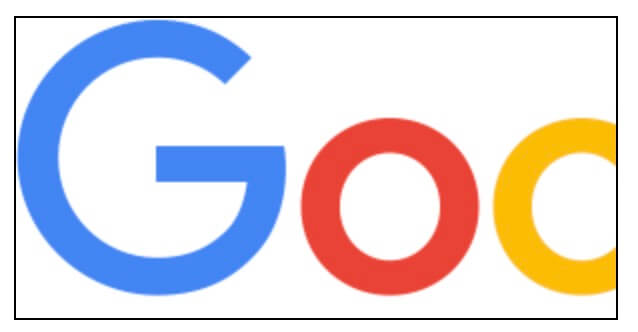

上面这个示例，这张 Google 图片的原始大小是 544\*184，而 canvas 区域的大小是默认的 300\*150。我们调用了第一种形式，直接将图片绘制到 canvas 的坐标原点处，图片没有被缩放，超出了 canvas 区域，超出的部分，会被 canvas 忽略的。有一点需要注意的是，我是在图片的`onload`事件中才开始绘制的，因为图片没有加载完毕，直接绘制图片是无效的。下面的代码示例，我都将只贴出`onload`事件里的代码，图片加载部分代码都相同，就省略了。

```javascript
// 获取canvas宽度
let canvasWidth = canvas.width
// 获取canvas高度
let canvasHeight = canvas.height
ctx.drawImage(img, 0, 0, canvasWidth, canvasHeight)
```

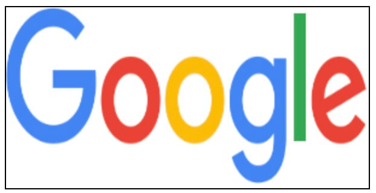

我们把目标 canvas 区域指定为 canvas 的宽高，图片总是会被绘制在整个 canvas 中，同时也可以看到绘制出来的图片变形了。我们可以通过计算出原图片的宽高比，根据 canvas 目标区域的宽度来计算出 canvas 目标区域的高度，或者根据 canvas 目标区域的高度来计算出 canvas 目标区域的宽度。

```javascript
// 获取图片的宽度
let imgWidth = img.width
// 获取图片的高度
let imgHeight = img.height
// 指定目标canvas区域的宽度
let targetWidth = canvasWidth
// 计算出目标canvas区域的高度
let targetHeight = (imgHeight * targetWidth) / imgWidth
ctx.drawImage(img, 0, 0, targetWidth, targetHeight)
```

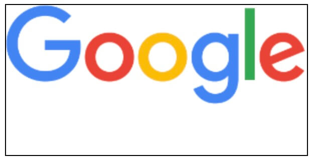

从图可以看到，根据图片宽高比计算出来的目标 canvas 区域，最终，图片绘制出来的效果是等比例缩放，没有变形。

我们再来看看最为复杂，且最为灵活的第三种方式。使用这种方式，我们可以把 Google 这张图片中的红色的那个 o 部分绘制出来。

```javascript
ctx.drawImage(img, 143, 48, 90, 90, 0, 0, 90, 90)
```

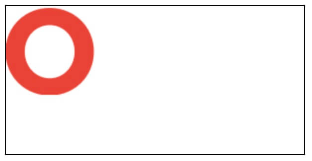

Google 这张图中，红色字母 o 在原图片中的坐标是(143,48)，宽高是 90\*90，我们简单的把这个字母绘制在了 canvas 的(0,0)坐标处，宽高也是 90\*90。可以再来复杂点，把这个红色的字母 o，让它的高度跟 canvas 的高度一样，且等比例放大宽度，且圆心正好在 canvas 中心，实现如下，

```javascript
// 获取字母o的宽度
let oWidth = 90
// 获取字母o的高度
let oHeight = 90
// 指定目标canvas区域的高度
let targetHeight = canvas.height
// 计算出目标canvas区域的宽度
let targetWidth = (oWidth * targetHeight) / oHeight
// 移动目标canvas坐标X
let targetX = (canvas.width - targetWidth) / 2
ctx.drawImage(
  img,
  143,
  48,
  oWidth,
  oHeight,
  targetX,
  0,
  targetWidth,
  targetHeight
)
```

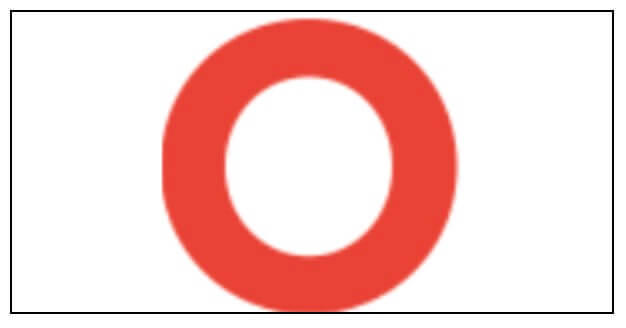

`drawImage`返回的第一参数 image，不仅可以是图片元素，实际上还可以是 canavs 元素，video 元素。常见的离屏 canvas 的使用，依就是将离屏不可见的 canvas 绘制到当前显示屏幕 canvas 上。离屏幕 canvas 这一部分将会在后续游戏部分中说到，这里不详细说了。

### 图像像素

跟图片绘制有关的函数还有 3 个，它们分别是`getImageData`，`putImageData`，`createImageData`。这些函数是直接可以改变图像中某一个具体的像素值，从而可以对图片做一些操作，比如滤镜。

我们先来看看`getImageData`方法，它的调用方式是`let imgData = ctx.getImageData(sx,sy,sw,sh)`，接受四个参数，表示 canvas 区域的某一个矩形区域，这个矩形区域的左上角坐标是(sx,sy)，宽高是 sw 和 sh，它的返回值是一个`ImageData`类型的对象，包含的属性有`width`，`height`，`data`。

- `ImageData.width`，无符号长整型，表示这个图像区域的像素的宽度。
- `ImageData.height`，无符号长整型，表示这个图像区域的像素的高度。
- `ImageData.data`，一个`Uint8ClampedArray`数组，数组里每 4 个单元，表示一个像素值。一个像数值用 RGBA 表示的，这 4 个单元分别表示 R，G，B，A，表示意思是红，绿，蓝，透明度，取值范围是 0 ～ 255。

需要注意的是，如果我们在调用`ctx.getImageData(sx,sy,sw,sh)`，参数表示的矩形区域超出了 canvas 的区域，那么超出的部分将是用黑色的透明度为 0 的 RGBA 值表示，也就是(0,0,0,0)。

```javascript
// 获取图片的宽度
let imgWidth = img.width
// 获取图片的高度
let imgHeight = img.height
// 指定目标canvas区域的宽度
let targetWidth = canvasWidth
// 计算出目标canvas区域的高度
let targetHeight = (imgHeight * targetWidth) / imgWidth
ctx.drawImage(img, 0, 0, targetWidth, targetHeight)
let imgData = ctx.getImageData(0, 0, canvasWidth, canvasHeight)
console.log(`canvas.width = ${canvasWidth}`)
console.log(`canvas.height = ${canvasHeight}`)
console.log(imgData)
```

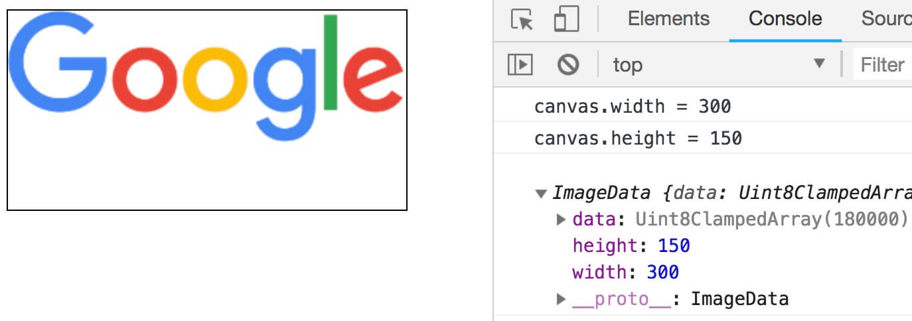

可以看到，我们的 canvas 默认宽高是 300\*150，通过`ctx.getImageData`获取整个 canvas 区域的像素数据值，得到的`ImageData`的设备像素的宽高也是 300\*150 ，`Imagedata.data` 的数组的长度是 180000，这个是因为，这个 imgData 的像素数是 300\*150，而每个像素是由 4 个分量表示的，所以$300*150*4 = 180000$了。

当我们通过`getImageData`得到 canvas 某一个矩形区域的像素数据之后，我们可以通过改变这个`imageData.data`数组里的颜色分量值，再将改变后的`ImageData`通过`putImageData`方法绘制到 canvas 上。`putImageData`的用法有 2 种调用形式，如下，

- `ctx.putImageData(imgData,dx,dy)`，这种方式，将 imgData 绘制到 canvas 区域(dx,dy)坐标处，绘制到 canvas 的区域的矩形大小就是 imgData 的矩形的大小。
- `ctx.putImageData(imgData,dx,dy,dirtyX,dirtyY,dirtyW,dirtyH)`，不仅指定了 canvas 区域(dx,dy)，也指定了 imgData 脏数据区域的(dirtyX,dirtyY)和宽高 dirtyW，dirtyH。这种形式，可以只将 imgData 种某一块区域绘制到 canvas 上。

```javascript
let canvasWidth = canvas.width
let canvasHeight = canvas.height
let img = document.createElement("img")
img.src = "./learn9/google.png"
img.addEventListener(
  "load",
  () => {
    // 获取图片的宽度
    let imgWidth = img.width
    // 获取图片的高度
    let imgHeight = img.height
    // 指定目标canvas区域的宽度
    let targetWidth = canvasWidth
    // 计算出目标canvas区域的高度
    let targetHeight = (imgHeight * targetWidth) / imgWidth
    ctx.drawImage(img, 0, 0, targetWidth, targetHeight)
    // 操作ImageData像素数据
    let imgData = ctx.getImageData(0, 0, canvasWidth, canvasHeight)
    oprImageData(imgData, (r, g, b, a) => {
      if (a === 0) {
        // 将透明的黑色像素值改变为不透明
        return [r, g, b, 255]
      }
      return [r, g, b, a]
    })
    // 将imgData绘制到canvas的中心。超出canvas区域将被自动忽略
    ctx.putImageData(imgData, canvasWidth / 2, canvasHeight / 2)
  },
  false
)

// 遍历像素数据
function oprImageData(imgData, oprFunction) {
  let data = imgData.data
  for (let i = 0, l = data.length; i < l; i = i + 4) {
    let pixel = oprFunction(data[i], data[i + 1], data[i + 2], data[i + 3])
    data[i] = pixel[0]
    data[i + 1] = pixel[1]
    data[i + 2] = pixel[2]
    data[i + 3] = pixel[3]
  }
}
```

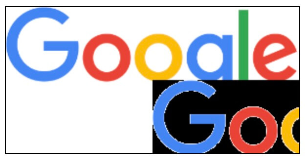

上面，我们遍历了`ImageData`中 data 数组，并将透明度为 0 的像素值的透明度变为 1（$255/255=1$）。在遍历像素数组时，我们每便利一次，`i` 的值加 4，这个是因为一个像素值是用 4 个数组单元值表示的，分别为 R，G，B，A，我们可以只改变某一个像素值的某一个分量值，例如透明度。

```javascript
ctx.putImageData(imgData, canvasWidth / 2, canvasHeight / 2, 79, 27, 50, 50)
```

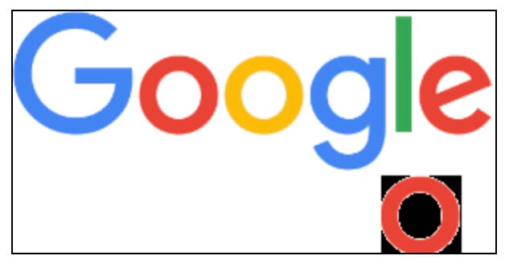

我们通过指定了`ImageData`中脏数据区域，只绘制了红色字母 o，其他部分忽略。上面在调用`putImageData`之前，我们通过遍历像素数据改变了部分像素值的透明度，这种可以操作像素值的方式，在图像处理等领域是非常有用的，例如常见的图像灰度和反相颜色等。

```javascript
// 操作ImageData像素数据
let imgData = ctx.getImageData(0, 0, canvasWidth, canvasHeight)
// 清除canvas
ctx.clearRect(0, 0, canvasWidth, canvasHeight)
oprImageData(imgData, (r, g, b, a) => {
  // 反相颜色
  return [255 - r, 255 - g, 255 - b, a]
})
ctx.putImageData(imgData, 0, 0)
```

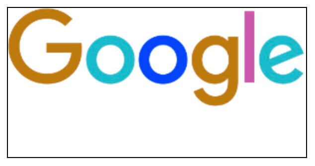

将颜色分量的 RGB 值都用 255 减去原颜色分量值，可以看到，Google 每个字母的颜色都与原图片的颜色不一样了。这个在改变每个颜色分量的值，用不通的逻辑计算，就可以得到不同的处理后的图片。

```javascript
// 操作ImageData像素数据
let imgData = ctx.getImageData(0, 0, canvasWidth, canvasHeight)
// 清除canvas
ctx.clearRect(0, 0, canvasWidth, canvasHeight)
oprImageData(imgData, (r, g, b, a) => {
  let avg = (r + g + b) / 3
  // 灰度
  return [avg, avg, avg, a]
})
ctx.putImageData(imgData, 0, 0)
```

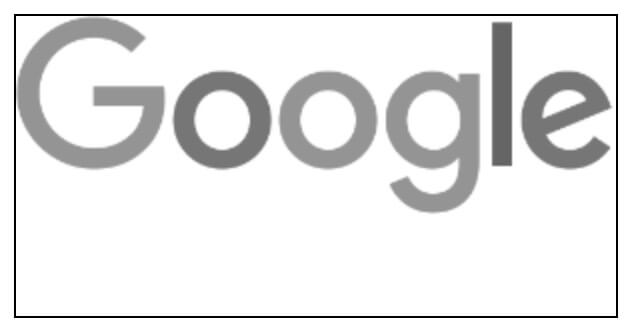

通过取 RGB 的平均值，原图片的每个字母都是灰色的了，当然，在计算的时候，可以给每个分量加一个系数，例如公式`let avg = 0.299r + 0.587g + 0.114b`，具体应用可以查看[Grayscale](https://en.wikipedia.org/wiki/Grayscale)。

最后来看看`createImageData`，这个很好理解了，就是创建一个`ImageData` 对象了，有两种形式，如下，

- `ctx.createImageData(width,height)`，可以指定宽高，创建一个`ImageData`对象，`ImageData.data`中的像素值都是一个透明的黑色，也就是（0，0，0，0）。
- `ctx.createImageData(imgData)`，可以指定一个已经存在的`ImageData` 对象来创建一个新的`ImageData`对象，新创建的`ImageData`对象的宽高与参数中的`ImageData` 的宽高一样，但是像素值就不一样了，新创建出来的`ImageData`的像素值都是透明的黑色，也就是（0，0，0，0）。

### 文本

在 canvas 中，我们不仅可以绘制图形，图片，还可以绘制文本。绘制文本比较简单了，先设置当前 ctx 的画笔的文本样式，例如，字体大小，字体样式，对其方式等，跟 css 中比较相似。

跟文本相关的方法有三个，如下，

- `strokeText(text,x,y,maxWidth?)`，用描边的形式绘制指定的文本 text，其中也指定了绘制的坐标（x，y）, 还有最后一个可选参数，最大的宽度，如果所绘制的文本超过了指定的`maxWidth`，则文本会按照最大的宽度来绘制，那么文字之间的间距就将减少，文字可能被压缩。
- `fillText(text,x,y,maxWidth?)`，同`strokeText`一样，只不过，是用填充的形式绘制文本，其参数含义一样。
- `measureText(text)`，在当前的文字样式下，测量绘制文本 text 会占据的宽度值，返回一个对象，这个对象有一个`width`属性。主要注意的是，必须先设置文本样式，再来测量才是准确的。

跟文本直接相关的属性设置，如下，

- `font`，同 css 中含义一样，可以指定文本的字体大小，字体集，字体样式等。但在 canvas 中，`line-height`被强制设置为`normal`，会忽略其他设置的值。
- `textAlign`，设置文本的水平对其方式，可选值有：`left`，`right`，`center`，`start`，`end`。默认值是`start`。各个含义参见[textAlign 取值](https://developer.mozilla.org/en-US/docs/Web/API/CanvasRenderingContext2D/textAlign)。
- `textBaseline`，设置文本的垂直对齐方式，可选值有：`top`，`hanging`，`middle`，`alphabetic`，`ideographic`，`bottom`。默认值是`alphabetic`。各个含义参见[textBaseline 取值](https://developer.mozilla.org/en-US/docs/Web/API/CanvasRenderingContext2D/textBaseline)。

当然了，还有一些其他的属性也会影响到文本最终绘制出来的效果，比如给当前 ctx 添加阴影效果，或者设置`fillStyle`的样式可以是图片或者渐变等。这些算是全局的属性设置，会影响到 canvas 所有其他的绘制，而不仅仅是文本，所以在这里，就不详细讨论了。

```javascript
// textAlign的取值
let textAligns = ["left", "right", "center", "start", "end"]
// 描边颜色
let colors = ["red", "blue", "green", "orange", "blueviolet"]
// 设置font
ctx.font = "18px sans-serif"
for (let [index, textAlign] of textAligns.entries()) {
  ctx.save()
  // 设置textAlign
  ctx.textAlign = textAlign
  // 设置描边颜色
  ctx.strokeStyle = colors[index]
  // 使用描边绘制文本
  ctx.strokeText(textAlign, width / 2, 20 + index * 30)
  ctx.restore()
}
```

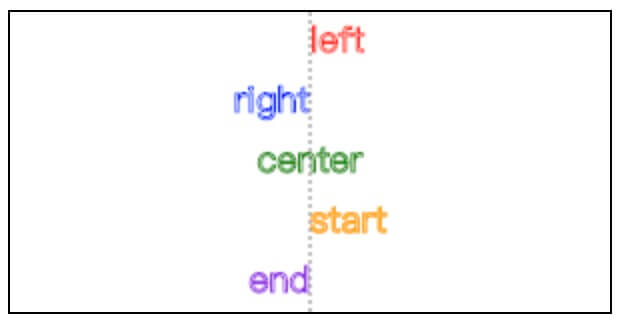

我们把`textAlign`的各个属性全都设置了一遍，看到`start`与`left`的效果一样，`end`与`right`的效果一样，这个是因为`start`和`end`是与当前本地文字开始方向有关的，如果是左到右开始，那么`start`与`left`一样，而如果是右到左开始，那么`start`是与`right`效果一样了。

```javascript
let textBaselines = [
  "top",
  "hanging",
  "middle",
  "alphabetic",
  "ideographic",
  "bottom",
]
// 描边颜色
let colors = ["red", "blue", "green", "orange", "blueviolet", "cyan"]
// 设置font
ctx.font = "18px sans-serif"
for (let [index, textBaseline] of textBaselines.entries()) {
  ctx.save()
  // 设置textBaseline
  ctx.textBaseline = textBaseline
  // 设置描边颜色
  ctx.strokeStyle = colors[index]
  // 使用描边绘制文本
  ctx.strokeText("abj", 10 + index * 50, height / 2)
  ctx.restore()
}
```

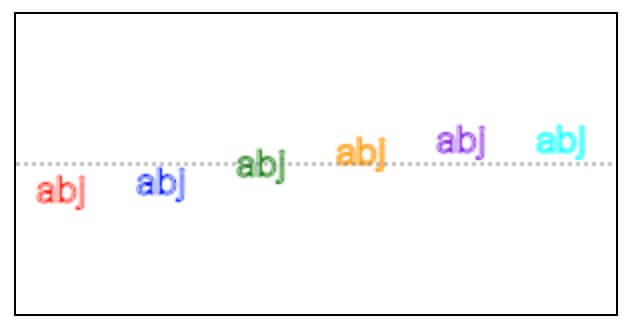

我们又把`textBaseline`的各个值全设置了一遍，看到的效果如上图。用到最多的应该是`top`， `middle`，`alphabetic`，`bottom`了，其中默认值是`alphabetic` 。

`measureText`在实际业务中也是用到比较多的一个方法了，这个方法可以测量出在当前设置的文本样式下，绘制指定的 text 会占据的宽度。特别是在绘制表格数据，或者一些分析图时，需要绘制说明提示性文本，但是又想根据当前鼠标位置来决定文本绘制的坐标，以免超出 canvas 可见区域。这个方法使用比较简单，会返回一个带有`width`属性的对象，这个`width`属性值就是测量出来的结果。在 canvas 没有测量文本高度的方法，然而，在实际时，常常会以**W**字母测量出来的宽度值加上一点点，就可以大致认为是当前文本的高度值了。

```javascript
// 设置font，一定得先设置font属性，才能测量准确
ctx.font = "18px sans-serif"
let textWidth = ctx.measureText("W").width
let textHeight = textWidth + textWidth / 6
console.log(`当前文本W的宽度：${textWidth}`)
console.log(`当前文本W的高度：${textHeight}`)
```

### 小结

这篇文章主要是学习了 canvas 中如何使用`drawImage`来绘制图片，以及如何使用`getImageData`和`putImageData`来对图像像素值做处理，比如常见的图片灰度处理，或者反相颜色等。也回顾了在 canvas 中绘制文本的一些相关方法和属性，这些知识在 css 中比较类似，理解起来也比较容易和简单。
