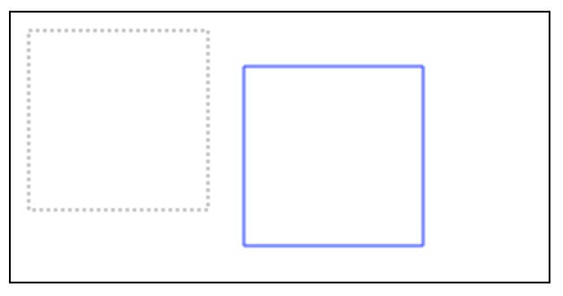
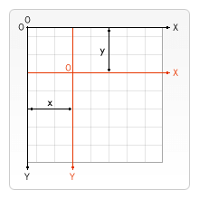
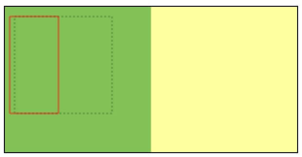
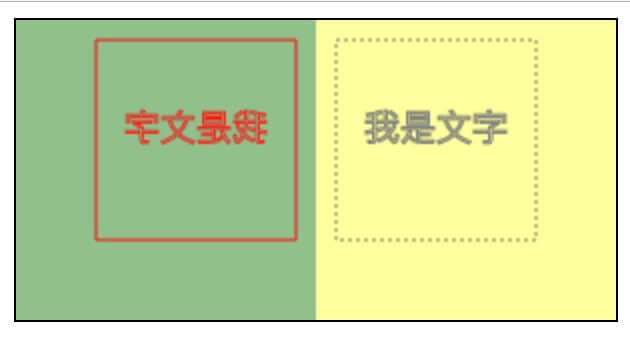
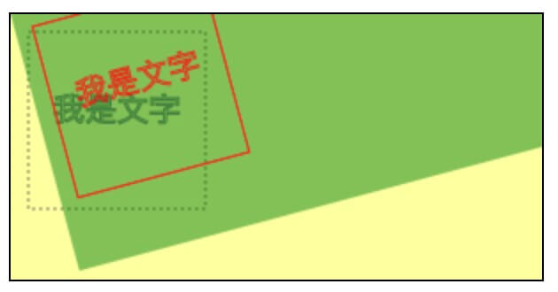
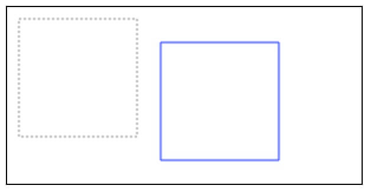
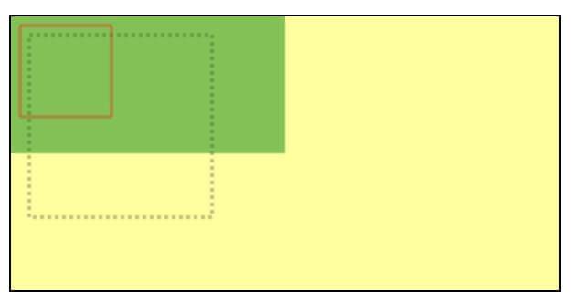
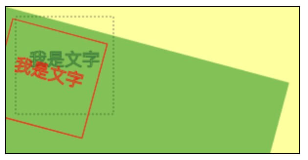
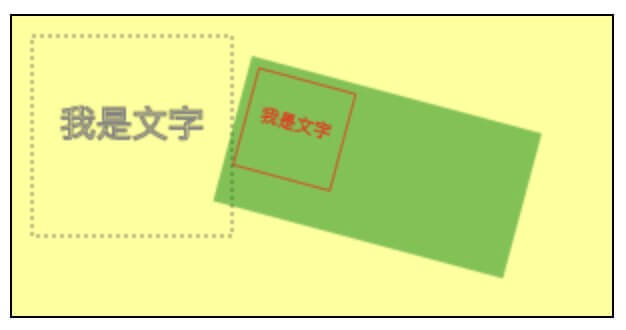
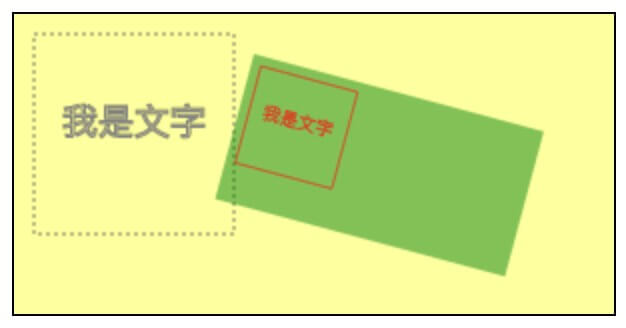

这篇是学习和回顾canvas系列笔记的第四篇，完整笔记详见：[canvas核心技术](https://snayan.github.io/2018/07/09/canvas-%E6%A0%B8%E5%BF%83%E6%8A%80%E6%9C%AF/)。

在前面几篇中，我们回顾了在canvas中绘制线段，图形，图片等基本功能，当在制作2d游戏或者更为丰富的图表库时，必须提供强大的动画功能。canvas本身不提供像css中`animation`属性专门来实现动画，但是canvas提供了`translate`，`scale `，`rotate`等基本功能，我们可以通过组合使用这些功能来实现动画。

跟动画有关的概念中，我们还要理解**帧速率**。我们通常说**一帧**，就是浏览器完整绘制一次所经过的时间。现代浏览器的帧速率一般是60fps，就是在1s内可以绘制60次。如果帧速率过低，就会觉得明显的卡顿了。一般是帧速率越高，动画越流畅。在JavaScript中，我们要在1s内绘制60次，以前的做法是使用`setTimeout`或者`setInterval`来定时执行。

```javascript
setInterval(() => {
  // 执行绘制操作
}, 1000 / 60);
```
<!--more-->
这种通过定时器的方式，虽然可以实现，但不是最好的方式，它只是以固定的时间间隔向执行队列中添加绘制代码，并不一定能跟浏览器的更新频率同步，并且严重依赖当前执行栈的情况，如果某一次执行栈里执行了复杂大量的运算，那么我们添加的绘制代码可能就不会在我们设置的时间间隔内执行了。在H5中，现代浏览器都提供了[requestAnimationFrame](https://developer.mozilla.org/en-US/docs/Web/API/window/requestAnimationFrame)这个方法来执行动画更新逻辑，它会在浏览器的下一次更新时执行传递给它的函数，我们完全不必考虑浏览器的**帧速率**了，可以更加专注于动画更新的逻辑上。

```javascript
const animate = () => {
  // 执行绘制操作
  requestAnimationFrame(animate);
};
animate();
```

当然，如果要兼容以前的浏览器，我们一般需要结合`requestAnimationFrame`和 `setTimeout`或者`setInterval`来实现polyfill，简单的处理方式大致如下，更好的实现方式可以查看[rAF.js](https://gist.github.com/paulirish/1579671)。

```javascript
function myRequestAnimationFrame(callback) {
  if (requestAnimationFrame) {
    return requestAnimationFrame(callback);
  } else {
    return setTimeout(() => {
      if (performance && performance.now) {
        return callback(performance.now());
      } else {
        return callback(Date.now());
      }
    }, 1000 / 60);
  }
}

function cancelMyRequestAnimationFrame(id) {
  if (cancelAnimationFrame) {
    cancelAnimationFrame(id);
  } else {
    clearTimeout(id);
  }
}

```

### 平移

在动画处理中，css可以针对某一个具体的元素来执行平移操作，在canvas中，只能平移坐标系，从而间接的改变了canvas中元素的位置。在[canvas核心技术-如何绘制线段](https://snayan.github.io/2018/07/09/canvas%E6%A0%B8%E5%BF%83%E6%8A%80%E6%9C%AF-%E5%A6%82%E4%BD%95%E7%BB%98%E5%88%B6%E7%BA%BF%E6%AE%B5/)中，详细讲解了canvas坐标系相关知识，有兴趣的同学可以先去看看。canvas坐标系默认原点是在左上角，水平向右为X正方向，垂直向下为Y正方向。可以通过平移canvas坐标系，可以把坐标原点移动到canvas中某一块区域，或者canvas可见区域外。

```javascript
//平移坐标系之前
ctx.strokeStyle = 'grey'; 
ctx.setLineDash([2, 2]);
ctx.rect(10, 10, 100, 100); //绘制矩形
ctx.stroke(); 
//平移坐标系
ctx.translate(120,20); //平移坐标系，往右平移120px,往下平移20px
ctx.beginPath(); //开始新的路径
ctx.strokeStyle='blue'; 
ctx.setLineDash([]); 
ctx.rect(10, 10, 100, 100); //绘制同样的矩形
ctx.stroke(); 
```



我们在平移之前，在坐标（10，10）处绘制了一个边长都为100的矩形，如图灰色虚线矩形，接着，我们调用`ctx.translate(120,20)`把坐标系向左平移120个像素，向下平移了20个像素，之后，我们有同样的在坐标（10，10）处绘制了一个边长为100的矩形，如图蓝色实线矩形。这两个矩形，我们绘制的坐标和边长都没有改变，但是坐标系被平移了，所以绘制出来的位置也发生了变化。

坐标系平移示意图如下，



### 缩放

坐标系不仅可以平移，还可以被缩放，canvas提供了`ctx.scale(x,y)` 来缩放X轴和Y轴。在默认情况下，canvas的缩放因子都是1.0，表示在canvas坐标系中，1个单位就表示绘制的1px长度，如果通过`scale`函数改变缩放因子为0.5，则在canvas坐标系中，1个单位就表示绘制0.5px长度了，原来的图形被绘制出来就只有一半大小了。

```javascript
ctx.strokeStyle = 'grey'; 
ctx.fillStyle = 'yellow'; 
ctx.globalAlpha = 0.5; 
ctx.fillRect(0, 0, width, height); //填充当前canvas整个区域
ctx.globalAlpha = 1;
ctx.setLineDash([2, 2]); 
ctx.rect(10, 10, 100, 100); //绘制矩形
ctx.stroke(); 
ctx.scale(0.5, 0.5); //缩放坐标系，X轴和Y轴都同时缩放为0.5
ctx.beginPath(); //开始新的路径
ctx.fillStyle = 'green';
ctx.strokeStyle = 'red';
ctx.globalAlpha = 0.5;
ctx.fillRect(0, 0, width, height); //填充缩放之后的canvas整个区域
ctx.globalAlpha = 1;
ctx.setLineDash([]); 
ctx.rect(10, 10, 100, 100); //绘制同样的矩形
ctx.stroke(); 
```


可以看到，我们将X轴和Y轴同时都缩小为原来的一半，新绘制出来的矩形（红色实线）不仅宽高都缩小为原来的一半了，且左上角坐标位置也发生了变化。这里要理解的是，我们在缩放，是针对坐标系缩放的，黄色区域为缩放之前的canvas坐标系区域，绿色区域为缩放0.5之后的canvas坐标系区域。

```javascript
ctx.scale(0.5, 1); //缩放坐标系，X轴缩放为0.5,Y轴不变
```



可以对X轴和Y轴的缩放因子设置为不一样，如上面示例，对X轴缩小为0.5，而Y轴不变，缩放之后的Canvas区域在X轴上就变为原来的一半了。

还有一些其他的技巧，比如制作镜像，设置缩放`ctx.scale(-1,1)`就可以绘制出Y轴的对称镜像了。同理，设置缩放`ctx.scale(1,-1)`就可以绘制出X轴的对称镜像了。

```javascript
ctx.font = '18px sans-serif';
ctx.textAlign = 'center';
ctx.translate(width / 2, 0); //先将坐标系向X轴平移到中间
ctx.strokeStyle = 'grey'; //设置描边样式
ctx.fillStyle = 'yellow';
ctx.globalAlpha = 0.5;
ctx.fillRect(0, 0, width, height);
ctx.globalAlpha = 1;
ctx.setLineDash([2, 2]); //设置虚线
ctx.rect(10, 10, 100, 100); //绘制矩形
ctx.stroke(); //描边
ctx.setLineDash([]); //设置实线
ctx.strokeText('我是文字', 60, 60);
ctx.scale(-1, 1); //缩放坐标系，X轴和Y轴都同时缩放为0.5
ctx.beginPath(); //开始新的路径
ctx.fillStyle = 'green';
ctx.strokeStyle = 'red'; //设置描边样式
ctx.globalAlpha = 0.5;
ctx.fillRect(0, 0, width, height);
ctx.globalAlpha = 1;
ctx.setLineDash([]); //设置实线
ctx.strokeText('我是文字', 60, 60);
ctx.rect(10, 10, 100, 100); //绘制同样的矩形
ctx.stroke(); //描边
```



如图，我们实现了在Y轴对称的镜像，在设置缩放之前先平移了坐标系到X轴的中间，因为不这样的话，我们缩放之后，绘制出来的部分就在canvas可见区域外面了，就看不到了。

### 旋转

在canvas中可以通过`ctx.rotate(angle)`来实现坐标系的旋转，参数**angle**是弧度值，而不是角度值。1角度等于$\frac\pi{180}$，在调用之前需要先进行角度转弧度，计算公式如下，

```javascript
//角度转换为弧度
function toAngle(degree) {
  return (degree * Math.PI) / 180;
}
```

我们来看一个将坐标系旋转15角度的示例，如下，

```javascript
ctx.font = '18px sans-serif';
ctx.textAlign = 'center';
ctx.strokeStyle = 'grey'; //设置描边样式
ctx.fillStyle = 'yellow';
ctx.globalAlpha = 0.5;
ctx.fillRect(0, 0, width, height);
ctx.globalAlpha = 1;
ctx.setLineDash([2, 2]); //设置虚线
ctx.rect(10, 10, 100, 100); //绘制矩形
ctx.stroke(); //描边
ctx.setLineDash([]); //设置实线
ctx.strokeText('我是文字', 60, 60);
ctx.rotate(15* Math.PI/180); //将坐标系旋转15角度
ctx.beginPath(); //开始新的路径
ctx.fillStyle = 'green';
ctx.strokeStyle = 'red'; //设置描边样式
ctx.globalAlpha = 0.5;
ctx.fillRect(0, 0, width, height);
ctx.globalAlpha = 1;
ctx.setLineDash([]); //设置实线
ctx.strokeText('我是文字', 60, 60);
ctx.rect(10, 10, 100, 100); //绘制同样的矩形
ctx.stroke(); //描边
```


黄色区域是旋转原默认canvas坐标系区域，绿色区域就是旋转之后的坐标系区域了，可以看到，旋转操作的实际也是把整个canvas坐标都旋转了，canvas里面的内容都会跟着被旋转。传入的参数`angle `不仅可以是正数，也可以是负数，正数是顺时针旋转，负数表示逆时针旋转。

```javascript
ctx.rotate(-15* Math.PI/180);  //逆时针旋转15角度
```



这些使用都比较简单，也好理解。在实际中，可以需要同时对canvas坐标系进行平移，缩放和旋转。在这种情况下，我们可以分别单独的使用上面这些方法进行对应的操作，他们的效果是叠加的。在canvas中，实际还提供了一个方法，可以同时实现平移，缩放，旋转。下面，我们就来看看这个方法的神奇之处。

### transform

在进行坐标系数据变换时，最常用的手段就是先建模成单位矩阵，然后对单位矩阵做变换。实际上，上面说的平移，缩放，旋转都是通过变换矩阵实现的，只不过canvas给我们封装成具体好用的方法了。canvas中`ctx.transform(a,b,c,d,e,f)`提供了6个参数，在canvas中矩阵是纵向存储的，代表的矩阵为，


在2维坐标系中，表示一个点为（x，y），为了做矩阵变换，我们需要将标准的2维坐标扩展到3维，需要增加一维**w**，这就是2维齐次坐标系（x，y，w）。齐次坐标上一点（x，y，w）映射到实际的2维坐标系中就是（x/w，y/w）。如果将点（x，y，w）映射在实际2维坐标系是（x，y）,我们只需要设置 w = 1 就可以了，更多可查看[齐次坐标](https://blog.csdn.net/janestar/article/details/44244849)。然后根据矩阵相乘得到的公式如下，


先来看看平移，我们看看把一个点（x，y）平移到另外一个点（x'，y'）。公式如下，


将平移公式代入到上面我们推到出来的矩阵变换公式中可以得到，$a=1$，$c=0$，$e=d_x$，$b=0$，$d=1$，$f=d_y$。我们用`transform`实现平移，只需要调用`ctx.transform(1,0,0,1,dx,dy)`，效果跟调用`ctx.translate(dx,dy)`一样的。

```javascript
//平移坐标系之前
ctx.strokeStyle = 'grey';
ctx.setLineDash([2, 2]);
ctx.rect(10, 10, 100, 100); //绘制矩形
ctx.stroke();
//平移坐标系
// ctx.translate(120,20); //平移坐标系，往右平移120px,往下平移20px
ctx.transform(1, 0, 0, 1, 120, 20); //使用transform来平移
ctx.beginPath(); //开始新的路径
ctx.strokeStyle = 'blue';
ctx.setLineDash([]);
ctx.rect(10, 10, 100, 100); //绘制同样的矩形
ctx.stroke();
```



可以看到，`ctx.translate(120,20);`与`ctx.transform(1, 0, 0, 1, 120, 20);`得到的效果是一样的。

再来看看缩放，我们把一个点（x，y） 通过缩放坐标系k之后，得到的新的点的坐标为（x'，y'）。公式如下，


我们也将缩放公式代入到矩阵变换公式中，可以得到$a = k$，$c = 0$，$e = 0$，$b = 0$，$d = k$，$f = 0$。我们用`transform`来实现缩放，只需要调用`ctx.transform(k,0,0,k,0,0)`，效果跟调用`ctx.scale(k,k)`一样的。

```javascript
ctx.strokeStyle = 'grey';
ctx.fillStyle = 'yellow';
ctx.globalAlpha = 0.5;
ctx.fillRect(0, 0, width, height); //填充当前canvas整个区域
ctx.globalAlpha = 1;
ctx.setLineDash([2, 2]);
ctx.rect(10, 10, 100, 100); //绘制矩形
ctx.stroke();
// ctx.scale(0.5, 0.5); //缩放坐标系，X轴和Y轴都同时缩放为0.5
ctx.transform(0.5, 0, 0, 0.5, 0, 0); //使用transform来缩放
ctx.beginPath(); //开始新的路径
ctx.fillStyle = 'green';
ctx.strokeStyle = 'red';
ctx.globalAlpha = 0.5;
ctx.fillRect(0, 0, width, height); //填充缩放之后的canvas整个区域
ctx.globalAlpha = 1;
ctx.setLineDash([]);
ctx.rect(10, 10, 100, 100); //绘制同样的矩形
ctx.stroke(); 
```



可以看到，调用`ctx.transform(0.5,0,0,0.5,0,0)`与`ctx.scale(0.5,0.5)`效果是一样的。

最后来看看旋转，我们把一个坐标（x，y）在旋转坐标角度$\beta$之后得到新的坐标（x'，y'），公式如下，


上面的公式，是根据三角形两角和差公式计算出来的，推导详见[2D Rotation](https://www.siggraph.org/education/materials/HyperGraph/modeling/mod_tran/2drota.htm)。同理，我们将旋转公式代入到矩阵变换公式可以得到$a=\cos(\beta)$，$c=-\sin(\beta)$，$e=0$，$b=\sin(\beta)$，$d=\cos(\beta)$，$f=0$。我们调用$ctx.transform(\cos(\beta),\sin(\beta),-\sin(\beta),\cos(\beta),0,0)$与$ctx.rotate(\beta)$是一样的。注意，我们这里的$\beta$是弧度值。

```javascript
ctx.font = '18px sans-serif';
ctx.textAlign = 'center';
ctx.strokeStyle = 'grey'; //设置描边样式
ctx.fillStyle = 'yellow';
ctx.globalAlpha = 0.5;
ctx.fillRect(0, 0, width, height);
ctx.globalAlpha = 1;
ctx.setLineDash([2, 2]); //设置虚线
ctx.rect(10, 10, 100, 100); //绘制矩形
ctx.stroke(); //描边
ctx.setLineDash([]); //设置实线
ctx.strokeText('我是文字', 60, 60);
// ctx.rotate(15* Math.PI/180); //将坐标系旋转15角度
let angle = (15 * Math.PI) / 180; //计算得到弧度值
let cosAngle = Math.cos(angle); //计算余弦 
let sinAngle = Math.sin(angle); //计算正弦
ctx.transform(cosAngle, sinAngle, -sinAngle, cosAngle, 0, 0); //使用transform旋转
ctx.beginPath(); //开始新的路径
ctx.fillStyle = 'green';
ctx.strokeStyle = 'red'; //设置描边样式
ctx.globalAlpha = 0.5;
ctx.fillRect(0, 0, width, height);
ctx.globalAlpha = 1;
ctx.setLineDash([]); //设置实线
ctx.strokeText('我是文字', 60, 60);
ctx.rect(10, 10, 100, 100); //绘制同样的矩形
ctx.stroke(); //描边
```



可以看到调用`ctx.transform(cosAngle,sinAngle,-sinAngle,cosAngle,0,0)`与`ctx.rotate(angle)`是一样的效果。

上面三种基本的操作坐标系的方式，我们都可以通过`transform`实现，通过组合，我们可以一次性设置坐标系的平移，旋转，缩放，只需要计算出正确的a，b，c，d，e，f。例如，我们将上面三种操作同时实现，先平移，再缩放，最后再旋转，分别给出`translate`+`scale`+`rotate`来实现，和`transform`来实现，

* `translate`+`scale`+`rotate`组合实现

```javascript
ctx.font = '18px sans-serif';
ctx.textAlign = 'center';
ctx.strokeStyle = 'grey'; //设置描边样式
ctx.fillStyle = 'yellow';
ctx.globalAlpha = 0.5;
ctx.fillRect(0, 0, width, height);
ctx.globalAlpha = 1;
ctx.setLineDash([2, 2]); //设置虚线
ctx.rect(10, 10, 100, 100); //绘制矩形
ctx.stroke(); //描边
ctx.setLineDash([]); //设置实线
ctx.strokeText('我是文字', 60, 60);
let angle = (15 * Math.PI) / 180;
ctx.translate(120, 20); //先平移
ctx.scale(0.5, 0.5); //再缩放
ctx.rotate(angle);//最后再旋转
ctx.beginPath(); //开始新的路径
ctx.fillStyle = 'green';
ctx.strokeStyle = 'red'; //设置描边样式
ctx.globalAlpha = 0.5;
ctx.fillRect(0, 0, width, height);
ctx.globalAlpha = 1;
ctx.setLineDash([]); //设置实线
ctx.strokeText('我是文字', 60, 60);
ctx.rect(10, 10, 100, 100); //绘制同样的矩形
ctx.stroke(); //描边
```



* `transform`一次性实现

```javascript
let angle = (15 * Math.PI) / 180;
// ctx.translate(120, 20);
// ctx.scale(0.5, 0.5);
// ctx.rotate(angle);
let cosAngle = Math.cos(angle);
let sinAngle = Math.sin(angle);
ctx.transform(0.5 * cosAngle, 0.5 * sinAngle, -0.5 * sinAngle, 0.5 * cosAngle, 120, 20);
```



这两种方式最终得到的效果是一样的，其实在将`translate`+`scale`+`rotate`组合用`transform`一次性实现时，就是在做矩阵的变换计算，


三个矩阵相乘，分别是平移矩阵\*缩放矩阵\*旋转矩阵，根据计算出来的矩阵，最后代入到公式中，可以得到$a=0.5\*\cos(\beta)$，$b=0.5\*\sin(\beta)$，$c=-0.5\*\sin(\beta)$，$d=0.5\*\cos(\beta)$，$e=120$，$f=20$。

`transform`如果多次调用，它的效果也是叠加的，例如，我们也可以分开用`transform`来实现上面的平移，缩放，旋转，

```javascript
ctx.transform(1, 0, 0, 1, 120, 20); //使用transform来平移
ctx.transform(0.5, 0, 0, 0.5, 0, 0); //使用transform来缩放
ctx.transform(cosAngle, sinAngle, -sinAngle, cosAngle, 0, 0); //使用transform旋转
```

第二次调用`transform`来缩放，是在第一次平移之后的坐标系上进行的，第三次调用`transform`来旋转，是在第一次和第二次结果上来进行的。canvas中提供了`setTransform`函数，它类似于`transform`函数，同样接受a，b，c，d，e，f 6个参数，且参数含义与`transform`中一摸一样，跟`transform`不同之处在于，**它不会叠加矩阵变换的效果，它会先重置当前坐标系矩阵为默认的单元矩阵**，之后再执行跟`transform`一样的矩阵变换。所以，如果我们在调用`transform`变换矩阵时，不想多次调用叠加，那么可以替换使用`setTransform`。实际上还有一个实验性的函数`resetTransform`，它的作用就是重置当前坐标系矩阵为默认的单元矩阵，去掉了作用在默认坐标系上的变换效果，注意它是一个实验性的函数，还有很多浏览器都没有提供支持，不建议使用。通过分析，我们可以得到，


### 小结

这篇文章主要是学习和回顾了canvas中坐标系的变换，我们是通过矩阵变换来实现canvas坐标系的变化，包括`translate`，`scale`，`rotate`，`transform`，`setTransform`，通过组合使用，可以实现强大的动画效果。实际上，动画效果应该在一段时间内持续变化，这篇文章，只学习了单一的变化，还没有涉及时间等动画因素，下一篇准备学习和回顾动画的高级知识，包括时间因素，物理因素，时间扭曲变化函数等。