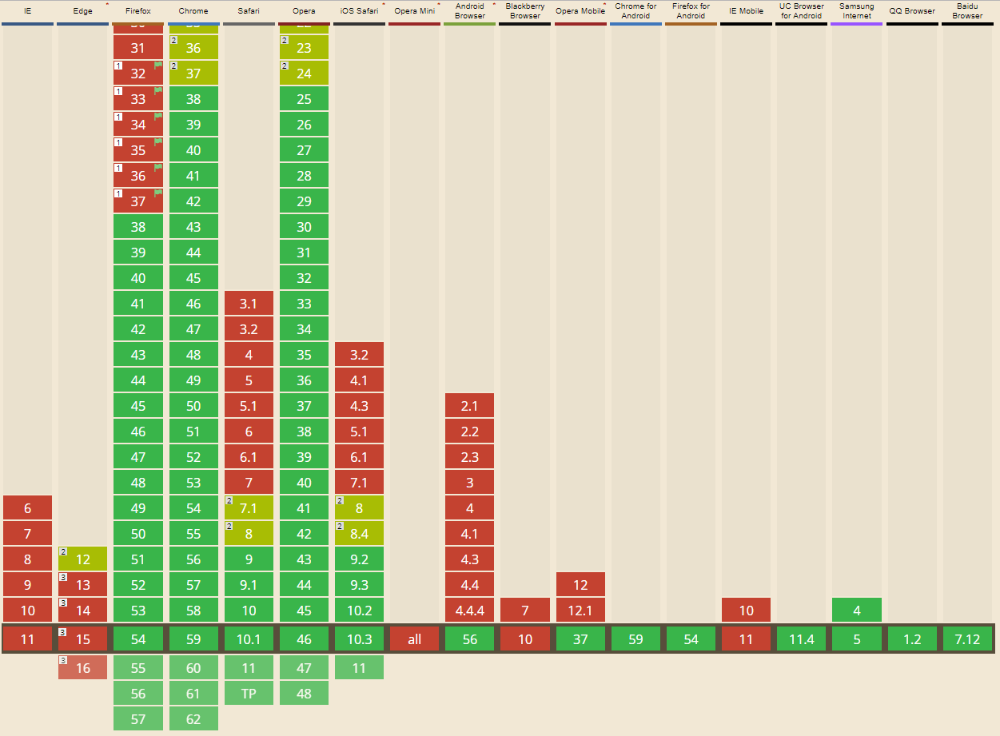

在做响应式图片加载需要使用到的两个关键属性就是`srcset`和`sizes` ，这两个属性是H5中新加的，是给img标签提供多个不同尺寸的图片，在不同设备，不同分辨率的情况下加载不同的图片。
### 根据屏幕分辨率选择
当只需要根据屏幕分辨率去选择不同的图片的时候，有2种情况。

第1种，语法形式为：
````html
srcset="[url] [dpr]x,[url] [dpr]x,....etc"
````
一般屏幕的分辨率会到3倍，例如iphone6plus，其dpr=3，这种是直接给出每种图片的分辨率规格，例子如下：
````html

````
上面的示例表示，在dpr=1的屏幕下加载128px这张图片；在1&lt;dpr&lt;=2时，加载256px这张图片；当dpr&gt;2时就加载512px这张图片了。
注意，srcset里的**x**一定要是小写，大写的话，chrome会无法识别。
[查看demo](https://webkit.org/demos/srcset/)
<!--more-->
第2种，语法形式为：
````html
srcset="[url] [width]w,[url] [width]w,...etc"
````
注意，这里的单位为**w**,与第一种不同。这里的**w**只是我们告诉浏览器这个图片的实际宽度，我们也可以给定不同的值，它仅用于我们给浏览器提示这个图片的实际大小，然后浏览器根据当前设备去选择最佳的图片。如果，我们给的是一个错误的值，或对浏览器撒谎，浏览器当然会选择错误的图片。浏览器最后也会根据我们给的这个值去转化为第1种形式中的等价的值，即像素密度。这种形式，浏览器会默认根据100vw的宽度去计算，也就是设备的viewport宽度，也就是说浏览器会默认图片会铺满整个设备的宽度去显示，例如，
````html

````
上面的示例，浏览器先会自动计算出每种图片在当前设备下显示的像素密度，比如当前用户在设备宽度为320px的设备下查看，则计算结果如下：
````javascript
320 / 320  = 1
640 / 320  = 2
750 / 320  = 2.34375
````

如果当前设备的dpr=1，所以显示128px这张图了；如果当前设备的dpr=2，这会选择256px这张图片了，如果当前设备的dpr=2.5，则会显示516px这张图了，实际上与第1种形式中判断的方式一样。
注意，**x**与**w**不能混合使用。

### 根据媒体查询来选择
媒体查询来选择就会用到sizes来写媒体查询语句了，sizes的语法格式为
````html
sizes="[media query] [length],[media query] [length],...etc"
````
这里的length可以是`rem`，`em` ，`px` ，`vw`，甚至是css3中的`calc`，表示我们想让这个图片在浏览器中显示的宽度，*注意实际的图片显示宽度并不会受这个值得影响,只会根据图片自身的实际大小或css规则去显示*。这个length值，只是我们提供给浏览器的一个计算依据值，浏览器根据这个值，再结合srcset提供的图片规格，去选择在当前设备下最合适的图片。在使用这种方式时一定要与srcset配合使用，才能生效。

````html

````

上面的例子表示，首先根据当前设备的viewport去匹配sizes的媒体查询，找到第一个匹配的值，然后应用它后面的width作为图片会显示宽度的去计算出**x**单位等价的值，即像素密度，计算规则跟上面的一样，例如，当前设备的viewport是640px，则匹配到width=640px，计算结果是：
```javascript
320 / 640  =  0.5
640 / 640  =  1
750 / 640  =  1.171875
```

然后根据当前设备的dpr去选择最接近的图片，如果dpr=1，则选择256px这张图片，如果dpr>1,则选择512px这张图片。上面的sizes查询选择640px，750px作为断点，也就是viewport=640px时匹配width=640px，viewport=750px时匹配width=750px，否则就是width=320px。实际，更为通用的端点是一个范围查询匹配，而不是一个固定的值，例如下面的例子：
````html

````
这个sizes的意思是：如果当前设备的viewport&lt;=750px，则width=100vw（表示图片铺满这个设备宽度显示，1vw=1%*viewport）,否则width=60vw。比如当前设备的viewport=780px，则计算结果是：
```javascript
320 / (0.6 * 780)  =  0.6837606837606838
640 / (0.6 * 780)  =  1.3675213675213675
750 / (0.6 * 780)  =  1.6025641025641026
```

类似的，再根据当前设备的dpr去选择图片了，如果dpr=1，则选择256px这张图片了，如果dpr&gt;1，则选择最接			近的512px这张了。

那如果当前设备viewport=400px，则匹配的width=100vw，计算结果是：
```javascript
320 / (1.0 * 400)  =  0.8
640 / (1.0 * 400)  =  1.6
750 / (1.0 * 400)  =  1.875
```

再根据设备的dpr去选择浏览器认为最佳的那张图片了。
这种sizes方式有一点要注意，浏览器只会应用一地个匹配的sizes，也就是说如果同时能匹配多个媒体查询的条件，但只会应用第一个匹配声明 的width。

实际上，上面的思想就是，我们给定一组规格不同的图片(这个就是srcset设置的)，以及表示我们想要它们在浏览器中显示的宽度(这个就是sizes设置的，如果没有设置sizes，则默认为100vw)，浏览器根据我们提供的这些信息去选择最佳的图片。我们一直强调的是浏览器去选择，所以最后用哪张图，还是得浏览器说了算，这样的目的是，为将来浏览器能更加智能的选择，比如，浏览器可能根据当前的设备网络环境去选择最优的，可能3G环境只选择普清的图片，而在wifi环境总是选择高清的图片，或者当前用户设置的方式去选择最优的，可能用户自己设置只加载普清的图片，等等。如果，要浏览器完全去根据我们设置的信息去选择，那么使用`picture`标签，`picture`标签会完全根据我们提供的srcset和sizes去选择了，例如：

````html
<picture>
	<source media="(min-width:30em)" srcset="cake-table.jpg">
  	<source media="(min-width:60em)" srcset="cake-shop.jpg">
  	
</picture>
````

这个例子表示，如果当前设备屏幕大于等于30em，则显示cake-table这张图片，如果大于等于60em，则选择cake-shop这张图片，否则就显示scones.jpg这张图片，这里的`img`标签一定是要的，对于不支持`picture`设备，会忽略`picture`，直接显示`img`指定的图片。

由于，srcset和sizes是h5中新加的，并不是所有的浏览器都支持，所以，在使用的时候，我们一直给`img`标签加了src属性，因为对于不支持srcset和sizes的设备，至少会显示src指定的图片。[看看浏览器对它的支持情况吧](http://caniuse.com/#search=srcset)，



##### 参考链接
* [mozilla对img标签各个属性的介绍](https://developer.mozilla.org/zh-CN/docs/Web/HTML/Element/img)
* [Figuring Out Responsive Images](https://css-tricks.com/video-screencasts/133-figuring-responsive-images/)
* [Responsive Images: If you’re just changing resolutions, use srcset](https://css-tricks.com/responsive-images-youre-just-changing-resolutions-use-srcset/)