在前端性能优化策略中，耳熟能详的手段有，[雅虎 35 条军规](https://developer.yahoo.com/performance/rules.html?guccounter=1)，使用 cache，减少请求数量，使用[cookie-free domain](https://www.keycdn.com/support/how-to-use-cookie-free-domains)，[critical asset](https://developers.google.com/web/fundamentals/performance/critical-rendering-path/optimizing-critical-rendering-path)，使用 CDN，Lazy load，PreLoad 等，这些手段其实主要都是围绕怎么样更快的拿到所需关键资源。当我们把这一步做到很好，没有可优化空间了，其实还可以从另外一个方向去做优化，那就是浏览器渲染方面。浏览器渲染优化是一个很大的主题，今天，我们只谈它一个小角度，动画帧。从动画帧，我们可以怎么样来做一些优化工作呢？本文篇幅较长，图较多，耐心看完，一定会有很多收获的。

## 基础概念

先还是来熟悉基础概念。帧，可以理解为浏览器每一次绘制的快照。1s 内绘制的次数，叫做帧率，也就是我们常说的 fps（frame per second）。帧率越大，浏览器在 1s 内绘制的次数就越多，动画就越流畅。人们视觉系统对帧率的最低要求一般是 24fps，当帧率低于 24 时，就会感觉到明显的卡顿了。不同的移动设备，有不同的帧率，一般默认是 60fps。

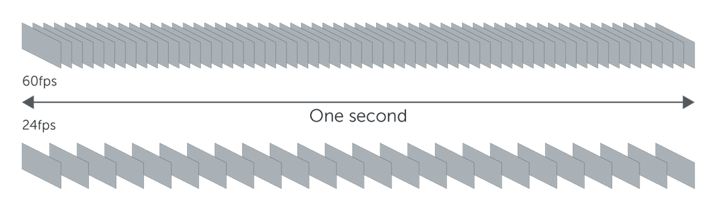

我们要追求的理想帧率是 60fps，那么一帧绘制的时间最多是 1 / 60 = 16.7ms，一旦超过这个数，就达不到 60fps 了。为了使得一帧花费的时间控制在 16.7ms 内，我们必须先搞清楚浏览器在一帧会做些什么事情呢？

## 帧任务

html，js，css 是浏览器处理最为常见的三种资源，也是我们前端工程师每天都会打交道的文件。可是我们真正知道浏览器是怎么绘制的吗？稍微思考一下，然后会说，html 解析为 dom tree，css 解析为 cssom tree，然后 dom tree 加上 cssom tree 就合并为 render tree，最后浏览器根据 render tree 绘制到屏幕上。这是我们最为熟知的步骤，但是它只是描述了一个整体大致的过程，并没有具体到一帧的绘制过程。下面看看一帧具体绘制的过程图。


上图就是浏览器在绘制一帧时，会经过的处理步骤。

- JavaScript，我们会通过 js 来改动一些视觉效果，比如基于 js 的动画，或者响应用户事件等。
- Style，如果通过 js 改变了某一个 dom 的样式，就会重新计算受影响的元素的样式。
- Layout，如果样式改变中涉及了布局属性，例如 top，left，width 等几何位置，还会重新计算它的布局位置，以及受影响的其他元素的布局。当然，如果不涉及布局样式，也不会执行这一步。
- Paint，计算出 Style 和 Layout 后，就可以把元素绘制到它所属的 paint layer 上。
- Composite，最后会将多个 composite layer 输出到屏幕上显示出来。

要控制一帧的执行时间在 16.7ms 内，就只需要把上述 5 个步骤处理时间总和控制在 16.7ms 内。接下来，我们一个步骤一个步骤来看，有哪些优化建议。

## JavaScript

### requestAnimationFrame

JavaScript 是前端工程师的利器，有了它，我们可以实现非常复杂的系统，或者非常流畅的游戏等。JavaScript 通常会处理用户输入或者点击等事件，然后做一系列的视觉效果的改变。**当涉及 dom 元素改变时，总是把操作放在 `requestAnimationFrame`中**。

`requestAnimationFrame`会有什么神奇之处呢？

- 它总是会确保 fn 的执行在浏览器一帧的开头
- 浏览器会自动调节帧率，间接调节了 fn 的执行频率

在不支持 raf 的浏览器中，通常使用`setTimeout(fn, 16.7)`来实现。但是`setTimeout`有一些不好的地方，

- 它并不是保证 fn 每隔 16.7ms 就执行一次，它只能每 16.7ms 将 fn 加入到[MacroTask Queue](https://developer.mozilla.org/en-US/docs/Web/JavaScript/EventLoop)中，具体什么时候执行，要根据当前执行队列决定
- 它不能保证每次执行时机都是一帧的开头，可能某一次执行触发是在帧的中间或者结尾，导致延长当前帧在 16.7ms 内无法执行完成，就会出现丢失当前帧
- 不同设备帧率不一样，并不是固定的 60fps，给低帧率（比如 30fps）的设备上执行`setTimeout(fn, 16.7)`将会导致执行很多无意义的 fn

我们先使用`setTimeout`来实现，每 16.7ms 就更新一次小球的位置，这样尽量保证了 1s 内更新 60 次。

```typescript
// 使用setTimeout来实现小球下落的动画
function animtionWithSetTimeout() {
  setTimeout(() => {
    updateBoll()
    animtionWithSetTimeout()
  }, 16.7)
}
```

然后，我们通过 Chrome 的 Performance 来分析当前帧率情况如下，

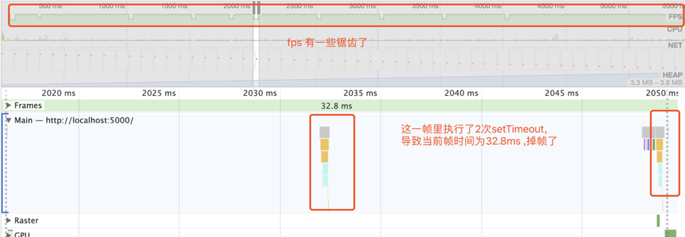

帧率上会有一些锯齿，表示有部分情况是低于 60fps 的。并且在上图中，某一帧中执行了两次`updateBoll`，第二次的`updateBoll`是在帧快结束时触发的，所以拉长了当前帧执行的时间。

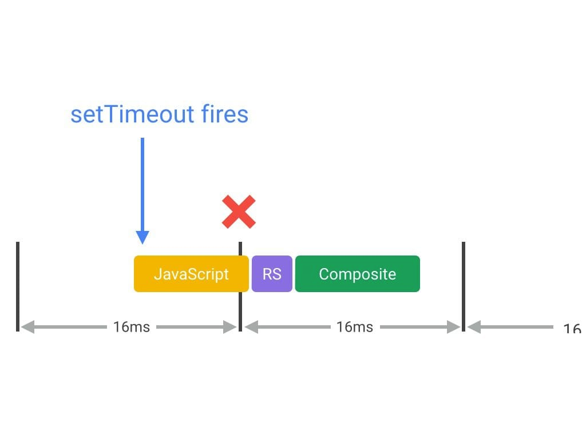

然后，我们使用`requestAnimationFrame`来实现它。

```typescript
// 使用requestAnimationFrame来实现小球下落
function animationWithRaf() {
  updateBoll()
  requestAnimationFrame(animationWithRaf)
}
```

同样，使用 Chrome 的 Performance 来分析当前帧率情况如下，

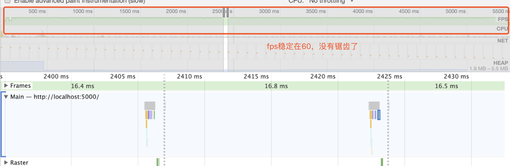

帧率明显稳定在 60fps 左右，没有上面出现的锯齿了，确保了每一帧中都只会触发一次`updateBoll`。

### 分块执行

JavaScript 的执行是在一帧的开头，JavaScript 执行的时间越长，那么当前帧花费的时间就越长。当浏览器要开始更新屏幕了，如果当前帧还未完成，那么当前帧就会被丢弃，延迟到一下次更新，表现出来的就是丢帧。我们应该尽可能缩短 JavaScript 的执行时间，通常不要超过 10ms，因为后面的 Style，Layout，Paint，Composite 至少要花费 6ms 的时间。

当有一个大任务，需要长时间的执行时，我们可以把它分散到每一帧中去完成其中一小部分。这样，可以缩短在每帧中执行的时间。我们来看一个例子，比如要在一帧里绘制 100 个小球，假设需要花费 3s 的时间。

```typescript
function createBoll() {
  sleep(30) // 模拟30ms操作
  const boll = document.createElement("div")
  boll.classList.add("boll")
  boll.style.background = randomColor()
  document.body.append(boll)
}

const COUNT = 100

/* 直接执行大任务 */
function longTask() {
  requestAnimationFrame(() => {
    for (i = 0; i < COUNT; i++) {
      createBoll()
    }
  })
}
```

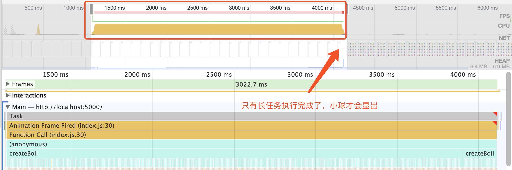

可以明显的看到，这一帧里花费了 3022.7ms，期间页面一直是上一帧的内容（空白）。只有等到任务完成了，才会全部显示小球出来。下面，我们把这个长任务分散到每一帧里执行，每一帧只创建一个小球。

```typescript
/* 分块执行小任务 */
function chunkTask() {
  let i = 0
  requestAnimationFrame(function doOne() {
    // 每一帧，只创建一个小球
    createBoll()
    i++
    if (i < COUNT) {
      requestAnimationFrame(doOne)
    }
  })
}
```

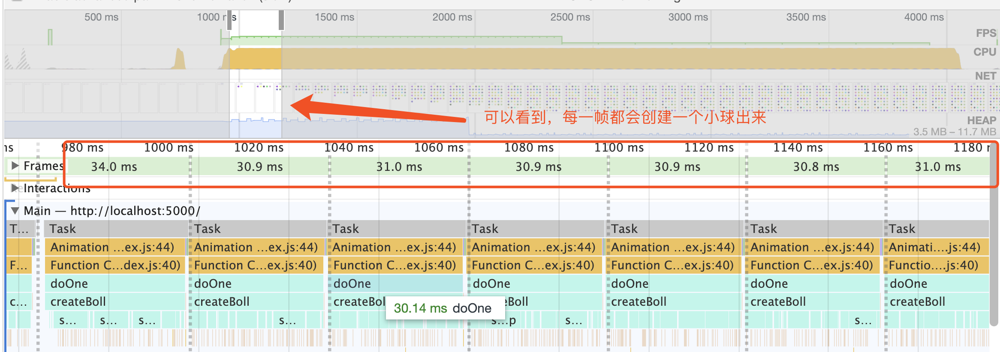

现在每一帧都只花费了 30ms 左右，并且页面不会空等 3s 才显示小球，而是小球逐个绘制出来了，体验明显好多了。

### 其他最佳实践

对于 JavaScript 步骤，还有其他一些很好的建议，下面简单列举出来，就不做 demo 了，

- 将一些纯计算型，不涉及 dom 访问的任务，放到[Web Workers](https://developer.mozilla.org/en-US/docs/Web/API/Web_Workers_API/Using_web_workers)中
- 对于可以使用 css3 来实现的动画，就不需要用 JavaScript 来实现了
- 对于用户事件的响应，同步执行时间不要太长，逻辑尽量简单，复杂的逻辑可以延迟处理或分块处理

## Style & Layout

### 先读取，后设置

使用 JavaScript 来绘制动画时，我们往往需要根据当前 dom 状态（比如位置，大小）来更新它的状态。通常的最佳实践是，**先读取，后设置**。在 raf 中，页面 dom 元素样式都已经在上一帧中计算好了，在读取某一个 dom 样式时，不会触发浏览器重新计算样式和布局。但是，如果我们是先设置，然后在读取，那么这个 dom 样式已经被改变了，为了保证获取到正确的样式值，浏览器必须重新对当前 dom 进行样式计算，如果还涉及布局改变，也会进行重新布局，这种情况就是我们通常说的**触发了 reflow**。

下面我们来验证一下，在 raf 中，每次都是先设置了小球的 top，然后再读取它的 offsetTop 和屏幕的 offsetHeight。

```javascript
function reflow() {
  requestAnimationFrame(() => {
    boll.style.top = boll.offsetTop + 2 + "px"

    if (boll.offsetTop < document.documentElement.offsetHeight) {
      reflow()
    }
  })
}
```

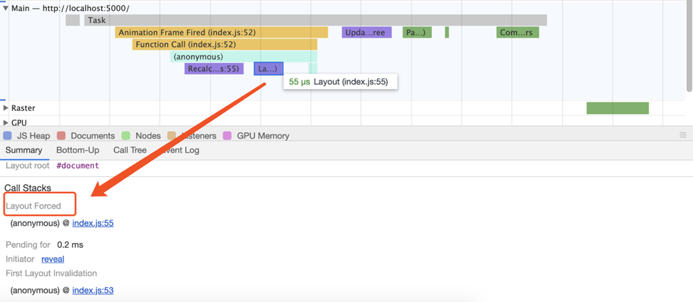

通过分析，可以看到在 JavaScript 中就触发了 Recalculation Forced 和 Layout Forced。现在我们优化一下，先读取它的 offsetTop 和屏幕的 offsetHeight 值，然后在去设置它的 top

```javascript
function optimizeReflow() {
  requestAnimationFrame(() => {
    const top = boll.offsetTop
    const bodyHeight = document.documentElement.offsetHeight
    if (top >= bodyHeight) {
      return
    }

    boll.style.top = top + 2 + "px"
    optimizeReflow()
  })
}
```

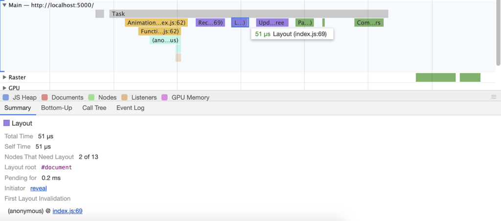

通过分析可以看到，在 JavaScript 步骤没有出现上面的 Recalculation Forced 和 Layout Forced。

### 减少 layout

如果我们在没有更改 dom 的几何属性（width，height，top，left，bottom，right 等），就不会触发 layout 步骤。当一个 dom 的 layout 被改变时，通常都会影响到其他关联的 dom 的 layout 也被改变。在设置动画时，能避免直接改变 dom 的 layout，就应该尽力避免。比如我们可以使用 transform 来位移元素，而不必直接改变它的 layout。还是上面的例子，同样的动画，我们改动 transform 来实现。

```javascript
function transform() {
  let distance = document.documentElement.offsetHeight - boll.offsetTop
  let dropDistance = 0

  requestAnimationFrame(function drop() {
    if (dropDistance > distance) {
      return
    }

    boll.style.transform = "translateY(" + dropDistance + "px)"
    dropDistance = dropDistance + 2
    requestAnimationFrame(drop)
  })
}
```

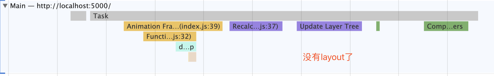

## Paint

### 减少绘制区域

通常，对某一个 dom 的改变，都会触发该 dom 所在层的整个重新绘制。为了避免对整个层的重新绘制，我们可以通过把该 dom 提升到一个新的 composite layer，减少对原始层的绘制。

未提升前，每一帧里都会有对整个 document 的绘制，对整个 document 的绘制会消耗 48us 左右

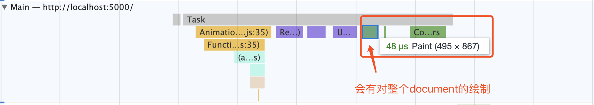

优化之后，我们通过`will-change: top`把小球提升到一个新的 composite layer 上，没有了对整个 document 的绘制，节省了 48us。

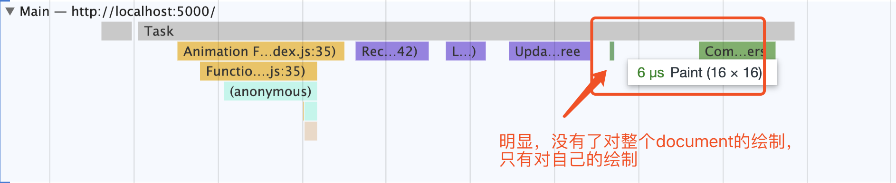

### 使用 transform 和 opacity

即使在同一层上，我们对某一个 dom 使用 transform 或者 opacity 来实现动画，也不会每帧都触发对整个 layer 的绘制，它只会对当前改变的 dom 的绘制和适当减少对整个 layer 的绘制次数。这个特性其实是浏览器的自身优化策略，transform 和 opacity 被视为合成器属性，它们在默认情况下都会生成新的 paint layer。相比上面的优化方式，使用合成器属性，实现了同样的优化效果，但是可以减少增加 composite layer，每创建一个 composite layer 也是会有性能开销的。

我们不必直接改变 dom 的 top 或者 width 等几何属性，而是使用 transform 的 translate，scale 等来实现同样的效果，既可以减少绘制区域，也可以避免 layout。

### 减少绘制的复杂度

不同的绘制效果，消耗的时间也是不同的。通常越复杂的效果，消耗的资源和花费的时间越多，比如阴影，渐变，圆角等，就属于比较复杂的样式。这些样式效果，通常都是设计师设计出来的，我们没有理由直接否定。但是，我们可以根据不同设备来做一些不同的降级处理，比如较低设备上，就只用纯色来代替渐变，去掉阴影效果等。通过降级处理，保证了页面功能不受影响，也提高了页面的性能。

## Composite

处理完了上面这些步骤，终于来到了 Composite 步骤。dom 通过适当条件触发，会提升为新的 composite layer，在 paint 阶段是发生在多个 layer 上的，最后浏览器通过合并多个 layer，根据它们的顺序来正确的显示在屏幕上。composite layer 提升触发条件非常多，这里我只列举几个常见的条件：

1. 3D 相关的 css 样式
2. will-change 设置为 opacity，transform，top，left，bottom，right
3. fixed（在高的 DPI 上会默认提升，在低 DPI 上不会）
4. Hardware-accelerated video element
5. Hardware-accelerated 2D canvas
6. 3D WebGL
7. Overlay（比如 A 覆盖在 B 上，而 B 是提升的 composite layer，则 A 也会提升到新的 composite layer）

composite layer 有自己的 graphic context，所以在渲染的时候，速度非常快，它是直接在 GPU 上完成的，不需要通过 CPU 处理。但是每新增一个 composite layer 都会消耗额外的内存，也不能盲目的将元素提升为新的 composite layer。

除了有 Composite layer，还有一种 paint layer。paint layer 是在[stacking context](https://developer.mozilla.org/en-US/docs/Web/CSS/CSS_Positioning/Understanding_z_index/The_stacking_context)上的，例如我们在使用`z-index`时就会生成新的 paint layer，在帧处理步骤中，其实还有一步 Update Layer Tree 就是用来更新 paint player 的。

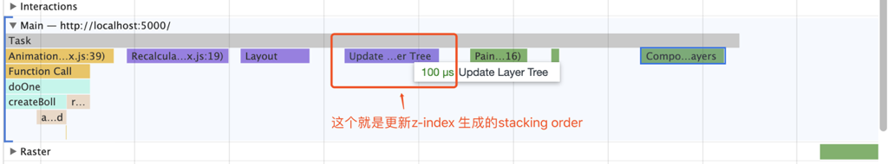

每个 dom node 都会有对应的 layout object。如果 layout object 在同一个坐标系空间中，就会在同一个 paint layer 上。在某些条件下，比如 z-index，absolute 等会生成新的 paint layer。默认情况下，paint layer 都共享同一个 composite layer，但是在某些条件下，比如 animation，will-change 等会把当前 paint layer 提升为新的 composite layer，从而加速渲染。


现在，一帧的任务都处理完了，是不是就结束了呢？

## requestIdleCallback

如果一帧的处理时间少于 16.7ms，多余出来的时间，浏览器会执行`requestIdleCallback`的任务。这个 API 目前还处在不稳定阶段，某些浏览器还未实现它。我们在使用的时候，一定要加上兼容性检测。

```javascript
if ("requestIdleCallback" in window) {
  // Use requestIdleCallback to schedule work.
} else {
  // Do what you’d do today.
}
```


### 一定不能在 requestIdleCallback 里更改 dom 样式

rIC 阶段，frame 的样式布局等都己经 commit 了，所以不能在 rIC 里直接改变 dom 的布局或者样式。如果改变了，会导致样式布局计算失效，在下一帧就会触发 forced layout 等。例如下面这个例子，我们直接在 rIC 里改了小球的位置。

```javascript
if ("requestIdleCallback" in window) {
  requestIdleCallback(() => {
    const left = boll.offsetLeft
    // 这里，我们直接改了boll的位置
    boll.style.left = left + 2 + "px"
    moveLeftWithBadRic()
  })
}
```

然后，打开 chrome 调试一下，就会发现问题，在下一帧的开头就会触发了 layout，这是我们不希望的。


更好的方式就是，我们可以在 rIC 里计算好样式，然后在 rAF 里去更新样式。

```javascript
if ("requestIdleCallback" in window) {
  requestIdleCallback(() => {
    const left = boll.offsetLeft + 2
    const top = boll.offsetTop + 2
    // 在rAF里更新位置
    requestAnimationFrame(() => {
      boll.style.left = left + "px"
      boll.style.top = top + "px"
    })
    moveLeftWithGoodRic()
  })
}
```

优化之后，我们再调试一下，发现，帧开头没有了 layout，这是我们想要的结果。

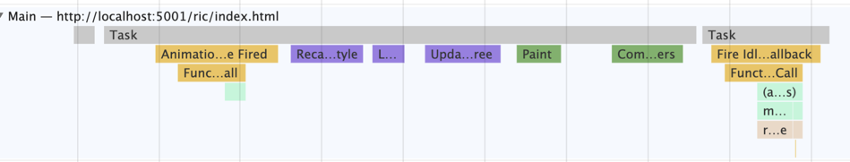

### 其他最佳实践

- rIC 里，可用时间是非常有限的，不能一次执行长时间任务。可根据参数 deadline.timeRemaing()来判断当前可用时间，如果时间到了，必须要结束，或者放在下一个 rIC 里执行

  ```javascript
  function myNonEssentialWork(deadline) {
    // Use any remaining time, or, if timed out, just run through the tasks.
    while (
      (deadline.timeRemaining() > 0 || deadline.didTimeout) &&
      tasks.length > 0
    )
      doWorkIfNeeded()

    if (tasks.length > 0) requestIdleCallback(myNonEssentialWork)
  }
  ```

- rIC 不能保证一定会执行。所以一般放在 rIC 里的任务是无关核心逻辑或用户体验的，一般比如数据上报或者预处理数据。可用传入 timeout 参数，保证任务一定会执行。

  ```javascript
  // Wait at most two seconds before processing events.
  requestIdleCallback(processPendingAnalyticsEvents, { timeout: 2000 })
  ```

## 小结

通过完整的学习一帧的绘制过程，然后针对每个过程，我们都采取一些优化手段，那么整个动画都将表现的非常流畅。最好，用一张图来作为结尾吧。

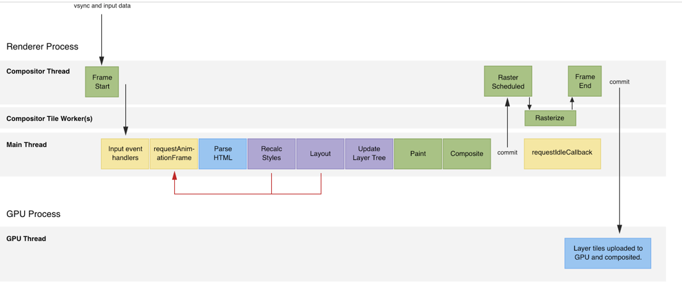

## 参考

- [渲染性能](https://developers.google.com/web/fundamentals/performance/rendering/)
- [Front-End Performance Optimization with Accelerated Compositing Part 1](https://www.alibabacloud.com/blog/front-end-performance-optimization-with-accelerated-compositing-part-1_594194)
- [The Anatomy of a Frame](https://aerotwist.com/blog/the-anatomy-of-a-frame/)
