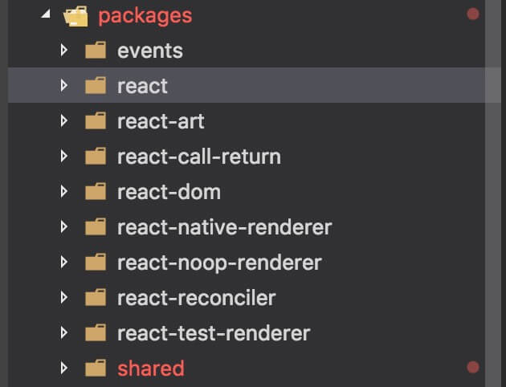
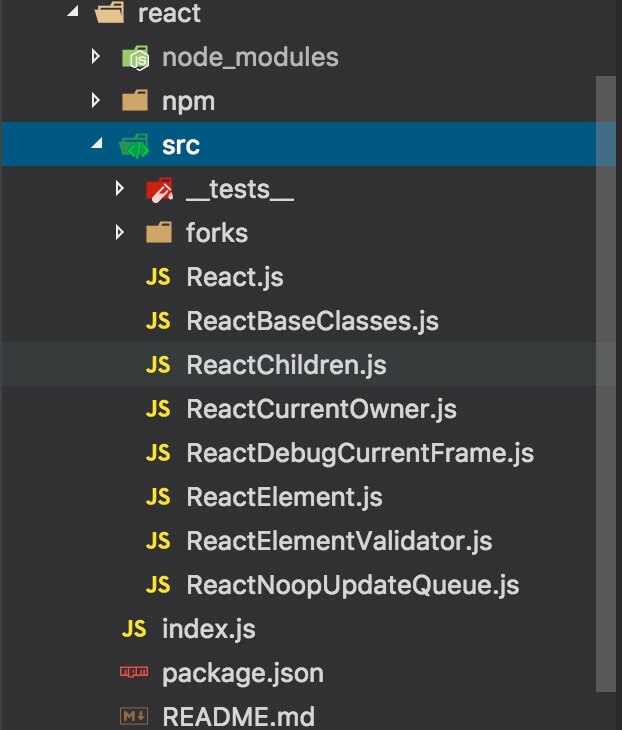

趁着离职期这段时间，制定了一个计划，再次阅读 React16 的源码，React16 是一个大版本的更新，其中新增了许多的新特性，并且重写了核心模块的架构，叫做**Fiber**，最令人兴奋的是**async rendering**。之前也浅显的阅读过 React15 的部分源码，发现这次 React16 与之有很大的不同。

## 核心文件

React16 真的是重新梳理了代码结构，并且解耦了很多，下面为 React16 的文件结构



可以看到我们熟悉的 react 和 react-dom。react-art 是绘制图形的，比如 Canvas，SVG，VML。react-call-return 是一个试验性的，用于 react 中的多遍渲染。react-reconciler 是 Fiber 的实现。share 中存放着一些公用的方法和属性。

<!--more-->

## React 目录

react 目录下存放着 react 的核心文件，如图



看着是不是很熟悉，跟 react15 的很多一样。ReactBaseClasses 实现了`Component`和`PureComponent`。ReactChildren 里是一些工具函数。ReactCurrentOwner 就是创建当前上下文环境对象。ReactElement 实现了`createElement`，`createFactory`，`cloneElement`，`isvalidElement`。ReactElementValidator 用于验证`ReactElement`相关方法。`ReactNoopUpdateQueue`维护着 react 的更新队列。

## React 源码

与 React15 一样，react 输出的也是一个对象，这个对象上绑定着我们用的一些类或方法。

```javascript
const React = {
  Children: {
    map,
    forEach,
    count,
    toArray,
    only,
  },

  Component,
  PureComponent,

  Fragment: REACT_FRAGMENT_TYPE, //react16增加了Fragment
  StrictMode: REACT_STRICT_MODE_TYPE,
  unstable_AsyncMode: REACT_ASYNC_MODE_TYPE,

  createElement: __DEV__ ? createElementWithValidation : createElement,
  cloneElement: __DEV__ ? cloneElementWithValidation : cloneElement,
  createFactory: __DEV__ ? createFactoryWithValidation : createFactory,
  isValidElement: isValidElement,

  version: ReactVersion,

  __SECRET_INTERNALS_DO_NOT_USE_OR_YOU_WILL_BE_FIRED: {
    ReactCurrentOwner,
    // Used by renderers to avoid bundling object-assign twice in UMD bundles:
    assign,
  },
}
```

其中值得注意的是，react16 中增加了 Fragment，这个是 react15 中没有的。上面代码都比较简单，我就不一一说了。
