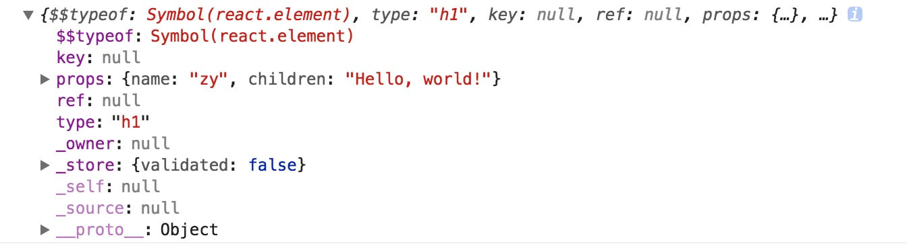
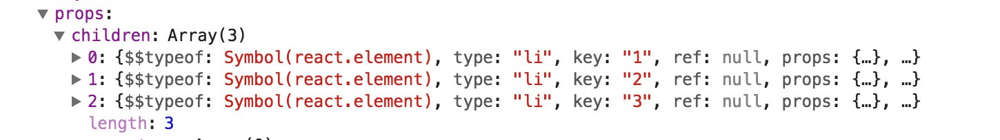

React 中比较重要的就是**React elements**了，可以理解为页面中可看到的节点元素。

## 结构

一个**React element**的结构为下面这样，


<!--more-->

可以看到比较重要的几个属性：**\$\$typeof**，**key**，**props**，**ref**，**type**。

- \$\$typeof：固定为`Symbol(react.element)`，在验证React element时就是取的这个值。

```javascript
export function isValidElement(object) {
  return (
    typeof object === "object" &&
    object !== null &&
    object.$$typeof === REACT_ELEMENT_TYPE
  )
}
```

- key：在循环输出 React elements 时加上 key 属性，可以极大的优化性能，react 在进行节点"diff"比较时，会取 key 值进行比较。
- props：传递给 element 的属性对象，也包含了当前元素的子节点`children`



- ref：保存了对应真实 dom 的节点的访问的名称

```javascript
const ref = function(value) {
  const refs = inst.refs === emptyObject ? (inst.refs = {}) : inst.refs
  if (value === null) {
    delete refs[stringRef]
  } else {
    refs[stringRef] = value
  }
}
```

- type：当前元素的类型，取值为 html 元素，自定义组件，Fragment，StrictMode，AsyncMode。

```javascript
export default function isValidElementType(type: mixed) {
  return (
    typeof type === "string" ||
    typeof type === "function" ||
    // Note: its typeof might be other than 'symbol' or 'number' if it's a polyfill.
    type === REACT_FRAGMENT_TYPE ||
    type === REACT_ASYNC_MODE_TYPE ||
    type === REACT_STRICT_MODE_TYPE ||
    (typeof type === "object" &&
      type !== null &&
      (type.$$typeof === REACT_PROVIDER_TYPE ||
        type.$$typeof === REACT_CONTEXT_TYPE ||
        type.$$typeof === REACT_FORWARD_REF_TYPE))
  )
}
```

## 源码分析

**React elements**是通过`React.createElement`函数创建的，可以创建内部预定义的元素类型，这些预定义的就是对应 html 中的原始 tagName（定义在 validateDOMNesting.js 文件中），也可以创建自定义组件的元素类型。

```javascript
export function createElement(type, config, children) {
  let propName

  // Reserved names are extracted
  const props = {}

  let key = null
  let ref = null
  let self = null
  let source = null

  if (config != null) {
    if (hasValidRef(config)) {
      ref = config.ref
    }
    if (hasValidKey(config)) {
      key = "" + config.key
    }

    self = config.__self === undefined ? null : config.__self
    source = config.__source === undefined ? null : config.__source
    // Remaining properties are added to a new props object
    for (propName in config) {
      if (
        hasOwnProperty.call(config, propName) &&
        !RESERVED_PROPS.hasOwnProperty(propName)
      ) {
        props[propName] = config[propName]
      }
    }
  }

  // Children can be more than one argument, and those are transferred onto
  // the newly allocated props object.
  const childrenLength = arguments.length - 2
  if (childrenLength === 1) {
    props.children = children
  } else if (childrenLength > 1) {
    const childArray = Array(childrenLength)
    for (let i = 0; i < childrenLength; i++) {
      childArray[i] = arguments[i + 2]
    }
    props.children = childArray
  }

  // Resolve default props
  if (type && type.defaultProps) {
    const defaultProps = type.defaultProps
    for (propName in defaultProps) {
      if (props[propName] === undefined) {
        props[propName] = defaultProps[propName]
      }
    }
  }
  return {
    $$typeof: REACT_ELEMENT_TYPE,
    type,
    key,
    ref,
    props,
    _owner: owner,
  }
}
```

## JSX

在创建**React elements**时，用`React.createElement`完全可以满足任何场景，并且 javascript 函数式编程的极大体现，极大的灵活。但是呢，在一些结构复杂，且嵌套层级多的结构中，我们使用`React.createElement`写会觉得比较繁琐，并且直观上不容易理解元素的结构。于是，`JSX`应运而生，用写 html 的方式写 React elements 的结构。实际背后是 babel，会把`JSX`转换为`React.createElement`的方式。详见：[transform-react-jsx](https://babeljs.io/docs/plugins/transform-react-jsx)
