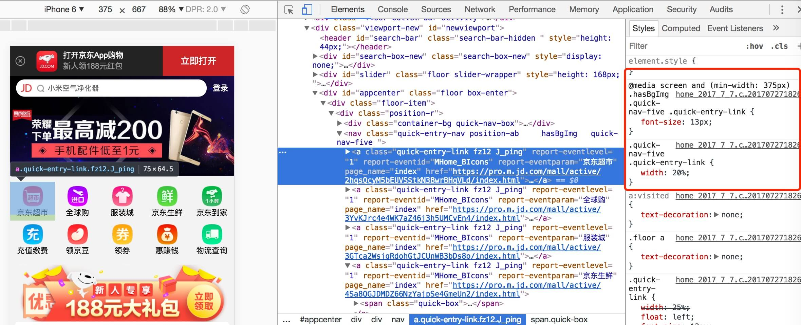
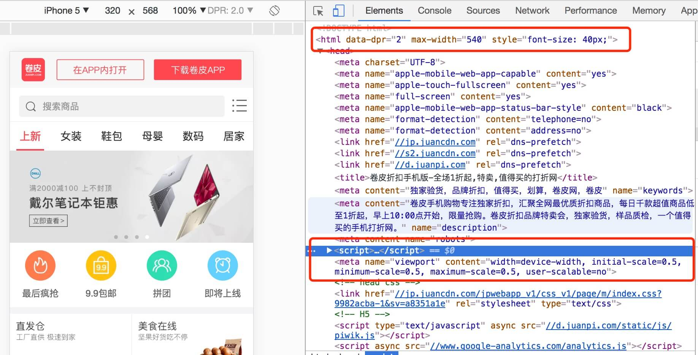
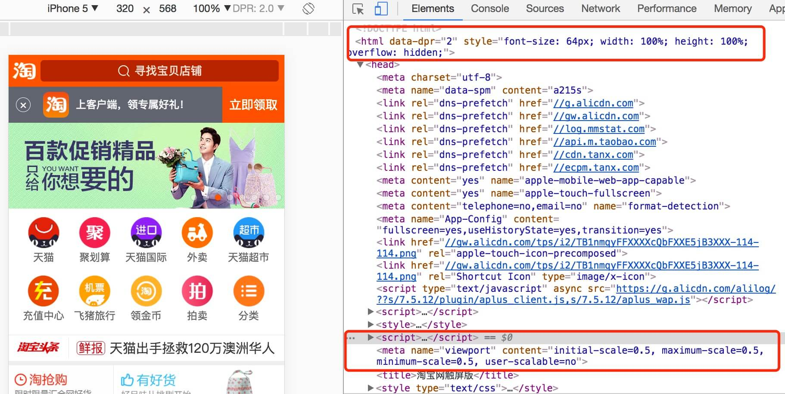
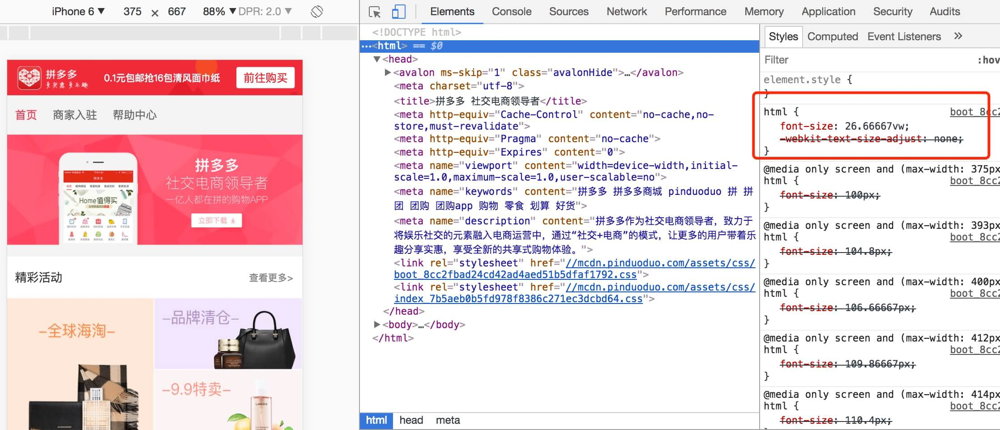

一直想抽时间总结一下现在业界可用的移动端布局方案。需求多，995模式，身心被掏空，一拖再拖，终于在周六的晚上，做着梦弄完成的，不足之道😪，请指教改正🤠。

### media+百分比
直接采用媒体查询加百分比去布局。

核心思想：
*   页面主体布局基本采用百分比去设置。
*   然后，其他块内布局,例如font-size等可通过设置媒体查询的断点来分设置，已达到兼容其他手机尺寸。

<!--more-->
优点：
*   灵活，简单
*   兼容性好，媒体查询，97.65%的浏览器都支持了。

缺点：
*   媒体查询的断点设置麻烦，只能在选取的几个主流设备尺寸下呈现完美适配。
*   1px的问题，需要额外做处理，比如transform:scaleX(0.5)。

例子：京东


### hotcss
这个方案比较简单和实用，理解起来也不难。项目地址[查看这里](https://github.com/imochen/hotcss)

原理：
* 自动通过hotcss.js计算页面的`html`的`font-size`的大小，其后在布局中使用rem作为像素单位，使得页面在不同的移动设备上可以视觉一致。
* 通过获取dpr，在`html`上设置属性`data-dpr`，在设置`font-size`时，可以配合`data-dpr`来使用px作为像素单位。
* 计算scale，为页面设置`viewport`，使得页面根据dpr进行缩放，最终达到，1个物理像素=1px。这样，也有效解决了1px的问题。
* 默认在320px屏幕中（非Retina屏），1rem=20px;

核心源码：

计算dpr并设置`data-dpr`和`scale`
````javascript
//计算dpr
var dpr=window.devicePixelRatio||1;
//在其他的一些方案中，会区分ios和android，对android统一设置为1.
dpr=dpr>=3?3:(dpr>=2?2:1);
//设置data-dpr
document.documentElement.setAttribute('data-dpr',dpr); 
//计算scale
var scale=1/dpr,
    content='width=device-width,initial-scale='+scale+',minimum-scale='+scale+',maximum-scale='+scale+',user-scalable=no';
//插入meta，设置页面缩放　
var viewport=document.createElement('meta');
viewport.setAttribute('name','viewport');
viewport.setAttribute('content',content);
document.head.appendChild(viewport);
````
计算`font-size`并设置`html`的`font-size`
````javascript
//获取设备的宽度
var innerWidth=document.documentElement.getBoundingClientRect().width||window.innerWidth;
//计算font-seize，默认320px中，1rem=20px.
document.documentElement.style.fontSize=(innerWidth*20/320)+'px';
````

优点：
*   后续布局处理简单，配合px2rem插件等，使用十分方便。
*   基本能很好适配市面即大多数尺寸手机。
*   兼容性也比较好,97.62%浏览器基本支持rem单位了。
*   通过设置缩放比例，有效解决了1px的问题。

缺点：
*   页面需要额外引入js脚本去计算，增加一次额外的http请求，或内嵌到页面中增加页面体积大小。

例子：卷皮


### flexible
这个是手机淘宝推出来一个方案，解决手机淘宝H5在移动端的布局。项目地址[查看这里](https://github.com/amfe/lib-flexible)

原理：
*   自动通过flexible.js计算页面`html`的`font-size`的大小，然后在页面布局中使用rem作为单位，而非px。
*   如果页面指定了`meta[name="viewport"]`，则直接根据已有的meta标签来设置缩放比例；否则，通过`dpr`来自动计算页面缩放比例。
*   设置1rem=10vw，例如，在320px屏幕（非Retina屏），1rem=32px；

核心源码：

计算缩放比例
```javascript
//参试获取页面已定义的缩放比例
var metaEl = doc.querySelector('meta[name="viewport"]');
if(metaEl){
  console.warn('将根据已有的meta标签来设置缩放比例');
  var match = metaEl.getAttribute('content').match(/initial\-scale=([\d\.]+)/);
  if (match) {
    scale = parseFloat(match[1]);
    dpr = parseInt(1 / scale);
  }
}
//如果没有，则自动计算
if (!dpr && !scale) {
    var isAndroid = win.navigator.appVersion.match(/android/gi);
    var isIPhone = win.navigator.appVersion.match(/iphone/gi);
    var devicePixelRatio = win.devicePixelRatio;
    if (isIPhone) {
      // iOS下，对于2和3的屏，用2倍的方案，其余的用1倍方案
      if (devicePixelRatio >= 3 && (!dpr || dpr >= 3)) {
        dpr = 3;
      } else if (devicePixelRatio >= 2 && (!dpr || dpr >= 2)) {
        dpr = 2;
      } else {
        dpr = 1;
      }
    } else {
      // 其他设备下，仍旧使用1倍的方案
      dpr = 1;
    }
    scale = 1 / dpr;
}
```

设置meta
```javascript
if (!metaEl) {
  metaEl = doc.createElement('meta');
  metaEl.setAttribute('name', 'viewport');
  metaEl.setAttribute('content', 'initial-scale=' + scale + ', maximum-scale=' + scale + ', minimum-scale=' + scale + ', user-scalable=no');
  if (docEl.firstElementChild) {
    docEl.firstElementChild.appendChild(metaEl);
  } else {
    var wrap = doc.createElement('div');
    wrap.appendChild(metaEl);
    doc.write(wrap.innerHTML);
  }
}
```
计算页面的html的font-size
```javascript
var width = docEl.getBoundingClientRect().width;
//最大屏幕宽度为540*dpr
if (width / dpr > 540) {
  width = 540 * dpr;
}
//设置1rem=10vw
var rem = width / 10;
docEl.style.fontSize = rem + 'px';
flexible.rem = win.rem = rem;
```

优缺点同hotcss。

例子：淘宝


### rem+vw
这种方案就是在计算html的font-size时，是根据vw去自动计算，而不是用js脚本去动态计算。vw是一种新的单位，类似的还有vh，vmin，vmax。定义如下：
*   vw：1vw等于视口宽度的1%；例如，320px宽度视口中，1vw=3.2px，10vw=32px，100vw=320px；
*   vh：1vh等于视口高度的1%；例如，568px高度视口中，1vh=5.58px，10vh=56.8px，100vh=568px；
*   vmin：选取vw和vh中最小的那个；
*   vmax：选取vw和vh中最大的那个；

核心思想：

不用js去动态计算页面的font-size ，而是设置根元素html的font-size=*a* vw；这里的*a*，可以选取一种屏幕尺寸去参考计算。例如，我们想iPhone6下，html的font-size为100px。那个html的font-size=100/375=0.26666666666666666vw。那么，其他屏幕的适配计算方式就是:
```javascript
iphone5:屏幕是320*568
html的font-size=0.26666666666666666*320=85.33333333333333

iphone6s:屏幕是414*736
html的font-size=0.26666666666666666*414=110.39999999999999　
```

页面布局采用rem布局，而非px。根据html的font-size和rem单位自动计算出了布局px。

优点：
*   不需要额外引入js脚本去计算，自动根据vw去计算font-size
*   后续布局也超级简单，采用rem即可。

缺点：

*   vw单位的支持相对比rem的浏览器少一些，目前有93.65%的浏览器都支持了。

例子：拼多多



