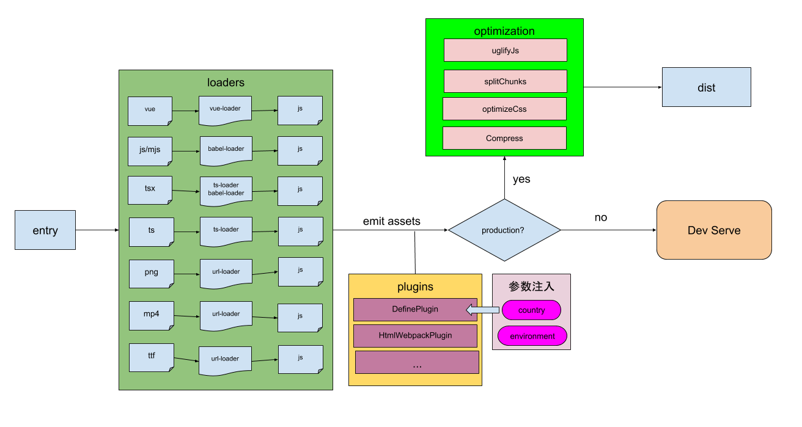

现在前端项目的构建一般基本都是基于 webpack 的。项目的技术栈目前比较主流的是 react 全家桶和 vue 全家桶。
趁空闲，以公司一个项目整理了 webpack 构建常见的流程,这个项目是使用 vue 全家桶开发的。

### 技术栈

- vue
- typescript

### 浏览器支持

```json
"browserslist": [
    "> 1%",
    "last 2 versions",
    "not ie <= 9",
    "Android >= 4.3"
]
```

<!--more-->

### 流程图



### 功能

- babel
- postcss
- eslint

#### babel

> Babel is a JavaScript compiler.

让我们可以在项目中使用较新 JavaScript 特性。可以通过.babelrc文件指定我们需要编译到的目标版本

```json
{
  "presets": [
    [
      "env",
      {
        "modules": false,
        "useBuiltIns": "usage"
      }
    ],
    "stage-2"
  ],
  "plugins": ["transform-vue-jsx", "transform-runtime"]
}
```

#### postcss

> a tool for transforming styles with JS plugins

可以让我们在项目使用一些较新 css 的特性。可以通过**.postcssrc.js**文件指定我们配置的 postcss 插件

- 可以通过 rem 方案来处理移动设备上的适配，在构建过程中，使用了 px2rem 插件来将 px 转为 rem。
- 使用了 postcss-import 将@import 引入的 css 文件内容内联到当前文件内
- postcss-url，配合 postcss-import 使用
- postcss-cssnext，使用一些 css 新特性，目前已建议使用 postcss-preset-env 替换。
- postss-pxtorem，将 px 转为 rem

```js
module.exports = {
  plugins: {
    "postcss-import": {
      path: "src/css/",
    },
    "postcss-url": {},
    "postcss-cssnext": {},
    "postcss-pxtorem": {
      rootValue: 75,
      unitPrecision: 5,
      propList: ["*"],
      selectorBlackList: [],
      replace: true,
      mediaQuery: false,
      minPixelValue: 2,
    },
  },
}
```

#### tslint

> An extensible linter for the TypeScript language.

定制项目 javascript 使用的标准化，建议将多个项目统一定制为一套。可以在 tslint.json 中定制项目的检查规则。

```json
{
  "extends": "tslint:recommended",
  "rulesDirectory": ["path/to/custom/rules/directory/", "another/path/"],
  "rules": {
    "max-line-length": {
      "options": [120]
    },
    "new-parens": true,
    "no-arg": true,
    "no-bitwise": true,
    "no-conditional-assignment": true,
    "no-consecutive-blank-lines": false,
    "no-console": {
      "severity": "warning",
      "options": ["debug", "info", "log", "time", "timeEnd", "trace"]
    }
  },
  "jsRules": {
    "max-line-length": {
      "options": [120]
    }
  }
}
```

### 环境配置

在配置 webpack 文件时，分 dev 和 prod 环境，不同的环境配置项有所差别，主要体现在 plugin 的使用上。主要有三个 webpack 配置文件

- webpack.base.conf.js，dev 和 prod 公用的基础配置，主要 loader 的配置
- webpack.dev.conf.js，dev 环境的配置，主要配置了 webpack-dev-serve，供开发环境使用
- webpack.prod.conf.js，production 环境的配置，主要增加了一些优化的配置，比如 OptimizeCSSPlugin，UglifyJsPlugin
  可以根据实际业务情况，配置不同环境变量，比如，我整理的这个项目，是会区分不同国家，以及不同的测试部署环境。在区分不同国家，不同部署环境时，采用了 test，staging，live 等环境名称。development 和 production 只是针对开发人员而言的，在本地开发就是 development，代码部署到 test，staging，live 都是 production。对不同国家，不同部署环境，又有 dev.env.js 和 prod.env.js.这两个文件其实是一样的，只不过参数不同而已。可以统一从 process.env.env 和 process.env.cid 拿参数，这样就可以不需要这两个配置文件了，且不需要在 build 脚本中去动态替换 prod.env.js 里的配置项（个人觉得，可以讨论）
- dev.env.js

```javascript
const merge = require("webpack-merge")
const prodEnv = require("./prod.env")

module.exports = merge(prodEnv, {
  NODE_ENV: '"development"',
  country: '"sg"',
  environment: '"test"',
})
```

- prod.env.js

```javascript
const COUNTRY = "sg"
const shopeeEnvironment = "live"

module.exports = {
  NODE_ENV: '"production"',
  country: '"' + COUNTRY + '"',
  environment: '"' + shopeeEnvironment + '"',
}
```

### 使用

- 在 dev 开发环境，需执行`npm run start`或者`yarn start`
- 在 build 时，需执行`npm run build`或者`yarn build`

### 其他

- babel-polyfill，对不同设备对 js 的兼容，**可以考虑使用 polyfill.io，针对具体设备引入具体的 feature**
- normalize.css，针对 Html5，样式 reset
