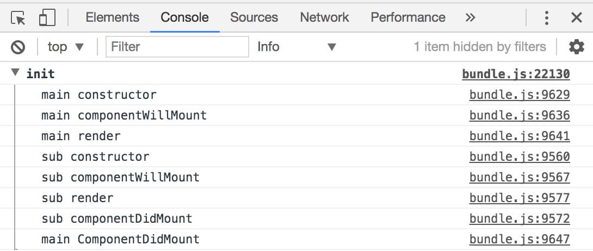
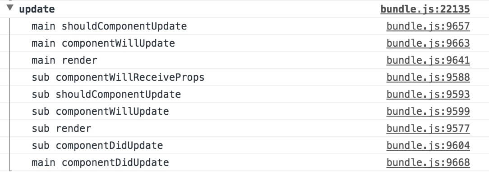

众所周知，react的组件是有一个个的钩子函数，构建成的生命周期，在用es6的class与用createClass有所不同，其中createClass还包括了`getDefaultProps`与`getInitialState`。由于createClass 将在后续版本中移除，建议使用class形式。所以，下面讨论的都是class形式下的生命周期方式。

## 初始阶段
*   constructor ，构造函数，在初始化实例时首先触发
*   componentWillMount，组件将渲染出来之前触发，可以调用setState，简单的合并state，不会触发render重新渲染
*   render ，将组件渲染，不可以调用setState
*   componentDidMount，组件渲染之后触发，可以调用setState，会重新触发render

<!--more-->
## 更新阶段
*   componentWillReceivePorps，组件获取新的props时触发
*   shouldComponentUpdate，组件在调用setState重新更新render之前调用，如果返回false,则不触发后续的生命周期的方法，不会更新组件的渲染，返回true，则一定会触发后续的生命周期方法，一定会重新更新组件的渲染，在这个方法里不能调用setState，如果不小心调用，会造成死循环
*   componentWillUpdate，组件在更新阶段，即将更新组件之前触发，不可调用setState，如果不小心调用，会造成死循环
*   Render，组件进行更新，不可调用setState
*   componentDidUpdate，组件更新之后触发，

## 卸载阶段
*   componentWillUnmount，组件即将卸载之前触发，在这里一般做一些清理工作，也不可调用setState


说完上面这些方法，就需要实际去验证了，我写了一个最基本的组件，且包含了它所有的生命周期的方法，看各个方法执行的情况。代码如下，其中Test与App大体类似，就不列出来了。

````jsx
export class App extends Component {
    constructor(props) {
        super(props);
        this.state = {
            name: 'zy'
        }
        console.log('main constructor');
    }
    componentWillMount() {
        console.log('main componentWillMount');
    }
    render() {
        console.log('main render');
        return <Test name={this.state.name} />
    }
    componentDidMount() {
        console.log('main ComponentDidMount');
    }
    componentWillReceiveProps() {
        console.log('main componentWillReceiveProps');
    }
    shouldComponentUpdate() {
        console.log('main shouldComponentUpdate');
        return true;
    }
    componentWillUpdate() {
        console.log('main componentWillUpdate');
    }
    componentDidUpdate() {
        console.log('main componentDidUpdate');
    }
    componentWillUnmount() {
        console.log('main componentWillUnmount');
    }
}
````

初始化时，查看Console控制台的打印情况如下，

可以看到，有2个点比较重要；第一个是， sub组件只有在main的render方法中实例化时才开始生命周期方法的调用；第二个是，main组件等sub组件实例化完成之后才完成。
再来看看更新阶段的情况，

上面是完整的更新阶段调用情况，也就是说我把shouldComponent都返回的是true，而实际中，shouldComponentUpdate可能在控制组件更新时返回false，那么返回false的情况下，后续的生命周期方法都不会调用，例如我把main的shouldComponentUpdate返回false，调用情况如下，


最后，来看看卸载的调用情况，如下，


