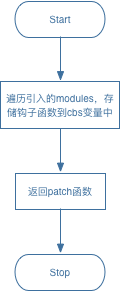
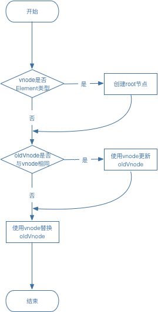
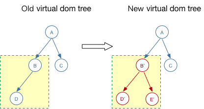
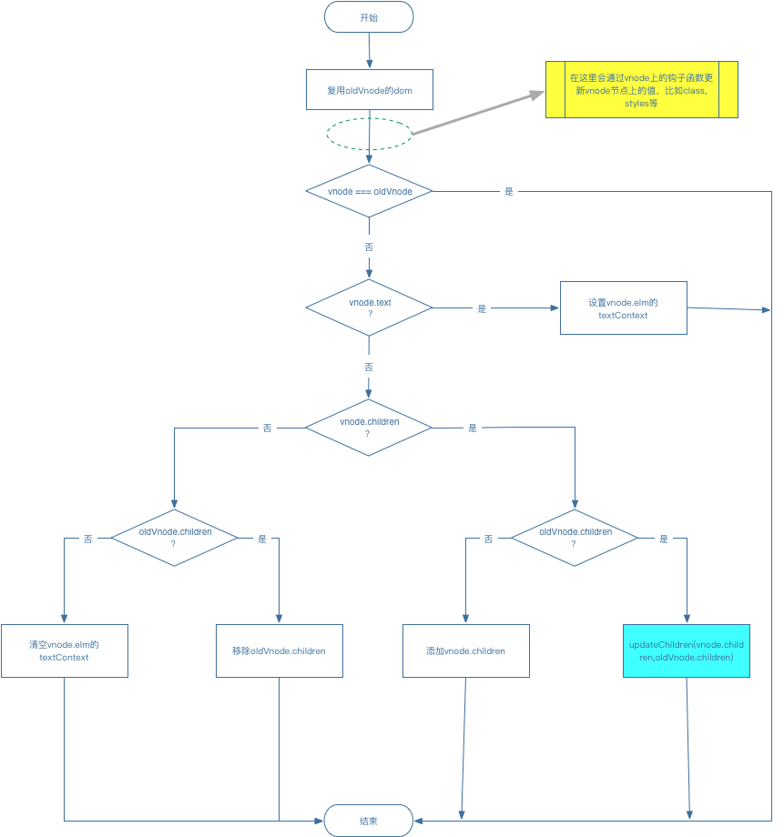
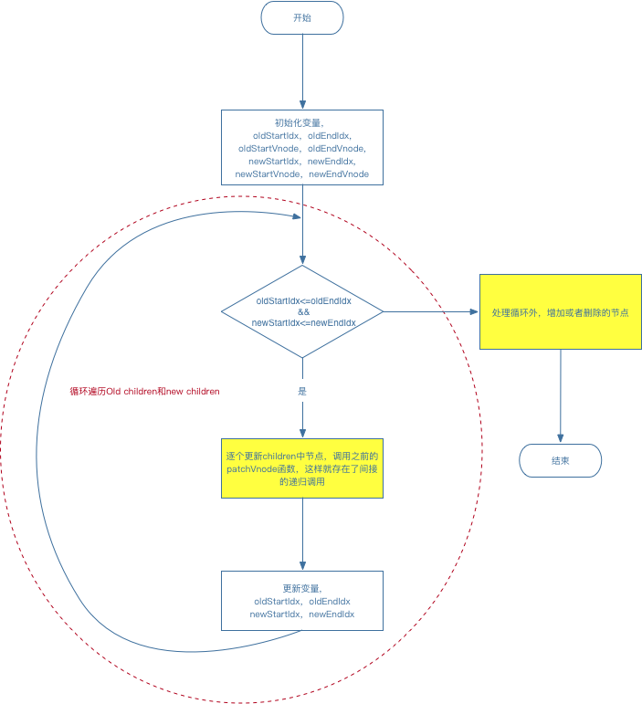
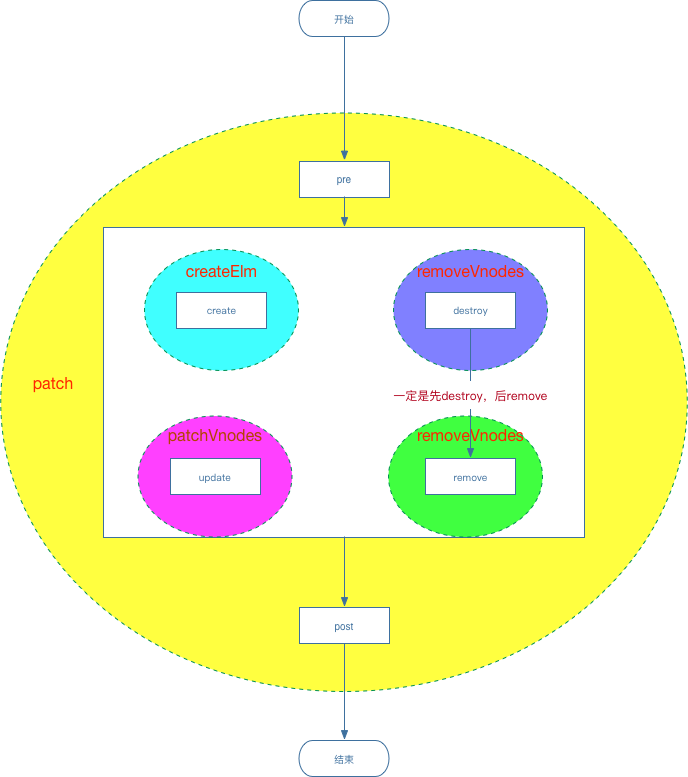

最近想了解一下 React 和 Vue 框架分别在 virtual dom 部分的实现，以及他们的不同之处。于是先翻开 Vue 的源码去找 virtual dom 的实现，看到开头，它就提到了 Vue 的 virtual dom 更新算法是基于 Snabbdom 实现的。于是，又去克隆了 Snabbdom 的源码，发现它的源码并不是很复杂并且星星 🌟 还很多，所以就仔细看了一遍了，这里就将详细学习一下它是如何实现 virtual dom 的。

在 Snabbdom 的 GitHub 上就解释了，它是一个实现 virtual dom 的库，简单化，模块化，以及强大的特性和性能。

> A virtual DOM library with focus on simplicity, modularity, powerful features and performance.

[这里是 Snabbdom 的仓库地址](https://github.com/snabbdom/snabbdom)。

### init

<!--more-->

Snabbdom 的简单是基于它的模块化，它对 virtual dom 的设计非常巧妙，在核心逻辑中只会专注于 vNode 的更新算法计算，而把每个节点具体要更新的部分，比如`props`，`class`，`styles`，`datalist`等放在独立的模块里，通过在不同时机触发不同 module 的钩子函数去完成。通过这样的方式解耦，不仅可以使代码组织结构更加清晰，更可以使得每一部分都专注于实现特定的功能，在设计模式中，这个也叫做单一职责原则。在实际场景使用时，可以只引入需要用到的特定模块。比如我们只会更新节点的类名和样式，而不关心属性以及事件，那么就只需要引用 class 和 style 的模块就可以了。例如下面这样，

```javascript
// 这里我们只需要用到class和style模块，所以就可以只需要引用这2个模块
var patch = snabbdom.init([
  require("snabbdom/modules/class").default,
  require("snabbdom/modules/style").default,
])
```

它的核心方法就是这个`init`，我们先来简单看一下这个函数的实现，

```typescript
// 这里是module中的钩子函数
const hooks = ["create", "update", "remove", "destroy", "pre", "post"]
export function init(modules: Array<Partial<Module>>, domApi?: DOMAPI) {
  let i: number,
    j: number,
    cbs = {} as ModuleHooks
  const api: DOMAPI = domApi !== undefined ? domApi : htmlDomApi
  // cbs存储了引入的modules中定义的钩子函数，
  for (i = 0; i < hooks.length; ++i) {
    cbs[hooks[i]] = []
    for (j = 0; j < modules.length; ++j) {
      const hook = modules[j][hooks[i]]
      if (hook !== undefined) {
        cbs[hooks[i]].push(hook)
      }
    }
  }

  // 还定义了一些其他的内部方法，这些方法都是服务于patch
  function emptyNodeAt() {
    /* ... */
  }
  function createRmCb() {
    /* ... */
  }
  function createElm() {
    /* ... */
  }
  function addVnodes() {
    /* ... */
  }
  function invokeDestroyHook() {
    /* ... */
  }
  function removeVnodes() {
    /* ... */
  }
  function updateChildren() {
    /* ... */
  }
  function patchVnode() {
    /* ... */
  }

  // init返回了一个patch函数，这个函数接受2个参数，第一个是将被更新的vNode或者真实dom节点，第二个是用来更新的新的vNode
  return function patch(oldVnode: VNode | Element, vnode: VNode): VNode {
    //...
  }
}
```

从`init`函数整体来看，它接受一个 modules 数组，返回一个新的函数`patch`。这不就是我们熟悉的闭包函数吗？在`init`中，它会将引入模块的钩子函数通过遍历存储在`cbs`变量里，后面在执行更新算法时会相应的触发这些钩子函数。只需要初始化一次，后面 virtual dom 的更新都是通过`patch`来完成的。

流程图如下，



### patch

最为复杂也最为耗时的部分就是如何实现 virtual dom 的更新，更新算法的好坏直接影响整个框架的性能，比如 React 中的 react-reconciler 模块，到 vue 中的 vdom 模块，都是最大可能优化这一部分。在 Snabbdom 中 virtual dom 的更新逻辑大致如下，

```typescript
// 这个patch就是init返回的
function patch(oldVnode, vnode) {
  // 第一步：如果oldVnode是Element，则根据Element创建一个空的vnode，这个也是vnode tree的根节点
  if (!isVnode(oldVnode)) {
    oldVnode = emptyAtNode(oldVnode)
  }
  // 第二步：判断oldVnode是否与vnode相同的元素，如果是，则更新元素即可。
  // 这里判断它们是否相同，是对比了它们的key相同且tagName相同且ID属性相同且类相同
  if (sameVnode(oldVnode, vnode)) {
    patchVnode(oldVnode, vnode)
  } else {
    // 第三步：如果不相同，则直接用vnode创建新的element元素替换oldVnode，且删除掉oldVnode。
    elm = oldVnode.elm
    parent = api.parentNode(elm)
    createElm(vnode)
    if (parent !== null) {
      api.insertBefore(parent, vnode.elm, api.nextSlibing(elm))
      removeVnodes(parent, [oldVnode], 0, 0)
    }
  }
}
```

`patch`逻辑可以简化为下面：

1. 如果 oldVnode 是 Element 类型，则根据 oldVnode 创建一个空 vnode，这个空 vnode 也是这个 vnode tree 的 root 节点
2. 比较 oldVnode 与 vnode，如果是同一个 vnode（key 值相同）或者是相同类型的元素（tagName 相同且 id 相同且 class 相同），则直接调用`patchVnode`
3. 否则，直接根据 vnode 创建一个新的 element，且用新的 element 替换掉 oldVnode 的 element，且删除掉 oldVnode

流程图如下，



在进行第 3 步时，当 oldVnode 与 vnode 不相同，是直接抛弃了旧的节点，创建新的节点来替换，在用新 vnode 来创建节点时会检查当前 vnode 有没有 children，如果有，则也会遍历 children 创建出新的 element。这意味 oldVnode 以及包含的所有子节点将被作为一个整体被新的 vnode 替换。示意图如下，



如果 B 与 B'不相同，则 B 在被 B'替换的过程中，B 的子节点 D 也就被 B'的子节点 D'和 E'一起替换掉了。

### patchVnode

我们再来看看第 2 步，如果 oldVnode 与 vnode 相同，则会复用之前已经创建好的 dom，只是更新这个 dom 上的差异点，比如 text，class，datalist，style 等。这个是在函数`patchVnode`中实现的，下面为它的大致逻辑，

```typescript
function patchVnode(oldVnode, vnode) {
   // 获取oldVnode的dom对象
  const elm = oldVnode.elm
  // 将vnode的elm直接指向elm，复用oldVnode的dom对象，因为它们类型相同
  vnode.elm = elm
  // 如果oldVnode与vnode相等，则直接返回，根本不用更新了
  if (oldVnode === vnode) {
    return
  }
  // 如果vnode是包含text，且不等于oldVnode.text，则直接更新elm的textContent为vnode.text
  if (isDef(vnode.text) && vnode.text !== oldVnode.text) {
    return api.setTextContext(elm, vnode.text)
  }
  let oldCh = oldVnode.children // 获取oldVnode的子节点
  let ch = vnode.children // 获取vnode的子节点

  // 如果oldVnode没有子节点，而vnode有子节点,则添加vnode的子节点
  if (isUndef(oldCh) && isDef(ch)) {
    // 如果oldVnode有text值，则先将elm的textContent清空
    if (idDef(oldVnode.text)) {
      api.setTextContext(elm, "")
    }
    addVnodes(elm, null, ch, 0, ch.length - 1)
  }
  // 如果oldVnode有子节点，而vnode没有子节点，则删除oldVnode的子节点
  else if (isUndef(ch) && isDef(oldCh)) {
    reoveVnodes(elm, oldCh, 0, oldCh.length - 1)
  }
  // 如果它们都有子节点，并且子节点不相同，则更新它们的子节点
  else if (ch !== oldCh) {
    updateChildren(elm, oldCh, ch)
  }
  // 否则就是它们都有子节点，且子节点相同，如果oldVnode有text值，则将elm的textContent清空
  else if (ifDef(oldVnode.text)) {
    api.setTextContext(elm, "")
  }
}
```

`patchVnode`逻辑可以简化为下面：

1. 直接将 vnode 的 elm 设置为 oldVnode 的 elm，以达到复用已有的 dom 对象，避免了创建新的 dom 对象的开销
2. 比较 oldVnode === vnode，如果相等，则直接返回，不同更新，因为它们就是同一个对象
3. 如果 vnode 有 text 值，则说明 elm 就只包含了纯 text 文本，无其他类型子节点，如果它的值与 oldVnode 的 text 不相同，则更新 elm 的 textContent，并返回。
4. 这一步开始，真正比较它们的 children 了，
   - 如果 vnode 有 children，oldVnode 没有 children，先清空 elm 的 textContext，再将 vnode 的 children 添加进来
   - 如果 vnode 没有 children，oldVnode 有 children，则直接删除 oldVnode 的 children
   - 如果它们都有 children，且不相同，则更新它们的 children
   - 如果它们都有 children，且相同，则清空 elm 的 textContext

流程图如下，



在`patchVnode`更新时，vnode 会先是通过触发定义在 data 数据上的钩子函数来更新自己节点上的信息，比如 class 或者 styles 等，然后再去更新 children 节点信息。

### updateChildren

更新 vnode.children 信息是通过`updateChildren`函数来完成的。只有当 oldVnode 上存在 children，且 vnode 上也存在 children 时，并且`oldVnode.children !== vnode.children`时，才会去调用`updateChildren`。下面来梳理一下`updateChildren`的大致逻辑，

```typescript
function updateChildren(parentElm, oldCh, newCh) {
  // 旧的children
  let oldStartIdx = 0
  let oldEndIdx = oldCh.length - 1
  let oldStartVnode = oldCh[oldStartIdx]
  let oldEndVnode = oldCh(oldEndIdx)

  // 新的children
  let newStartIdx = 0
  let newEndIdx = newCh.length - 1
  let newStartVnode = newCh(newStartIdx)
  let newEndVnode = newCh(newEndIdx)

  let before = null

  // 循环比较
  while (oldStartIdx <= oldEndIdx && newStartIdx <= newEndIdx) {
    if (oldStartVnode == null) {
      // 当前节点可能被移动了
      oldStartVnode = oldCh[++oldStartIdx]
    } else if (oldEndVnode == null) {
      oldEndVnode = oldCh[--oldEndIdx]
    } else if (newStartVnode == null) {
      newStartVnode = newCh[++newStartIdx]
    } else if (newEndVnode == null) {
      newEndVnode = newCh[--newEndIdx]
    } else if (sameVnode(oldStartVnode, newStartVnode)) {
      patchVnode(oldStartVnode, newStartVnode) // 更新newStartVnode
      oldStartVnode = oldCh[++oldStartIdx] // oldStartIdx 向右移动
      newStartVnode = newCh[++newStartIdx] // newStartIdx 向右移动
    } else if (sameVnode(oldEndVnode, newEndVnode)) {
      patchVnode(oldEndVnode, newEndVnode) // 更新newEndVnode
      oldEndVnode = oldCh[--oldEndIdx] // oldEndIdx 向左移动
      newEndVnode = newCh[--newEndIdx] // newEndIdx 向左移动
    } else if (sameVnode(oldStartVnode, newEndVnode)) {
      patchVnode(oldStartVnode, newEndVnode) //更新newEndVnode
      let oldAfterVnode = api.nextSibling(oldEndVnode)
      // 将oldStartVnode移动到当前oldEndVnode后面
      api.insertBefore(parentElm, oldStartVnode.elm, oldAfterVnode)
      oldStartVnode = oldCh[++oldStartIdx] // oldStartIdx 向右移动
      newEndVnode = newCh[--newOldVnode] // newEndIdx 向左移动
    } else if (sameVnode(oldEndVnode, newStartVnode)) {
      patchVnode(oldEndVnode, newStartVnode) // 更新newStartVnode
      // 将oldEndVnode移动到oldStartVnode前面
      api.insertBefore(parentElm, oldEndVnode.elm, oldStartVnode.elm)
      oldEndVnode = oldCh[--oldEndIdx] // oldEndVnode 向右移动
      newStartVnode = newCh[++newStartIdx] // newStartVnode 向左移动
    } else {
      // 获取当前旧的children的节点的key与其index的对应值，
      if (oldKeyIdx == undefined) {
        oldKeyIdx = createKeyToOldIdx(oldCh, oldStartIdx, oldEndIdx)
      }
      // 获取当前newStartVnode的key是否存在旧的children数组里
      idxInOld = oldKeyIdx[newStartVnode.key]
      if (isUndef(idxInOld)) {
        // 如果当前newStartVnode的key不存在旧的children数组里，那么这个newStartVnode就是新的，需要新建dom
        let newDom = createElm(newStartVnode)
        api.insertBefore(parentElm, newDom, oldStartVnode.elm)
        newStartVnode = newCh[++newStartIdx]
      } else {
        // 否则，当前newStartVnode的key存在旧的children里，说明它们之前是同一个Vnode,
        elmToMove = oldCh[idxInOld]
        if (elmToMove.sel !== newStartVnode.sel) {
          // 节点类型变了，不是同一个类型的dom元素了,也是需要新建的
          let newDom = createElm(newStartVnode)
          api.insertBefore(parentElm, newDom, oldStartVnode.elm)
        } else {
          // 否则，它们是同一个Vnode且dom元素也相同，则不需要新建，只需要更新即可
          patchVnode(elmToMove, newStartVnode)
          oldCh[idxInOld] = undefined // 标志旧的children当前位置的元素被移走了，
          api.insertBefore(parentElm, elmToMove, oldStartVnode.elm)
        }
        newStartVnode = newCh[++newStartIdx]
      }
    }
  }

  // 如果循环之后，还有未处理的children，
  if (oldStartIdx <= oldEndIdx || newStartIdx <= newEndIdx) {
    // 如果新的children还有部分未处理，则把多的部分增加进去
    if (oldStartIdx > oldEndIdx) {
      before = newCh[newEndIdx + 1] == null ? null : newCh[newEndIdx + 1]
      addVnodes(parentElm, before, newCh, newStartIdx, newEndIdx)
    } else {
      // 如果旧的children还有未处理，则把多的部分删除掉
      removeVnodes(parentElm, oldCh, oldStartIdx, oldEndIdx)
    }
  }
}
```

`updateChildren`函数逻辑可以简化为，

1. 初始化循环变量
2. 根据变量循环遍历 old children 与 new children，并逐个比较更新，当类型相同时，则调用`patchVnode`更新，当类型不同时，则直接新建 new vnode 的 dom 元素，并插入到合适的位置
3. 循环完了之后，增加新增的 new vnode 节点和移除旧的冗余的 old vnode

流程图如下，



在`updateChildren`函数中，逐个更新 children 中节点时，当比较的两个节点类型相同时，又会反过来调用`patchVnode`来更新节点，这样，实际上存在了间接的递归调用。

### life cycle hooks

在使用 React 或者 Vue 时，你会发现它们都分别定义了组件的生命周期方法，虽然名称或触发时机不完全相同，但是基本的顺序和目的是差不多的。Snabbdom 也提供了相应的生命周期钩子函数，不同的是它提供了 2 套，一套是针对 virtual dom 的，比如一个 Vnode 的`create`，`update`，`remove`等；一套是针对 modules 的，通过在不同时机触发不同 module 的钩子函数去完成当前 Vnode 的更新操作。

modules 的上的钩子函数如下,

```typescript
export interface Module {
  pre: PreHook
  create: CreateHook
  update: UpdateHook
  destroy: DestroyHook
  remove: RemoveHook
  post: PostHook
}
```

它的触发时机图如下，



在触发 modules 的 hooks 函数时，不同的函数会接受不同的参数，下面为 modukes 中钩子函数接受参数情况，

| Name      | Triggered when                         | Arguments to callback     |
| --------- | -------------------------------------- | ------------------------- |
| `pre`     | 在`patch`函数开始处                    | 无                        |
| `create`  | 在`createElm`函数中创建一个 element 时 | `vnode`                   |
| `update`  | 在`pathVnode`函数中更新 Vnode 时，     | `oldVnode`，`newVnode`    |
| `destroy` | 在`removeVnodes`函数中移除 Vnode 时，  | `vnode`                   |
| `remove`  | 在`removeVnodes`函数中移除 Vnode 时，  | `vnode`，`removeCallback` |
| `post`    | 在`patch`函数最后处，                  | 无                        |

大部分 module 中都没有定义`pre`函数和`post`函数，主要是在`create`，`update`， `destory`，`remove`中对当前 Vnode 进行操作。比如，在 class module 中在`create`函数内对 Vnode 上的操作如下，

```typescript
// class modules 中在create钩子函数中对当前Vnode操作
function updateClass(oldVnode: VNode, vnode: VNode): void {
  var cur: any,
    name: string,
    elm: Element = vnode.elm as Element,
    oldClass = (oldVnode.data as VNodeData).class, // 旧的class
    klass = (vnode.data as VNodeData).class // 新的class

  if (!oldClass && !klass) return // 都不存在class,直接返回
  if (oldClass === klass) return // 相等，直接返回
  oldClass = oldClass || {}
  klass = klass || {}

  // 删除那些存在oldVnode上而不存在vnode上的
  for (name in oldClass) {
    if (!klass[name]) {
      elm.classList.remove(name)
    }
  }
  // 遍历当前vnode上的class，
  for (name in klass) {
    cur = klass[name]
    // 如果不想等
    if (cur !== oldClass[name]) {
      // 如果值为true，则添加class，否则移除class
      ;(elm.classList as any)[cur ? "add" : "remove"](name)
    }
  }
}
```

其他 module 的其他 hook 函数也都会对当前 vnode 更新，这里就不一一列举了。

我们再来看看对 Vnode 上的钩子函数如下，

```typescript
export interface Hooks {
  init?: InitHook
  create?: CreateHook
  insert?: InsertHook
  prepatch?: PrePatchHook
  update?: UpdateHook
  postpatch?: PostPatchHook
  destroy?: DestroyHook
  remove?: RemoveHook
}
```

它的触发时机以及接受参数情况如下，

| Name        | Triggered when                                                                                           | Arguments to callback     |
| ----------- | -------------------------------------------------------------------------------------------------------- | ------------------------- |
| `init`      | 在`createElm`时会先触发`init`                                                                            | `vnode`                   |
| `create`    | 在`createElm`时，已经建好了 element，已经对应的 children 都创建完毕，之后在触发`create`                  | `emptyVnode`，`vnode`     |
| `insert`    | 当`vnode.elm`已经更新到 dom 文档上了，最后在`patch`函数结尾处触发                                        | `vnode`                   |
| `prepatch`  | 在`patchVnode`开始处就触发了`prepatch`                                                                   | `oldVnode`，`vnode`       |
| `update`    | 在`patchVnode`中，`vnode.elm=oldVnode.elm`之后，更新 children 之前触发                                   | `oldVnode`，`vnode`       |
| `postpatch` | 在`patchVnode`中结尾处，已经更新为 children 后触发，                                                     | `oldvnode`，`vnode`       |
| `destroy`   | 在`removeVnodes`中触发，此时还没有被移除                                                                 | `vnode`                   |
| `remove`    | 在`removeVnodes`中，`destroy`之后触发，此时还没有真正被移除，需调用`removeCallback`才真正将 element 移除 | `vnode`，`removeCallback` |

在`Vnode`上的钩子函数就是我们自己定义的了，定义在`data.hooks`中，例如，

```typescript
h("div.row", {
  key: movie.rank,
  hook: {
    insert: vnode => {
      movie.elmHeight = vnode.elm.offsetHeight
    },
  },
})
```

### 小结

在看了源码之后，其实最为复杂的地方就是`updateChildren`中更新子节点，这里为了避免重复创建 element，而做了很多的判断和比较，以达到最大化的复用之前已经创建好的 element。与 React 和 Vue 类似，它在比较中也添加了`key`来优化这一点。在更新 Vnode 对应的 element 时，它将不同数据分解到不同 module 中去更新，通过钩子函数来触发，这一点非常的优雅。
